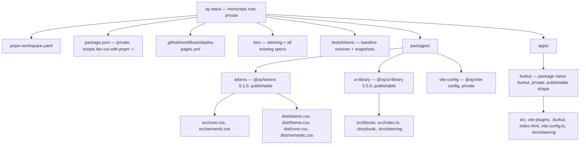
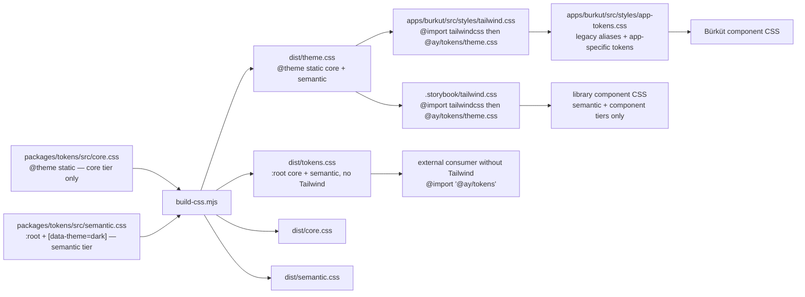
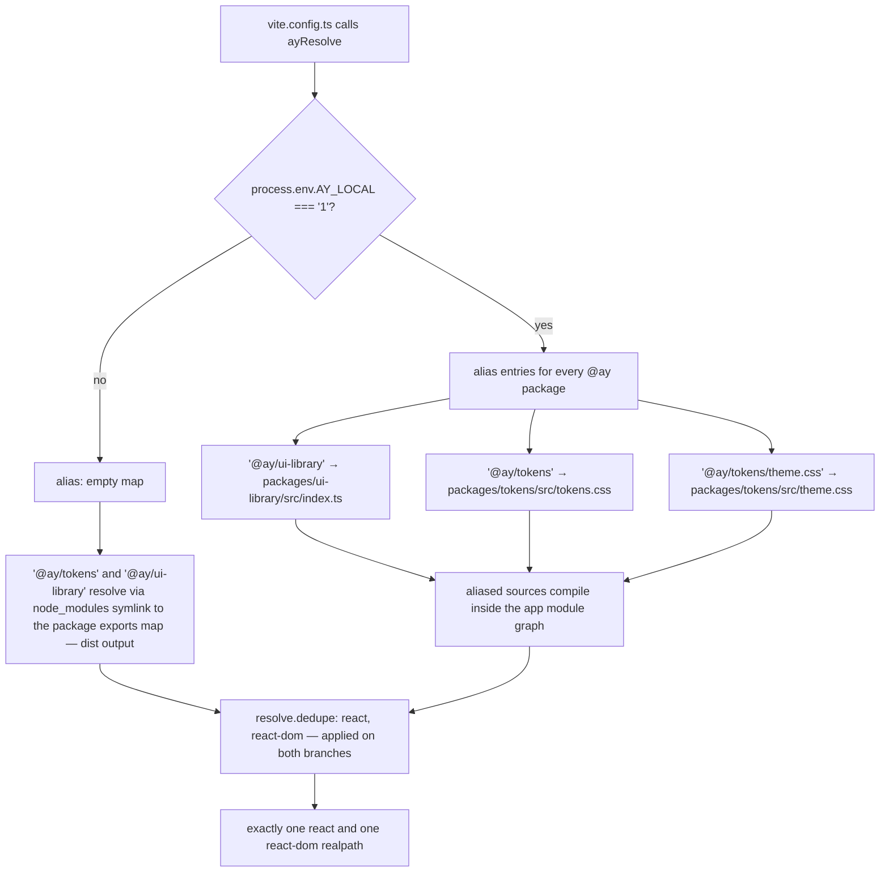
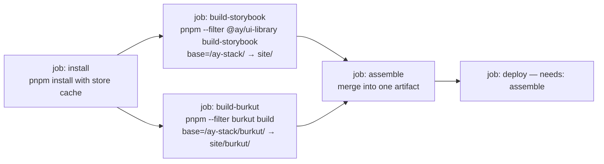

# Design Document

## Overview

This design restructures the current workspace root in place into a pnpm workspace named `ay-stack`, extracts the shared design language into a new publishable `@ay/tokens` package, renames the component library to `@ay/ui-library`, and relocates the Bürküt application under `apps/burkut/`. The work is a pure structural refactor: with one documented exception (recorded in [Semantic tier conflict](#semantic-tier-conflict-dark---color-border-hover)), every custom property resolves to the same literal after the migration as before, in both themes.

Three ideas carry most of the design weight:

1. **Tokens ship twice, authored once.** `@ay/tokens` authors the core tier inside a Tailwind v4 `@theme static` block, and a build step derives a Tailwind-free copy of the same declarations. Tailwind consumers get custom properties *and* utility classes from one declaration; non-Tailwind consumers get plain custom properties from the derived entry.
2. **The semantic tier never enters `@theme`.** Tailwind requires `@theme` at the top level and cannot express `[data-theme="dark"]`. The semantic tier is runtime-theme-switched, so it stays hand-authored in `:root` plus `[data-theme="dark"]`.
3. **A committed baseline of resolved custom properties is the regression guard.** Before anything moves, a resolver walks the two pre-migration stylesheets and records every custom property's fully-resolved literal for both themes. After the migration, the same resolver runs against the new stylesheet chain and the two maps are diffed. This is the mechanism that makes Requirements 6.5 and 8.1–8.4 checkable instead of aspirational.

### Prerequisites

Four steps are human-performed and cannot be automated by the implementation plan. All four must be done before task execution begins.

| # | Manual step | Why it must happen first |
|---|---|---|
| 1 | **Push the current `ay-ui-library` repository to its remote.** | `ay-ui-library/.git/` is deleted during the move into `packages/ui-library/`. The library's commit history survives only on the remote, at `github.com/pemre/ay-ui-library`. |
| 2 | **Rename the GitHub repository `burkut` → `ay-stack`.** | The monorepo is conceptually `ay-stack`, and every `repository.url` and Pages URL in this design assumes the new name. GitHub redirects the old repository URL, so clones and remotes keep working, but the Pages paths change (see [Accepted tradeoffs](#accepted-tradeoffs)). |
| 3 | **Confirm npm publish rights for the `@ay` scope.** | `publishConfig.access: "public"` only works once the scope exists and the publishing account owns it. Scoped packages default to restricted access, and a first publish into a scope you do not own fails with a 403 rather than creating the scope. |
| 4 | **Run `npm deprecate ay-ui-library "Renamed to @ay/ui-library"`.** | Requirement 3.7 is an authenticated registry mutation on an already-published package. Nothing in the workspace can perform it; it is verified once with `npm view ay-ui-library deprecated`. |

Steps 1–3 gate the first task. Step 4 can run any time after `@ay/ui-library` is published, but it is listed here because it is manual, not because it is ordered first.

### Findings from reading the current sources

Four things surfaced while verifying the token sources, and they shape decisions below.

**The two core tiers agree exactly.** Every core token declared in `ay-ui-library/src/styles/tokens.css` is byte-identical to its counterpart in Bürküt's `global.css`. Bürküt declares six additional alpha variants the library lacks. There is no core-tier value conflict, so Requirement 4.5 has nothing to resolve at the core tier — the union is the answer.

**There is one true semantic-tier conflict.** In the dark block, the library declares `--color-border-hover: var(--color-amber-400-a44)` while Bürküt declares `--color-border-hover: var(--color-amber-500-a44)`. Both consumers reference this token (`Button.css`, `layout.css`, and the library's own component tokens), so a single shared declaration necessarily changes one of them. Resolution and rationale are recorded below; this is the one accepted pixel-level deviation in the feature.

**The alpha-suffix convention is internally inconsistent.** `a12`, `a15`, `a20`, and `a30` are decimal alpha percentages; `a44` and `a66` are hex alpha bytes carried over from hex literals (`#f29b1744` → alpha `0x44` ≈ 0.267, `#f29b1766` → `0x66` = 0.4). Bürküt's `--color-amber-400-a44: rgba(245, 171, 53, 0.27)` rounds that hex byte to two decimals, and `--color-amber-400-a66: rgba(245, 171, 53, 0.4)` matches `0x66` exactly. Normalizing the notation would change rendered alpha by up to 1/255 and violate Requirements 8.1–8.4, so values are preserved verbatim and the convention is documented in place. See [Alpha notation](#alpha-notation-decision).

**`SpiralTimeline.css` violates Requirement 5.7 today.** It references core tokens directly: `var(--radius-lg, 8px)`, `var(--space-4, 0.5rem)`, `var(--font-size-sm, 0.85rem)`, `var(--font-size-xs, 0.75rem)`, `var(--duration-fast, 0.15s)`. Satisfying 5.7 requires mapping these to component tokens in the `.spiral-timeline` block, which preserves computed values exactly. No library block currently uses Tailwind utility classes, so Requirement 11.7 is vacuous today and Requirement 11.8 holds by construction.

### Accepted tradeoffs

- **`ay-ui-library/.git/` is deleted, not merged.** The library's commit history does not survive into the monorepo. The alternative — `git subtree add` or `git read-tree` grafting — is available, but the requirements do not ask for history preservation and the graft complicates the in-place restructure. **Before executing the first task, push the current `ay-ui-library` repository to its remote so the history remains recoverable at `github.com/pemre/ay-ui-library`** (Prerequisite 1). All moves *inside* the monorepo use `git mv` so the root repository's history is preserved for those files.
- **Both published URLs change, because the repository is renamed and one repository hosts one Pages site.** The rename `burkut` → `ay-stack` (Prerequisite 2) makes GitHub redirect the old *repository* URL, but it does not redirect Pages *paths* — and the Pages layout changes too, because Storybook takes the site root:

  | Artifact | Before | After |
  |---|---|---|
  | Storybook | `pemre.github.io/ay-ui-library/` | `pemre.github.io/ay-stack/` |
  | Bürküt | `pemre.github.io/burkut/` | `pemre.github.io/ay-stack/burkut/` |

  Storybook takes the root because the library documentation is the durable primary artifact of what this repository is becoming; Bürküt is the temporary tenant. Consequence: every README badge, README link, and hardcoded URL in source or documentation must be updated in both packages and at the root. The library README and CHANGELOG record the new Storybook URL; Bürküt's README and `homepage` record the new subpath.
- **Bürküt's Pages URL will change a second time.** When Bürküt is extracted to its own repository in a later spec, its deploy moves back with it and its URL becomes whatever that repository serves (`pemre.github.io/burkut/` again, if the name is reused). This is expected, not a regression — recorded here so the second move is not a surprise.
- **One dark-theme hover border color changes in Bürküt.** Quantified below.

## Architecture

### Target directory layout



Relocations, all via `git mv`:

| From | To |
|---|---|
| `ay-ui-library/*` | `packages/ui-library/*` |
| `ay-ui-library/.github/workflows/deploy-docs.yml` | folded into `.github/workflows/deploy-pages.yml` |
| `ay-ui-library/.kiro/steering/*` | `packages/ui-library/.kiro/steering/*` |
| `src/`, `vite-plugins/`, `.burkut/`, `index.html`, `vite.config.ts`, `tsconfig.json`, `biome.json` | `apps/burkut/` |
| `package.json` — the current root manifest **is** Bürküt's (`name: "burkut"`, `bin`, `files`, `homepage`, the `cac`/`gray-matter` CLI deps) | `apps/burkut/package.json` |
| `.kiro/steering/{product,structure,tech,post-implementation}.md` | `apps/burkut/.kiro/steering/` |
| `ay-ui-library/src/styles/tokens.css` | superseded by `packages/tokens/src/` |

Deleted: `ay-ui-library/.git/`, `ay-ui-library/package-lock.json`, the **root** `package-lock.json` (also Bürküt's — deleted rather than moved, because pnpm replaces it with `pnpm-lock.yaml` at the root), `MIGRATION_PLAN.md` (Requirement 17.6). `.kiro/specs/` stays at the root untouched (Requirement 2.7).

**Ordering constraint: Bürküt's root files move out before the new root files are created.** `package.json`, `biome.json`, `tsconfig.json`, `vite.config.ts`, and `index.html` currently sit at the repository root but belong to Bürküt. Every one of them must land in `apps/burkut/` *first*; only then may the new root-level `package.json` (private `ay-stack`), root `biome.json`, root `.gitignore`, and `pnpm-workspace.yaml` be written. Creating the new root files first would mean the subsequent moves either carry the freshly created files away into `apps/burkut/` or overwrite Bürküt's originals at the destination. See [Restructure ordering](#restructure-ordering) in Error Handling.

### Token dependency graph



The single authoring site for core values is `src/core.css`. Everything else is derived or references it. No consumer declares a core or semantic token (Requirements 4.8, 4.9, 16.7).

### How Tailwind v4 consumption works

Tailwind v4's `@theme` is not a parallel config: theme variables declared in it are emitted as CSS custom properties **and** register utility namespaces, so one declaration produces both ([Theme variables](https://tailwindcss.com/docs/theme)). Three mechanics matter here, all verified against the v4 documentation:

1. **`@theme` may live in an imported file.** The docs' own "Sharing across projects" guidance is exactly this pattern: put `@theme` in its own CSS file and `@import` it, including from an npm package. Tailwind resolves the `@import` graph itself (not Vite's CSS pipeline), which is why a bare package specifier works and why the `@theme` block inside the imported file is honored. The consuming stylesheet is therefore:

   ```css
   /* apps/burkut/src/styles/tailwind.css */
   @import "tailwindcss";
   @import "@ay/tokens/theme.css";
   ```

   The order matters: `@import "tailwindcss"` first so the token block extends and overrides the default theme rather than being overridden by it.

2. **`@theme` must be top level.** It cannot be nested under a selector or media query. This is the structural reason the semantic tier cannot go through `@theme` — `[data-theme="dark"]` is a selector.

3. **`@theme static` is required, not optional.** By default Tailwind emits only the theme variables it observes in use, and "in use" means utility usage. Our core tokens are consumed through hand-authored `var(--space-4)` / `var(--duration-fast)` references in component CSS, which is not utility usage. Declaring `@theme static` guarantees every core token lands in the output `:root`, which is what makes computed-value preservation hold. Without `static` the migration would silently drop tokens.

**A consumer without Tailwind** imports `@ay/tokens` (the root subpath), which resolves to `dist/tokens.css`: the identical declarations with `@theme static { … }` rewritten to `:root { … }`, plus the semantic tier. It contains no Tailwind at-rule, so it works in plain Vite, plain PostCSS, or a raw `<link>` tag (Requirements 9.4, 11.8).

**Tailwind namespace side effects.** Core token names collide with Tailwind namespaces in two places, and this is intentional but must be recorded:

| Token group | Tailwind namespace | Effect |
|---|---|---|
| `--color-amber-400/500`, `--color-gray-100…900`, `--color-green-400/500` | `--color-*` | Overrides Tailwind's default amber/gray/green ramps. `bg-amber-500` renders `#f29b17`, `text-gray-900` renders `#1f2328`. This is the desired brand behavior. |
| `--color-amber-500-a12` and the other alpha variants | `--color-*` | Generates extra utilities such as `bg-amber-500-a12`. Harmless; unused today. |
| `--radius-sm/md/lg` | `--radius-*` | Overrides Tailwind's defaults `0.25rem/0.375rem/0.5rem` with `4px/6px/8px`. `rounded-md` changes meaning. No block or app CSS uses those utilities today, so there is no current visual impact. |
| `--space-1…4`, `--font-size-xs/sm`, `--duration-fast/normal` | none | Tailwind's namespaces are `--spacing`, `--text-*`, and there is no `--duration-*` namespace, so these emit as plain custom properties and generate no utilities. No collision. |

**Why the semantic tier stays out of `@theme`.** Beyond the top-level restriction: theme variables that reference other variables need the `inline` option, which bakes the referenced value into the generated utility instead of emitting a `var()` chain. A semantic token processed that way would freeze its light-theme value into every utility that used it, and toggling `[data-theme="dark"]` would no longer change anything. Runtime-theme-switched tokens must stay as hand-authored custom properties so the cascade — not the compiler — resolves them.

### Local dev alias resolution flow



**Why `npm link` fails here and aliasing does not.** `npm link` puts a symlink at `node_modules/@ay/ui-library` pointing at the library checkout. Bare `react` imports inside the library then resolve from the library's *real* location, finding the library's own `node_modules/react` — a second React copy. Two copies means two module-level dispatcher variables, so a hook called inside a library component reads a `null` dispatcher and React throws "Invalid hook call. Hooks can only be called inside the body of a function component," usually reported as a duplicate-React error. Vite compounds this by treating the linked path as outside the project root for dependency pre-bundling.

Source aliasing avoids the failure by construction: the aliased files are compiled as ordinary members of the app's module graph, so their `react` imports resolve from the app's root like any app file. `resolve.dedupe: ["react", "react-dom"]` forces a single resolution even when a transitive path would produce a second one, and is applied on both branches so the published-entry branch is protected too.

**Where the helper lives: a private workspace package, `@ay/vite-config` at `packages/vite-config/`.** The alternative — copying a snippet into each config — was rejected for three reasons. There are already two consumers (`apps/burkut/vite.config.ts` and the library's Storybook Vite config), and both must agree on the alias map or the app and Storybook diverge. The map must stay in sync with the set of `@ay/*` packages and their entry subpaths, which changes when a package is added. And a function is unit-testable once, which is what makes the alias-map correctness property (Property 12) and the React-singleton property (Property 13) possible; a copied snippet is not addressable by a test. The package is `"private": true` and never published, so it does not occupy a name in the public `@ay` scope.

### CI: one Pages site, Storybook at the root, Bürküt under a subpath

Two workflows deploying to GitHub Pages from one repository is a genuine conflict, not a cosmetic one. A repository has exactly one Pages site, both existing workflows call `actions/deploy-pages`, and both use the concurrency group `pages` — so the second run to finish replaces the first run's site rather than coexisting with it. Whichever workflow deployed last would win.

Resolution: **one workflow, two build jobs, one deploy.**



- **Storybook occupies the site root** at `https://pemre.github.io/ay-stack/`. Its Vite `base` is set through `viteFinal` from a `STORYBOOK_BASE` environment variable — `/ay-stack/` in CI, defaulting to `/` for local runs. The library docs are the durable primary artifact of the repository, which is why they get the root.
- **Bürküt occupies `/burkut/`** at `https://pemre.github.io/ay-stack/burkut/`. Its Vite `base` becomes `process.env.GITHUB_PAGES ? "/ay-stack/burkut/" : "/"`, and `homepage` becomes `https://pemre.github.io/ay-stack/burkut/` so the two continue to agree (Requirement 14.6). Local dev is unaffected — `base` stays `/`.
- The `assemble` job copies Storybook output to the artifact root and Bürküt output to `site/burkut/`. Because Storybook's output is placed first and Bürküt's goes into a fresh subdirectory, no filename can collide between the two.
- Both build jobs depend on a single `pnpm/action-setup` + `actions/cache` of the pnpm store keyed on `pnpm-lock.yaml` (Requirements 14.3, 14.4).
- `deploy` declares `needs: [assemble]`, and `assemble` declares `needs: [build-storybook, build-burkut]`, so any build failure short-circuits the deployment with a non-zero status and no artifact (Requirement 14.5).

### Steering and the single token-architecture document

The three-tier architecture is currently duplicated verbatim in `ay-ui-library/.kiro/steering/tech.md` and Bürküt's `.kiro/steering/tech.md`. Requirement 15.5 allows exactly one statement of it.

**Canonical location: `packages/tokens/TOKEN-ARCHITECTURE.md`.** The package that owns the tiers owns their description. It is a plain document rather than a steering file for two reasons: it must ship inside the published tarball so external consumers get the same contract (it is listed in `files`), and root-level steering loading semantics should not determine whether the canonical document is readable. `packages/tokens/README.md` links to it instead of restating it (Requirement 17.2 is satisfied by the link plus install/consumption instructions, which are README-specific content).

Every steering document that needs the architecture references it with Kiro's file-reference syntax rather than restating it (Requirement 15.6):

```markdown
Token tiers, naming patterns, and tier ownership: #[[file:packages/tokens/TOKEN-ARCHITECTURE.md]]
```

The reference path is relative to the workspace root, so the same line works from root steering, `packages/ui-library/.kiro/steering/tech.md`, and `apps/burkut/.kiro/steering/tech.md`. The tier tables are deleted from both `tech.md` files and replaced with that reference.

### Bürküt path integrity

The audit splits every path into two classes. Package-relative paths move with the package; content-relative paths must keep resolving against the user's target directory.

| Path / mechanism | Class | Pre-migration | Post-migration | Action |
|---|---|---|---|---|
| `bin.burkut` | package | `./dist/cli/bin/burkut.js` | unchanged string, now resolved inside `apps/burkut/` | none — `bin` is always package-relative |
| `serve` script | package | `tsx src/cli/bin/burkut.ts serve` | unchanged, runs with `apps/burkut/` as cwd via `pnpm --filter burkut serve` | none |
| `devServer.ts` `projectRoot` | package | `resolve(import.meta.dirname, "../..")` | same expression, resolves to `apps/burkut/` from `src/cli/` and to the package root from `dist/cli/` | none — file-relative by construction |
| `configFile` | package | `resolve(projectRoot, "vite.config.ts")` | `apps/burkut/vite.config.ts` | none |
| plugin import in `devServer.ts` | package | `../../vite-plugins/burkut-content.ts` | valid because `src/` and `vite-plugins/` move together | none |
| `virtual:burkut-content` | neither | virtual module id | unchanged | none — ids are not paths |
| plugin's `scanDirectory` / `buildContentGraph` imports | package | `../src/cli/*.ts` | valid after the paired move | none |
| `/content-assets/` middleware | content | `resolve(contentDir, relativePath)` | unchanged | none — verify boundary check still rejects traversal |
| plugin `/api/layouts` GET/POST | content | `join(contentDir, ".burkut", "layouts", "dashboard.json")` | unchanged | none |
| `vite.config.ts` `devLayoutsApi` | **cwd** | `join(process.cwd(), ".burkut", "layouts")` | resolves to `apps/burkut/.burkut/layouts/` when run via `pnpm --filter burkut dev`, but to the monorepo root when run from the root without a filter | pin to the package: `join(import.meta.dirname, ".burkut", "layouts")` |
| Vite `root` | package | implicit cwd | set explicitly to `import.meta.dirname` so root-level invocation cannot drift | change |
| Vite `base` | deploy | `process.env.GITHUB_PAGES ? "/burkut/" : "/"` | `process.env.GITHUB_PAGES ? "/ay-stack/burkut/" : "/"` — matches the new `homepage`; local dev unchanged at `/` | change |
| `index.html` script src | package | `/src/main.tsx` | unchanged relative to the new `root` | none |
| `tsconfig.json` `include` | package | `["src","vite-plugins"]` | unchanged | none |

The one real defect the audit found is `devLayoutsApi`'s use of `process.cwd()`. In the current single-package repo the cwd is always the package, so the bug is latent; in a workspace, `pnpm dev` at the root would write layouts to the wrong directory. The dev-mode API is the *repo-local* development counterpart of the CLI plugin's content-directory API, so pinning it to the package directory is the behavior-preserving fix. The CLI plugin's handlers keep using `contentDir` and are untouched.

## Components and Interfaces

### `@ay/tokens` (`packages/tokens/`)

```
packages/tokens/
├── package.json
├── LICENSE
├── README.md
├── TOKEN-ARCHITECTURE.md      # canonical three-tier document
├── scripts/build-css.mjs      # derives dist/ from src/
├── src/
│   ├── core.css               # @theme static { … core tier … }
│   ├── semantic.css           # :root { … } + [data-theme="dark"] { … }
│   ├── theme.css              # @import "./core.css"; @import "./semantic.css";
│   └── tokens.css             # dev entry: plain-CSS composition for AY_LOCAL runs
├── dist/                      # build output, published
└── tests/
```

Interface surface:

| Subpath | Resolves to | Contains | For |
|---|---|---|---|
| `@ay/tokens` | `dist/tokens.css` | core as `:root`, semantic, dark. No Tailwind at-rules. | any consumer, Tailwind or not (Req 9.4, 11.8) |
| `@ay/tokens/theme.css` | `dist/theme.css` | core as `@theme static`, semantic, dark | Tailwind v4 consumers (Req 11.4–11.6) |
| `@ay/tokens/core.css` | `dist/core.css` | core as `:root` only | consumers layering their own semantic tier |
| `@ay/tokens/semantic.css` | `dist/semantic.css` | semantic + dark only | consumers supplying their own core scale |
| `@ay/tokens/package.json` | itself | — | tooling |

`scripts/build-css.mjs` is a ~40-line Node script with no dependencies:

```js
// packages/tokens/scripts/build-css.mjs — contract
// 1. read src/core.css  → emit dist/core.css      (@theme static → :root)
// 2. copy src/core.css  → dist/theme-core.css     (verbatim, keeps @theme static)
// 3. copy src/semantic.css → dist/semantic.css
// 4. concat (1)+(3)     → dist/tokens.css   // plain entry
// 5. concat (2)+(3)     → dist/theme.css    // Tailwind entry
// The @theme → :root rewrite is the ONLY transformation. Values are never touched.
```

Because the rewrite is textual and value-preserving, `dist/tokens.css` and `dist/theme.css` declare identical names with identical values; only the wrapping at-rule differs. This is what makes the plain and Tailwind paths provably equivalent (Property 8).

### `@ay/ui-library` (`packages/ui-library/`)

Unchanged in structure. Four changes:

1. `src/styles/tokens.css` is deleted. `.storybook/preview.ts` drops `import "../src/styles/tokens.css"`, and `.storybook/tailwind.css` becomes `@import "tailwindcss"; @import "@ay/tokens/theme.css";` (Requirements 5.3, 11.6).
2. `SpiralTimeline.css` gains component tokens for the five core references it currently makes, preserving computed values:

   ```css
   .spiral-timeline {
     /* existing semantic → component mappings unchanged */
     --spiral-radius: var(--radius-lg, 8px);
     --spiral-gap: var(--space-4, 0.5rem);
     --spiral-gap-sm: var(--space-2, 0.25rem);
     --spiral-font-sm: var(--font-size-sm, 0.85rem);
     --spiral-font-xs: var(--font-size-xs, 0.75rem);
     --spiral-duration: var(--duration-fast, 0.15s);
   }
   ```

   Every downstream rule swaps `var(--radius-lg, 8px)` for `var(--spiral-radius)` and so on. The `calc(var(--space-4, 0.5rem) * 1.5)` expressions become `calc(var(--spiral-gap) * 1.5)`. Resolved values are identical, so Requirement 8.6's component-token-value clause holds while 5.7 becomes satisfiable.
3. `package.json` is renamed and republished under the scope; `.kiro/steering/` arrives from the old repo with paths and commands updated.
4. `vite.config.ts` keeps library mode unchanged. The Vitest block continues to resolve `src/tests/setup.ts` package-relatively.

The barrel `src/index.ts` is untouched — same two components, same fifteen exported types (Requirements 3.5, 3.6).

### `burkut` (`apps/burkut/`)

Stylesheet split, replacing the single `global.css`:

| File | Contents | Tier |
|---|---|---|
| `src/styles/tailwind.css` | `@import "tailwindcss"; @import "@ay/tokens/theme.css";` | — |
| `src/styles/app-tokens.css` | Legacy alias block (all `var()` references) + app-specific tokens (`--tl-bg-*`, `--vis-*`, `--font-serif`) for both themes + the `*`/`html, body, #root` base rules | app |
| `src/styles/layout.css` | unchanged | app |

`src/main.tsx` import order becomes: vendor CSS → `./styles/tailwind.css` → `./styles/app-tokens.css` → `./styles/layout.css`. Tailwind first so the token declarations it emits are available to the alias block, alias block before layout so aliases resolve.

`global.css` is deleted. It declares no core or semantic token afterwards, which is what Requirement 16.7's test asserts.

`vite.config.ts` gains: the Tailwind v4 plugin, `root: import.meta.dirname`, `ayResolve()` spread from `@ay/vite-config`, and the `devLayoutsApi` cwd fix.

### `@ay/vite-config` (`packages/vite-config/`)

```ts
// packages/vite-config/src/index.ts — contract

/** Every @ay package specifier the workspace can alias, and its source entry. */
export const AY_LOCAL_ENTRIES: Record<string, string>;
//   "@ay/ui-library"        → "packages/ui-library/src/index.ts"
//   "@ay/tokens"            → "packages/tokens/src/tokens.css"
//   "@ay/tokens/theme.css"  → "packages/tokens/src/theme.css"
//   "@ay/tokens/core.css"   → "packages/tokens/src/core.css"
//   "@ay/tokens/semantic.css" → "packages/tokens/src/semantic.css"

/** Pure: (env value, workspace root) → alias entries. Empty unless value === "1". */
export function ayLocalAlias(ayLocal: string | undefined, workspaceRoot: string):
  Record<string, string>;

/** Vite `resolve` fragment. dedupe is present on every branch. */
export function ayResolve(opts?: { ayLocal?: string; workspaceRoot?: string }):
  { alias: Record<string, string>; dedupe: string[] };
```

`ayLocalAlias` is a pure function of its two arguments — no `process.env` read inside — which is what makes it property-testable. `ayResolve` reads `process.env.AY_LOCAL` and `import.meta` only to supply defaults.

### Baseline resolver (`tools/tokens/`)

```ts
// tools/tokens/resolve.mjs — contract

/** Parse declarations out of :root / [data-theme="dark"] blocks of one or more CSS texts. */
export function parseBlocks(cssTexts: string[]):
  { root: Map<string,string>; dark: Map<string,string> };

/** Follow var() chains to a literal. Throws on cycles and on unresolvable names. */
export function resolveAll(decls: Map<string,string>): Map<string,string>;

/** Convenience: both themes resolved. dark = resolveAll(root overlaid with dark). */
export function resolveThemes(cssTexts: string[]):
  { light: Record<string,string>; dark: Record<string,string> };
```

The resolver also understands `@theme static { … }` as a root-level block, so it can read `dist/theme.css` and `dist/tokens.css` interchangeably. `var(--x, fallback)` uses the declared value when `--x` exists and the fallback when it does not, matching CSS semantics — this matters for `SpiralTimeline.css`'s fallbacks and for `--accent-a66`, which the dark block deliberately does not redeclare.

## Data Models

### Root `package.json`

```json
{
  "name": "ay-stack",
  "private": true,
  "version": "0.0.0",
  "packageManager": "pnpm@9.15.4",
  "scripts": {
    "build": "pnpm -r build",
    "test": "pnpm -r test",
    "typecheck": "pnpm -r typecheck",
    "lint": "pnpm -r lint",
    "verify": "pnpm typecheck && pnpm lint && pnpm test && pnpm build",
    "dev": "pnpm --filter burkut dev",
    "storybook": "pnpm --filter @ay/ui-library storybook"
  },
  "devDependencies": { "typescript": "catalog:" },
  "repository": {
    "type": "git",
    "url": "git+https://github.com/pemre/ay-stack.git"
  }
}
```

No `bin`, `files`, `main`, `module`, or `types` (Requirement 1.2). `verify` is the single workspace-wide Quality Gate script (Requirements 16.5, 16.6 — `pnpm -r` prints the failing package name and propagates a non-zero exit).

### `pnpm-workspace.yaml`

```yaml
packages:
  - "packages/*"
  - "apps/*"

catalog:
  "@biomejs/biome": "^2.4.6"
  "@testing-library/dom": "^10.4.0"
  "@testing-library/jest-dom": "^6.9.1"
  "@testing-library/react": "^16.3.2"
  "@types/react": "^18.3.28"
  "@types/react-dom": "^18.3.7"
  "@vitejs/plugin-react": "^4.7.0"
  d3: "^7.9.0"
  fast-check: "^4.6.0"
  jsdom: "^28.1.0"
  react: "^18.3.1"
  react-dom: "^18.3.1"
  tailwindcss: "^4.2.1"
  typescript: "^5.9.3"
  vite: "^5.4.21"
  vitest: "^1.6.1"
```

Catalogs are the mechanism for Requirement 10: each package writes `"vitest": "catalog:"`, so a single version exists by construction rather than by convention.

### Toolchain reconciliation (Requirement 10.8 — higher of the two)

| Tool | Bürküt | ay-ui-library | Adopted | Note |
|---|---|---|---|---|
| `@testing-library/react` | ^15.0.6 | ^16.3.2 | ^16.3.2 | v16 moved `@testing-library/dom` to a peer dependency — added to the catalog |
| `jsdom` | ^24.0.0 | ^28.1.0 | ^28.1.0 | |
| `vitest` | ^1.6.0 | ^1.6.1 | ^1.6.1 | |
| `@biomejs/biome` | ^2.4.5 | ^2.4.6 | ^2.4.6 | |
| `fast-check` | ^4.5.3 | ^4.6.0 | ^4.6.0 | |
| `typescript` | ^5.9.3 | ^5.9.3 | ^5.9.3 | already aligned |
| `react` / `react-dom` | ^18.3.1 | ^18.3.1 | ^18.3.1 | already aligned |
| `vite` | ^5.4.0 | ^5.4.21 | ^5.4.21 | |
| `@vitejs/plugin-react` | ^4.3.1 | ^4.7.0 | ^4.7.0 | |
| `tailwindcss` | absent | ^4.2.1 | ^4.2.1 | new for Bürküt (Requirement 11.1) |
| `d3` | absent | ^7.9.0 | ^7.9.0 | new for Bürküt (Requirement 11.2) |

Biome configuration lives once at the root (`biome.json`, indent 2 / width 100 / double quotes / semicolons always) and each package's `biome.json` reduces to `{"extends": ["../../biome.json"]}`, satisfying Requirement 10.9 uniformly. The library's current 4-space *file* indentation is a formatting artifact, not a config difference — its `biome.json` already declares 2; running `pnpm lint:fix` reformats those files.

### `packages/tokens/package.json`

```json
{
  "name": "@ay/tokens",
  "version": "0.1.0",
  "description": "🌜 Ay design tokens — core and semantic CSS custom properties with a Tailwind v4 theme entry",
  "license": "MIT",
  "type": "module",
  "exports": {
    ".": "./dist/tokens.css",
    "./theme.css": "./dist/theme.css",
    "./core.css": "./dist/core.css",
    "./semantic.css": "./dist/semantic.css",
    "./package.json": "./package.json"
  },
  "files": ["dist", "README.md", "TOKEN-ARCHITECTURE.md", "LICENSE"],
  "sideEffects": ["*.css"],
  "scripts": {
    "build": "node scripts/build-css.mjs",
    "test": "vitest run",
    "typecheck": "tsc --noEmit",
    "lint": "biome check src scripts tests"
  },
  "publishConfig": { "access": "public" },
  "devDependencies": {
    "@biomejs/biome": "catalog:",
    "fast-check": "catalog:",
    "typescript": "catalog:",
    "vitest": "catalog:"
  },
  "repository": {
    "type": "git",
    "url": "git+https://github.com/pemre/ay-stack.git",
    "directory": "packages/tokens"
  }
}
```

No `dependencies` and no `peerDependencies` (Requirement 9.3). `tailwindcss` is deliberately *not* a peer dependency: `dist/theme.css` is inert text unless a Tailwind build processes it, and requiring the peer would break the plain-CSS consumption path.

### `packages/ui-library/package.json` (changed fields only)

```json
{
  "name": "@ay/ui-library",
  "version": "0.5.0",
  "exports": {
    ".": { "types": "./dist/index.d.ts", "import": "./dist/index.es.js", "require": "./dist/index.cjs.js" },
    "./dist/style.css": "./dist/style.css",
    "./styles.css": "./dist/style.css",
    "./package.json": "./package.json"
  },
  "files": ["dist", "README.md", "CHANGELOG.md", "LICENSE"],
  "publishConfig": { "access": "public" },
  "dependencies": { "@ay/tokens": "workspace:^" },
  "peerDependencies": {
    "d3": "^7.0.0",
    "react": "^18.0.0",
    "react-dom": "^18.0.0",
    "tailwindcss": "^4.2.1"
  },
  "repository": {
    "type": "git",
    "url": "git+https://github.com/pemre/ay-stack.git",
    "directory": "packages/ui-library"
  }
}
```

`main`/`module`/`types` are retained alongside `exports` for older bundlers. Version `0.5.0` is a minor bump, not a major: the public API is byte-identical apart from the package name, and the rename is communicated through `npm deprecate ay-ui-library "Renamed to @ay/ui-library"` rather than through a major-version signal (Requirements 3.4, 3.6, 3.7).

### `apps/burkut/package.json` (changed fields only)

```json
{
  "name": "burkut",
  "private": true,
  "version": "0.1.0",
  "homepage": "https://pemre.github.io/ay-stack/burkut/",
  "bin": { "burkut": "./dist/cli/bin/burkut.js" },
  "files": ["dist/"],
  "dependencies": {
    "@ay/tokens": "workspace:^",
    "@ay/ui-library": "workspace:^",
    "d3": "catalog:",
    "tailwindcss": "catalog:"
  },
  "repository": {
    "type": "git",
    "url": "git+https://github.com/pemre/ay-stack.git",
    "directory": "apps/burkut"
  }
}
```

Name stays unscoped — Bürküt is a published CLI with its own identity, not part of the `@ay` design-system scope. It keeps `bin`, `files`, and `homepage` so its publishable shape survives the later extraction to a standalone repository, while `private: true` prevents accidental publication from the monorepo. `@tailwindcss/vite` joins its devDependencies. `homepage` matches the Pages subpath the CI workflow deploys to (Requirement 14.6) and changes again when Bürküt is extracted.

### Core tier reconciliation

Every core token from both sources. "Both" means the two declarations are byte-identical (verified by reading both files).

| Token | ay-ui-library | Bürküt | Chosen | Source / rationale |
|---|---|---|---|---|
| `--color-amber-400` | `#f5ab35` | `#f5ab35` | `#f5ab35` | identical |
| `--color-amber-500` | `#f29b17` | `#f29b17` | `#f29b17` | identical |
| `--color-gray-100` | `#f0f2f5` | `#f0f2f5` | `#f0f2f5` | identical |
| `--color-gray-200` | `#e8ebef` | `#e8ebef` | `#e8ebef` | identical |
| `--color-gray-300` | `#d1d9e0` | `#d1d9e0` | `#d1d9e0` | identical |
| `--color-gray-400` | `#8b949e` | `#8b949e` | `#8b949e` | identical |
| `--color-gray-500` | `#656d76` | `#656d76` | `#656d76` | identical |
| `--color-gray-600` | `#545d68` | `#545d68` | `#545d68` | identical |
| `--color-gray-700` | `#444c56` | `#444c56` | `#444c56` | identical |
| `--color-gray-800` | `#373e47` | `#373e47` | `#373e47` | identical |
| `--color-gray-900` | `#1f2328` | `#1f2328` | `#1f2328` | identical |
| `--color-amber-500-a12` | `rgba(242, 155, 23, 0.12)` | same | `rgba(242, 155, 23, 0.12)` | identical |
| `--color-amber-500-a15` | — | `rgba(242, 155, 23, 0.15)` | `rgba(242, 155, 23, 0.15)` | Bürküt-only; union (Req 4.4, 4.6) |
| `--color-amber-500-a20` | `rgba(242, 155, 23, 0.2)` | same | `rgba(242, 155, 23, 0.2)` | identical |
| `--color-amber-500-a30` | — | `rgba(242, 155, 23, 0.3)` | `rgba(242, 155, 23, 0.3)` | Bürküt-only; union |
| `--color-amber-500-a44` | `#f29b1744` | `#f29b1744` | `#f29b1744` | identical; hex notation preserved verbatim |
| `--color-amber-500-a66` | — | `#f29b1766` | `#f29b1766` | Bürküt-only; union |
| `--color-amber-400-a12` | `rgba(245, 171, 53, 0.12)` | same | `rgba(245, 171, 53, 0.12)` | identical |
| `--color-amber-400-a15` | — | `rgba(245, 171, 53, 0.15)` | `rgba(245, 171, 53, 0.15)` | Bürküt-only; union |
| `--color-amber-400-a20` | `rgba(245, 171, 53, 0.2)` | same | `rgba(245, 171, 53, 0.2)` | identical |
| `--color-amber-400-a30` | — | `rgba(245, 171, 53, 0.3)` | `rgba(245, 171, 53, 0.3)` | Bürküt-only; union |
| `--color-amber-400-a44` | `rgba(245, 171, 53, 0.27)` | `rgba(245, 171, 53, 0.27)` | `rgba(245, 171, 53, 0.27)` | identical; see [Alpha notation](#alpha-notation-decision) |
| `--color-amber-400-a66` | — | `rgba(245, 171, 53, 0.4)` | `rgba(245, 171, 53, 0.4)` | Bürküt-only; union |
| `--space-1` … `--space-4` | `0.125/0.25/0.375/0.5rem` | same | same | identical |
| `--radius-sm/md/lg` | `4px/6px/8px` | same | same | identical |
| `--font-size-xs/sm` | `0.75rem/0.85rem` | same | same | identical |
| `--duration-fast/normal` | `0.15s/0.25s` | same | same | identical |
| `--color-green-500` | — | — | `#2da44e` | **new**; raw value behind Bürküt's `--success` (light) |
| `--color-green-400` | — | — | `#3fb950` | **new**; raw value behind Bürküt's `--success` (dark) |
| `--color-green-500-a30` | — | — | `rgba(45, 164, 78, 0.3)` | **new**; raw value behind `--success-a30` (light) |
| `--color-green-400-a30` | — | — | `rgba(63, 185, 80, 0.3)` | **new**; raw value behind `--success-a30` (dark) |

**Requirement 4.5 outcome at the core tier: no conflict exists.** The two sources agree on every overlapping core token; Bürküt's six extra alpha variants are additive. The union satisfies Requirement 4.6's full `a12/a15/a20/a30/a44/a66` set for both shades with no value derivation needed.

#### Alpha notation decision

The suffix convention is inconsistent, and the inconsistency is preserved on purpose:

| Suffix | Intended alpha | `amber-500` | `amber-400` |
|---|---|---|---|
| `a12` | 0.12 | `rgba(…, 0.12)` | `rgba(…, 0.12)` |
| `a15` | 0.15 | `rgba(…, 0.15)` | `rgba(…, 0.15)` |
| `a20` | 0.20 | `rgba(…, 0.2)` | `rgba(…, 0.2)` |
| `a30` | 0.30 | `rgba(…, 0.3)` | `rgba(…, 0.3)` |
| `a44` | `0x44` = 0.267 | `#f29b1744` (hex byte) | `rgba(…, 0.27)` (rounded decimal) |
| `a66` | `0x66` = 0.400 | `#f29b1766` (hex byte) | `rgba(…, 0.4)` (exact decimal) |

So `a12`–`a30` read as percentages while `a44`/`a66` read as hex alpha bytes, and the two shades express the same suffix in different notations. Normalizing would mean either rewriting `#f29b1744` as `rgba(242, 155, 23, 0.267)` or rewriting `rgba(245, 171, 53, 0.27)` as `0.267`. Both change the rendered 8-bit alpha by up to 1/255 in at least one token, which violates Requirements 8.1–8.4.

**Decision: preserve all twelve values verbatim.** `src/core.css` carries an inline comment documenting the convention drift, and a follow-up token-normalization spec can renormalize once a visual-diff budget exists. Rejected alternative: normalize now — rejected because this feature's contract is zero rendered change.

#### Semantic tier conflict: dark `--color-border-hover`

| Source | Dark declaration | Resolves to |
|---|---|---|
| `ay-ui-library/src/styles/tokens.css` | `var(--color-amber-400-a44)` | `rgba(245, 171, 53, 0.27)` |
| Bürküt `global.css` | `var(--color-amber-500-a44)` | `#f29b1744` = `rgba(242, 155, 23, 0.267)` |

**Chosen: `var(--color-amber-400-a44)` — the library's value.** Rationale: the dark theme sets `--color-primary: var(--color-amber-400)`, so every other accent-derived token in that block descends from amber-400. Bürküt's amber-500 reference is a copy-paste leftover from the light block and is inconsistent with its own `--color-primary`. Taking the library's value makes the dark block internally coherent.

**Impact, stated plainly.** Bürküt's dark-theme hover border shifts from `rgb(242,155,23)` at α≈0.267 to `rgb(245,171,53)` at α=0.27 — a 3/255 red, 16/255 green, 30/255 blue shift at roughly 27% opacity over a dark surface, affecting `.btn:hover` and `.language-select:hover` only. The alternative — keeping Bürküt's value — would shift the library's Storybook dark theme instead, propagating the inconsistency into the shared package.

**Status: accepted.** This deviation has been acknowledged and is a recorded design decision, not an open question. It is the single deviation from Requirements 8.2 and 6.5 and the only entry in the computed-value allowlist described in the Testing Strategy; any other computed-value difference is a failure.

### Semantic tier, final shape

Ten pre-existing tokens plus six promoted from Bürküt's legacy aliases. All sixteen appear in both blocks (Requirement 4.3).

| Token | `:root` | `[data-theme="dark"]` | Status |
|---|---|---|---|
| `--color-primary` | `var(--color-amber-500)` | `var(--color-amber-400)` | existing |
| `--color-bg-body` | `var(--color-gray-100)` | `#1c2128` | existing |
| `--color-bg-surface` | `#ffffff` | `#22272e` | existing |
| `--color-bg-surface-alt` | `#f6f8fa` | `#2d333b` | existing |
| `--color-text-primary` | `var(--color-gray-900)` | `#adbac7` | existing |
| `--color-text-secondary` | `var(--color-gray-500)` | `#768390` | existing |
| `--color-border-default` | `var(--color-gray-300)` | `var(--color-gray-700)` | existing |
| `--color-border-hover` | `var(--color-amber-500-a44)` | `var(--color-amber-400-a44)` | **conflict resolved** |
| `--color-hover-bg` | `rgba(208, 215, 222, 0.32)` | `rgba(99, 110, 123, 0.16)` | existing |
| `--radius-control` | `var(--radius-md)` | `var(--radius-md)` | existing |
| `--color-text-muted` | `var(--color-gray-400)` | `var(--color-gray-600)` | promoted from `--text-muted` |
| `--color-text-on-primary` | `#ffffff` | `#ffffff` | promoted from `--text-on-accent` |
| `--color-border-subtle` | `var(--color-gray-200)` | `var(--color-gray-800)` | promoted from `--border-subtle` |
| `--color-bg-code` | `#eff1f3` | `var(--color-bg-surface-alt)` | promoted from `--code-bg` |
| `--color-status-success` | `var(--color-green-500)` | `var(--color-green-400)` | promoted from `--success` |
| `--color-status-success-subtle` | `var(--color-green-500-a30)` | `var(--color-green-400-a30)` | promoted from `--success-a30` |

Dark-block literals (`#1c2128`, `#22272e`, `#2d333b`, `#adbac7`, `#768390`, `#eff1f3`, `#ffffff`) are carried over exactly as the pre-migration sources declared them. Introducing a dark core ramp to back them would change nothing visually but would inflate the diff; it is left to a follow-up spec.

### Legacy alias decisions

Every alias in Bürküt's Legacy Alias block. Grep over `src/**/*.{css,ts,tsx}` found at least one reference for all of them, so Requirement 6.6 removes nothing — the honest answer is that there is no dead alias to delete.

| Alias | Pre-migration light | Pre-migration dark | Decision | Post-migration light | Post-migration dark |
|---|---|---|---|---|---|
| `--accent` | `var(--color-primary)` | `var(--color-primary)` | keep, already semantic | unchanged | unchanged |
| `--accent-a12/a15/a20/a30/a44` | `var(--color-amber-500-aNN)` | `var(--color-amber-400-aNN)` | keep, core-referencing aliases are the app's own indirection layer | unchanged | unchanged |
| `--accent-a66` | `var(--color-amber-500-a66)` | *not redeclared* | keep the asymmetry — dark inherits the amber-500 value from `:root` today, and redeclaring it to amber-400 would change rendering | unchanged | still absent |
| `--bg-body`, `--bg-surface`, `--bg-surface-alt`, `--text-primary`, `--text-secondary`, `--border-default`, `--hover-bg` | `var(--color-…)` | `var(--color-…)` | keep, already semantic | unchanged | unchanged |
| `--bg-sidebar` | `#f6f8fa` **(literal)** | `#22272e` **(literal)** | **resolve to different semantic tokens per theme** — the light literal equals `--color-bg-surface-alt`, but the dark literal equals `--color-bg-surface`, not surface-alt (`#2d333b`) | `var(--color-bg-surface-alt)` | `var(--color-bg-surface)` |
| `--text-muted` | `#8b949e` **(literal)** | `#545d68` **(literal)** | **promote** — no semantic token expresses muted text; values match `--color-gray-400` / `--color-gray-600` exactly | `var(--color-text-muted)` | `var(--color-text-muted)` |
| `--text-on-accent` | `#ffffff` **(literal)** | `#ffffff` **(literal)** | **promote** — "text drawn on the accent fill" is a missing semantic meaning; `--color-bg-surface` happens to be `#ffffff` in light but diverges in dark, so it cannot be reused | `var(--color-text-on-primary)` | `var(--color-text-on-primary)` |
| `--border-subtle` | `#e8ebef` **(literal)** | `#373e47` **(literal)** | **promote** — values match `--color-gray-200` / `--color-gray-800` exactly | `var(--color-border-subtle)` | `var(--color-border-subtle)` |
| `--code-bg` | `#eff1f3` **(literal)** | `#2d333b` **(literal)** | **promote** — the dark literal equals `--color-bg-surface-alt`, but the light literal `#eff1f3` matches no existing token (`gray-100` is `#f0f2f5`, `gray-200` is `#e8ebef`), so the new semantic token carries the literal in light | `var(--color-bg-code)` | `var(--color-bg-code)` |
| `--success` | `#2da44e` **(literal)** | `#3fb950` **(literal)** | **promote with a new status set** — success is a genuinely missing semantic meaning; adds core `--color-green-500/400` | `var(--color-status-success)` | `var(--color-status-success)` |
| `--success-a30` | `rgba(45, 164, 78, 0.3)` **(literal)** | `rgba(63, 185, 80, 0.3)` **(literal)** | **promote** — the subtle/fill companion of the status color; adds core `--color-green-500-a30` / `--color-green-400-a30` | `var(--color-status-success-subtle)` | `var(--color-status-success-subtle)` |

Every promotion preserves the exact rendered value in both themes, which is what Requirement 6.5 demands. After the rewrite the alias block contains only `var()` references and no color literal (Requirement 6.3), and `@ay/tokens` declares none of these alias names (Requirement 6.4).

A note on why the status set is worth promoting rather than leaving as app literals: `--success` is the first of a family (`warning`, `danger`, `info`) that any future `@ay` consumer will need, and it is the only place in the current design where a rendered color bypasses the tiers entirely. Naming it `--color-status-success` leaves room for siblings without renaming.

### App-specific tokens (unchanged, stay in Bürküt)

`--tl-bg-ancient/early/fragment/mid/late/modern`, `--vis-bg/text/border/item-bg/item-border/item-text`, and `--font-serif` move from `global.css` to `app-tokens.css` with values byte-identical in both themes (Requirement 7). None of them appears in `@ay/tokens` (Requirement 4.11).

## Correctness Properties

*A property is a characteristic or behavior that should hold true across all valid executions of a system — essentially, a formal statement about what the system should do. Properties serve as the bridge between human-readable specifications and machine-verifiable correctness guarantees.*

This feature is largely structural, so the properties below quantify over sets that the repository actually produces — declared custom properties, CSS files, package manifests, packed tarball entries, documentation files — rather than over synthetic runtime inputs. Each one stays meaningful as those sets grow, which is what distinguishes it from a fixed assertion.

### Property 1: Computed-value preservation across the migration

*For any* pre-migration source (Bürküt's `global.css`, `ay-ui-library/src/styles/tokens.css`) and *for any* custom property that source declares, resolving that property through **that source's own** post-migration stylesheet chain SHALL yield the identical literal value in the light theme and in the dark theme, except for the single allowlisted entry — dark `--color-border-hover` on Bürküt's consumer chain.

**Validates: Requirements 4.4, 6.5, 7.4, 8.1, 8.2, 8.3, 8.4**

### Property 2: Semantic tier dark completeness

*For any* custom property declared in the semantic `:root` block of `@ay/tokens`, the `[data-theme="dark"]` block SHALL declare a property with the same name, and both blocks SHALL declare `color-scheme`.

**Validates: Requirements 4.3, 4.7, 8.5**

### Property 3: Bidirectional tier ownership

*For any* CSS file in `@ay/ui-library` or in the Bürküt application, that file SHALL declare no custom property whose name belongs to the core or semantic tier owned by `@ay/tokens`; and *for any* custom property declared by `@ay/tokens`, that property's name SHALL belong to the core or semantic tier and SHALL match no legacy-alias name, no app-specific prefix, and no component-tier prefix.

**Validates: Requirements 4.1, 4.5, 4.8, 4.9, 4.10, 4.11, 6.4, 16.7**

### Property 4: Token imports use the package specifier

*For any* import statement in `@ay/ui-library` or in the Bürküt application whose target resolves inside `packages/tokens`, that import SHALL be written as an `@ay/tokens` package specifier and SHALL NOT be a relative filesystem path.

**Validates: Requirements 5.3, 5.4**

### Property 5: Legacy alias block is literal-free

*For any* declaration inside the Bürküt legacy alias region, in either the light or the dark block, the declared value SHALL consist solely of `var()` references and SHALL contain no hex or `rgba()` color literal.

**Validates: Requirements 6.1, 6.2, 6.3**

### Property 6: Legacy aliases are reachable

*For any* legacy alias declared by the Bürküt application, at least one `var()` reference to that alias SHALL exist in Bürküt source.

**Validates: Requirements 6.6**

### Property 7: Component CSS never reaches the core tier

*For any* `var()` reference appearing in an `@ay/ui-library` component stylesheet, the referenced custom property SHALL belong to the semantic tier or the component tier and SHALL NOT belong to the core tier.

**Validates: Requirements 5.7**

### Property 8: Theme entry and plain entry declare the same tokens

*For any* custom property declared by the `@ay/tokens` Tailwind theme entry, the plain-CSS entry SHALL declare the same name with the same value and SHALL contain no Tailwind at-rule; and every core-tier token SHALL appear inside the theme entry's `@theme` block while no core-tier token appears outside it.

**Validates: Requirements 9.1, 11.4, 11.5, 11.6, 11.8**

### Property 9: Single version per shared tool

*For any* dependency name in the shared-tool catalog, the resolved dependency graph SHALL contain exactly one version of that dependency across every workspace importer.

**Validates: Requirements 10.1, 10.2, 10.3, 10.4, 10.5, 10.6, 10.7**

### Property 10: Manifest hygiene

*For any* workspace package, every dependency of that package whose name matches another workspace package SHALL use the `workspace:` protocol, and that package's directory SHALL contain no `package-lock.json` and no `yarn.lock`.

**Validates: Requirements 1.6, 1.8, 5.1, 5.2**

### Property 11: Publishable tarball contents

*For any* non-private workspace package, the packed tarball SHALL contain a `LICENSE` file, a non-empty `description`, and every file its `exports` map targets, and SHALL contain no test file, story file, `.storybook` file, or lockfile.

**Validates: Requirements 9.2, 9.7, 9.8**

### Property 12: Local dev alias map correctness

*For any* value of the `AY_LOCAL` environment variable, `ayResolve` SHALL include `react` and `react-dom` in `resolve.dedupe`; and the alias map SHALL contain an entry mapping every known `@ay/*` specifier to a path under `packages/*/src` when the value is exactly `"1"`, and SHALL be empty for every other value including absence.

**Validates: Requirements 12.1, 12.2, 12.3**

### Property 13: React singleton under the local dev alias

*For any* alias target directory produced by `ayLocalAlias`, resolving `react` and `react-dom` from that directory SHALL yield the same realpath as resolving them from the Bürküt application root.

**Validates: Requirements 12.4**

### Property 14: CLI path-resolution split

*For any* caller working directory, the Bürküt CLI SHALL compute a project root equal to the `apps/burkut` package directory; and *for any* pair of caller working directory and target directory argument, the CLI SHALL resolve the target to `path.resolve(cwd, argument)` independently of the package location.

**Validates: Requirements 13.1, 13.2**

### Property 15: Content plugin payload round-trips

*For any* scanned content directory, the `virtual:burkut-content` module payload SHALL parse back to a `ContentGraph` equal to the graph built from the same scan; and *for any* layout document written through `POST /api/layouts`, a subsequent `GET /api/layouts` SHALL return that same document from `.burkut/layouts/dashboard.json` inside the active content directory.

**Validates: Requirements 13.3, 13.5**

### Property 16: Content asset boundary and error reporting

*For any* request path under `/content-assets/`, the plugin SHALL serve the file only when it resolves inside the scanned content directory and SHALL reject it otherwise; and *for any* unresolvable path reached by the CLI or the plugin, the reported error message SHALL contain that path.

**Validates: Requirements 13.4, 13.7**

### Property 17: Documentation and steering hygiene

*For any* markdown or steering document in the workspace, every filesystem path it references SHALL exist, every package-manager command it shows SHALL invoke pnpm, every reference to the library by package specifier SHALL use `@ay/ui-library`, and no document SHALL instruct the reader to use `npm link` or `yalc`.

**Validates: Requirements 3.8, 12.6, 12.7, 15.3, 15.4, 17.7**

### Property 18: Token architecture is stated exactly once

*For any* set of workspace documents, exactly one document SHALL contain the three-tier token architecture statement, and every other document that mentions the tiers SHALL reference that document through Kiro's file-reference syntax rather than restating it.

**Validates: Requirements 15.5, 15.6**

### Property 19: Workflow path and tooling currency

*For any* GitHub Actions workflow in the workspace, the workflow SHALL install dependencies with pnpm, SHALL cache the pnpm store, SHALL reference no pre-migration path, and any job that publishes a Pages artifact SHALL declare `needs` on every build job feeding it.

**Validates: Requirements 14.1, 14.2, 14.3, 14.4, 14.5**

### Property 20: Gitignore covers every package path

*For any* workspace package, git SHALL report that package's `node_modules`, `dist`, and `coverage` paths as ignored.

**Validates: Requirements 2.9**

## Error Handling

### Migration-time failures

| Failure | Detection | Handling |
|---|---|---|
| **New root files created before Bürküt's root files are moved out** | The new root `package.json` ends up at `apps/burkut/package.json`, or Bürküt's manifest/config never arrives at its destination. Detected by the manifest unit tests: the root manifest is not private `ay-stack`, or `apps/burkut/package.json` lacks `bin`/`files`/`homepage`. | Enforce the ordering below. If it has already gone wrong, recover from git — the moves are `git mv` and the new root files are new, so `git checkout -- package.json biome.json tsconfig.json vite.config.ts index.html` restores Bürküt's originals before retrying in the correct order. |
| Nested `.git` survives the move | Property 3's sibling filesystem check; `git status` shows the directory as untracked | Abort and delete `ay-ui-library/.git/` explicitly before staging. Recovery relies on the pre-migration backup push. |
| `git mv` refuses a path (untracked or ignored file) | non-zero exit from `git mv` | Move untracked files with a plain `mv` and stage them separately; never fall back to `cp` plus delete, which loses rename detection. |
| pnpm install fails on a peer dependency | install output | Expected case: `@testing-library/react@16` requires `@testing-library/dom` as a peer. It is pre-added to the catalog. Any other peer warning is resolved by adding a catalog entry, never by `--no-strict-peer-dependencies`. |
| A token disappears silently | Property 1 reports a missing key rather than a changed value | Missing keys and changed values are distinct failures in the baseline diff report so the cause is unambiguous. |
| Tailwind emits only some core tokens | Property 8 finds theme-entry names absent from the built output | Root cause is a missing `static` on `@theme`. The build asserts the emitted `:root` count matches the declared core count. |

#### Restructure ordering

Five files currently at the repository root belong to Bürküt, and the new workspace root needs three of those five names for itself. The ordering is therefore a hard constraint, not a preference:

1. **Move Bürküt's root files into `apps/burkut/` first** — `package.json`, `biome.json`, `tsconfig.json`, `vite.config.ts`, `index.html` (alongside `src/`, `vite-plugins/`, `.burkut/`).
2. **Then create the new root files** — the private `ay-stack` `package.json`, the shared root `biome.json`, the root `.gitignore`, and `pnpm-workspace.yaml`.
3. Delete the root `package-lock.json` at any point in this window; it is Bürküt's and pnpm replaces it, so it is not moved.

The root `package.json` is the sharpest case: its current content **is** Bürküt's manifest — `name: "burkut"`, `bin`, `files`, `homepage`, and the CLI dependencies (`cac`, `gray-matter`). That content must become `apps/burkut/package.json` before the private `ay-stack` root manifest exists, or Bürküt's publishable shape is lost. The design's original wave ordering placed root-file creation ahead of the moves, which would have moved the newly written root files away into `apps/burkut/` (or overwritten Bürküt's originals there). `biome.json`, `tsconfig.json`, `vite.config.ts`, and `index.html` were already in the relocation table but carried no stated ordering; `package.json` was missing from the table entirely, and both gaps are closed above.

### Runtime failures

| Failure | Behavior |
|---|---|
| Tailwind stylesheet fails to load | Library blocks keep their custom-property styling. `dist/tokens.css` supplies every token those blocks reference, and no block depends on a utility class (Requirement 11.8). |
| `@ay/tokens` stylesheet missing entirely | Every `var()` in component CSS falls through to its declared fallback where one exists; the SpiralTimeline component tokens keep literal fallbacks precisely for this case. Colors degrade to browser defaults but layout and text remain legible. |
| `AY_LOCAL=1` set but a `packages/*/src` entry is absent | `ayLocalAlias` throws at config load with the missing absolute path in the message, rather than letting Vite fail later with an opaque resolution error. |
| CLI target directory missing or not a directory | Existing behavior retained: message naming the resolved absolute path, exit code 1 (Requirement 13.7). |
| Content directory unreadable during scan | The plugin surfaces the failing absolute path; the dev server does not start with a partial graph. |
| `/api/layouts` read or write fails | Existing 404/500 JSON responses retained verbatim. |
| Storybook or Bürküt `base` misconfigured in CI | Asset requests 404 under `/ay-stack/` or `/ay-stack/burkut/`. Guarded by Property 19's path check plus a post-build assertion that each build's emitted asset URLs carry its expected prefix. |

### Quality-gate failures

`pnpm -r` stops at the first failing package and names it in the output, which satisfies Requirement 16.6 without custom scripting. The root `verify` script orders the gates cheapest-first (typecheck, lint, test, build) so feedback arrives early.

## Testing Strategy

### The computed-value baseline — the primary regression guard

This is the mechanism that turns "no visual regression" from an intention into a check, and it must be captured **before any file moves**.

**Step 1 — capture (first task in the implementation plan; already executed, `tools/tokens/baseline.json` is committed).**

```bash
node tools/tokens/capture-baseline.mjs \
  --in src/styles/global.css \
  --in ay-ui-library/src/styles/tokens.css \
  --out tools/tokens/baseline.json
```

`parseBlocks` collects declarations from `:root` and `[data-theme="dark"]`; `resolveAll` follows `var()` chains to literals, applying dark as an overlay on root so inherited-but-not-redeclared properties (such as `--accent-a66`) resolve the way the cascade resolves them.

As-built output shape — the implementation added `mergeStrategy`, `conflicts`, and `perSource` beyond the three keys originally documented, because the two pre-migration sources genuinely disagree on dark `--color-border-hover` and a single merged map would destroy one of the two pre-migration realities:

```json
{
  "capturedAt": "…",
  "sources": ["src/styles/global.css", "ay-ui-library/src/styles/tokens.css"],
  "mergeStrategy": "first-source-wins: …",
  "light": { "…": "…" },
  "dark":  { "…": "…" },
  "conflicts": { "light": {}, "dark": { "--color-border-hover": { "chosen": "…", "declaredBy": [ … ] } } },
  "perSource": { "<source path>": { "light": { … }, "dark": { … } } }
}
```

- `light` and `dark` are **merged** maps across all sources, resolved with **first-`--in`-source-wins**: on a name two sources both declare with different values, the earliest `--in` source's resolved value is what lands in the merged map.
- `conflicts` records every disagreement. It holds **exactly one entry**: dark `--color-border-hover`, with `chosen` set to `#f29b1744` (Bürküt's, as the first source) and `declaredBy` listing both sources and their resolved values. `conflicts.light` is empty.
- `perSource` resolves **each source independently**, so each consumer's own pre-migration reality is preserved verbatim rather than flattened. This is the map the diff actually uses.

Captured facts, for the record:

| Fact | Value |
|---|---|
| Custom properties in the union | 78 |
| Present in both themes | all 78 (light and dark each hold 78 keys) |
| Declared by `src/styles/global.css` | all 78 |
| Declared by `ay-ui-library/src/styles/tokens.css` | 38 — a strict subset of the 78 |
| Resolved values still containing `var(` | none |

The file is committed. It is the only artifact that remembers the pre-migration world once `global.css` is deleted.

**Step 2 — diff (a test that runs on every subsequent task): per consumer, not merged.** `packages/tokens/tests/baseline.property.test.ts` compares **each consumer's own `perSource` baseline against that same consumer's own post-migration stylesheet chain**. It does not use the merged `light`/`dark` maps.

| Consumer | Baseline side | Post-migration chain |
|---|---|---|
| Bürküt | `perSource["src/styles/global.css"]` (78 properties) | `packages/tokens/dist/tokens.css` + `apps/burkut/src/styles/app-tokens.css` |
| `@ay/ui-library` | `perSource["ay-ui-library/src/styles/tokens.css"]` (38 properties) | `packages/tokens/dist/tokens.css` |

**Why per-consumer is both stricter and correct.** The two pre-migration sources are *independent consumers*, not layers of one cascade. Bürküt never loaded `ay-ui-library/src/styles/tokens.css`, and the library never loaded `global.css`. A merged comparison would therefore check, for at least one name, a value that neither consumer ever resolved — for dark `--color-border-hover` the merged map carries Bürküt's `#f29b1744`, which the library's own rendering never saw. Per-consumer diffing also removes the masking effect of a merge: the library's 38 properties are checked against the library's actual chain instead of being absorbed into Bürküt's 78.

It still yields **exactly one deviation**, which is what keeps the single-entry allowlist valid:

| Consumer | baseline dark `--color-border-hover` | post-migration | outcome |
|---|---|---|---|
| Bürküt | `#f29b1744` | `rgba(245, 171, 53, 0.27)` | the one accepted deviation |
| `@ay/ui-library` | `rgba(245, 171, 53, 0.27)` | `rgba(245, 171, 53, 0.27)` | unchanged |

**Note on a plausible misreading:** per-consumer diffing does *not* produce two deviations. Two deviations only appear if the *merged* map — which carries Bürküt's `#f29b1744` because Bürküt is the first source — is compared against the library's chain as well as Bürküt's. That is the wrong pair: it charges the library with a change to a value it never declared. Each consumer is diffed against its own baseline, and only Bürküt's chain deviates.

The allowlist holds exactly one entry, scoped to **Bürküt's consumer chain** rather than to "dark" globally, and nothing may be added to it without a corresponding design decision:

```ts
const ALLOWED_DEVIATIONS = {
  "src/styles/global.css": {
    dark: {
      "--color-border-hover": {
        from: "#f29b1744",
        to: "rgba(245, 171, 53, 0.27)",
        reason: "design.md — dark accent derives from amber-400, matching --color-primary",
      },
    },
  },
} as const;
```

Keying the allowlist by source path means the same deviation is *not* tolerated for `@ay/ui-library`: if the library's dark `--color-border-hover` ever moved off `rgba(245, 171, 53, 0.27)`, that is a plain failure. Any other difference fails with the consumer, the token name, both values, and the theme reported. Missing keys and changed values are reported separately.

**Why not a browser-based `getComputedStyle` snapshot.** jsdom does not resolve `var()` chains, so a jsdom test cannot see through the tiers; a real-browser snapshot would mean adding Playwright and a CI browser download for a check whose entire input is static CSS. Resolving the chains in Node is deterministic, dependency-free, runs in milliseconds, and covers exactly the property the requirements state. The resolver itself is the thing under test, so it carries its own property tests (below).

### Property test configuration

Property tests use **fast-check** (already a devDependency in both packages, catalogued at `^4.6.0`), minimum **100 iterations** each, one property test per design property. Each carries a tag comment:

```ts
// Feature: ay-monorepo-foundation, Property 12: For any value of the AY_LOCAL environment
// variable, ayResolve SHALL include react and react-dom in resolve.dedupe; and the alias map
// SHALL contain an entry mapping every known @ay/* specifier to a path under packages/*/src
// when the value is exactly "1", and SHALL be empty for every other value including absence.
```

### Test type by property

| Property | Kind | Location | Generator / input set |
|---|---|---|---|
| 1 Computed-value preservation | static check over CSS, driven by a committed baseline | `packages/tokens/tests/` | each consumer's own `perSource` key set (78 for Bürküt, 38 for the library) × its own post-migration chain; exhaustive, not sampled |
| 2 Dark completeness | static check over CSS | `packages/tokens/tests/` | declarations parsed from the semantic block |
| 3 Tier ownership | static check over CSS | `packages/tokens/tests/` and `apps/burkut/src/tests/` (the latter satisfies Req 16.7) | owned name set × every CSS file found by glob |
| 4 Token import form | static check over source | both packages | every import string in every source file |
| 5 Alias literal-freedom | static check over CSS | `apps/burkut/src/tests/` | every declaration in the alias region |
| 6 Alias reachability | static check over CSS | `apps/burkut/src/tests/` | declared alias set × reference index |
| 7 Component-tier discipline | static check over CSS | `packages/ui-library/src/tests/` | every `var()` reference in block CSS |
| 8 Theme/plain equivalence | static check over build output | `packages/tokens/tests/` | declarations of both built entries |
| 9 Single version per tool | static check over `pnpm-lock.yaml` | root `tests/` | catalog name set |
| 10 Manifest hygiene | static check over manifests | root `tests/` | every workspace package × its dependency entries |
| 11 Tarball contents | integration (runs `pnpm pack --dry-run --json`) | root `tests/` | every non-private package; 1 run each, not 100 |
| 12 Alias map | **property-based, fast-check** | `packages/vite-config/tests/` | arbitrary strings for `AY_LOCAL` including `"1"`, `"0"`, `""`, `"1 "`, `undefined`; arbitrary package-name subsets |
| 13 React singleton | static resolution check | `packages/vite-config/tests/` | every alias target directory |
| 14 CLI path split | **property-based, fast-check** | `apps/burkut/src/cli/*.test.ts` | arbitrary absolute cwds and arbitrary relative/absolute directory arguments, including `.`, `..`, and paths with spaces and non-ASCII characters |
| 15 Plugin round-trips | **property-based, fast-check** | `apps/burkut/vite-plugins/*.test.ts` | generated content trees (varying depth, filename date prefixes, extensions, unicode names) and arbitrary JSON layout documents |
| 16 Asset boundary + error naming | **property-based, fast-check** | `apps/burkut/vite-plugins/*.test.ts` | arbitrary relative request paths including `../` sequences, URL-encoded traversal, and empty segments |
| 17 Doc hygiene | static check over markdown | root `tests/` | every tracked `.md` file × extracted paths, commands, specifiers |
| 18 Architecture uniqueness | static check over markdown | root `tests/` | every tracked `.md` and steering file |
| 19 Workflow currency | static check over YAML | root `tests/` | every file in `.github/workflows/` |
| 20 Gitignore coverage | static check invoking `git check-ignore` | root `tests/` | every workspace package × three candidate paths |

The static checks are ordinary Vitest tests, not lint rules — they need to glob the filesystem and parse CSS, which Biome cannot do. They live with the package they constrain so `pnpm -r test` runs them, and the root-level ones live in a small root `tests/` directory covered by a root `test` script.

### Unit and integration tests

Beyond the properties:

- **Unit (example-based):** manifest field assertions (Requirements 1.2–1.4, 3.1–3.4, 3.9, 9.3, 9.6, 11.1–11.3, 13.6, 14.6); barrel export-name snapshot (3.5, 3.6); directory layout assertions (2.2–2.5, 2.7); the twelve alpha-variant names and the sixteen semantic names (4.2, 4.6); `color-scheme` values (4.7); build-artifact existence (5.5); app-specific token presence (7.1–7.3); documentation presence (17.1–17.6).
- **Resolver unit + property tests:** the baseline resolver is itself code under test. Properties: resolution is idempotent, no `var()` survives a successful resolution, cyclic chains throw, and `var(--x, fb)` selects `fb` exactly when `--x` is undeclared. These use fast-check with generated declaration maps.
- **Integration (1–3 examples, not 100):** `pnpm pack` → install into a temp project → resolve `@ay/tokens` subpaths and import the `@ay/ui-library` barrel (Requirements 9.4, 9.5); dev server starts with `AY_LOCAL=1`, a source edit invalidates the module (12.5); a semantic value patch propagates to a consumer stylesheet (5.6); compiled Tailwind output contains rules for utility classes blocks declare (11.7, vacuous today).
- **Smoke (single execution):** the four Quality Gates per package (16.1–16.4); one lockfile at the root and no foreign lockfiles (1.5); no nested `.git` (2.8); root `dev` script starts Bürküt without extra path configuration (13.8).
- **Regression:** the existing `@ay/ui-library` and Bürküt suites must pass unchanged. Their class-name and markup assertions are the guard for Requirement 8.6.

### What automation does not cover

Being direct about the gaps, because pretending otherwise is how visual regressions ship:

- **Storybook visual parity in both themes (Requirements 8.3, 8.4) needs manual verification.** The baseline diff proves every token resolves identically, but it cannot prove that Storybook loads the stylesheet chain in the right order or that the Tailwind preflight reset does not alter block appearance — Tailwind's preflight is new to Bürküt and normalizes margins, list styles, and heading sizes. **Both are real risks and require a side-by-side visual check:** run Storybook and Bürküt before and after, in light and dark, and compare. If preflight changes Bürküt's appearance, the fix is to scope it out via a layered import rather than to accept the change.
- **Bürküt screen parity (Requirements 8.1, 8.2)** has the same limitation for the same reason.
- **The `ay-ui-library` npm deprecation (Requirement 3.7)** is an authenticated registry mutation. It is Prerequisite 4, verified once with `npm view ay-ui-library deprecated`.
- **The published URLs are not reachable until the first deploy lands.** Property 17 checks documented filesystem paths, package specifiers, and commands, not HTTP URLs. That `pemre.github.io/ay-stack/` serves Storybook and `pemre.github.io/ay-stack/burkut/` serves Bürküt is confirmed by loading both after the first successful Pages run. The repository rename (Prerequisite 2) is likewise assumed, not asserted.
- **Requirement 2.1 and 2.6** (root path retained, relocated content otherwise unchanged) are verified by reviewing the `git mv` diff, not by a test.
- **Requirement 14.5's runtime behavior** is asserted structurally through `needs` declarations; that a failing build actually blocks the deployment is confirmed by observing the first real failure.
