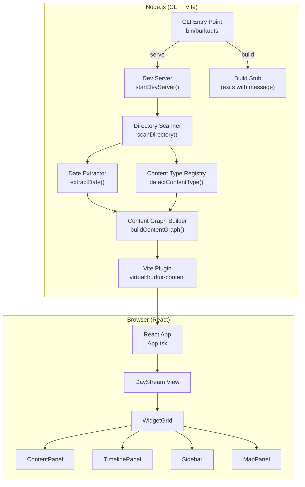
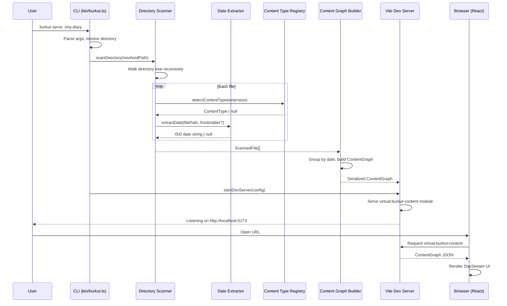
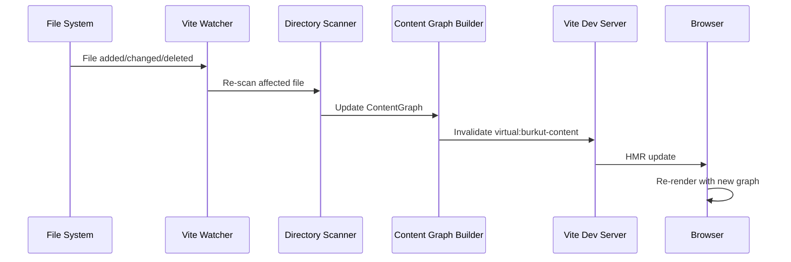

# Design Document: CLI Content Visualizer (Phase 1)

## Overview

Burkut Phase 1 transforms the existing Bürküt History Explorer from a single-purpose, bundled-content app into a general-purpose, CLI-driven content visualization tool. The user runs `burkut serve <directory>` and the tool scans the target directory for content files (markdown, images, video, audio), extracts dates from filenames, folder names, and frontmatter, builds a date-indexed content graph, and serves an interactive "daily stream" UI on localhost via Vite.

The core mental model is a flowing timeline of days. Each day aggregates all content files associated with that date. The existing widget-based UI (Sidebar, TimelinePanel, ContentPanel, MapPanel, WidgetGrid) is adapted to consume the new content graph instead of the current static `virtual:md-content` module. The CLI is distributed as an npm package (`npx burkut serve`, `npm i -g burkut`).

Phase 1 deliberately excludes EXIF extraction, thumbnail generation, sidecar YAML, multi-source directories, multi-tab dashboards, advanced widgets, query/filtering, and static build implementation (the `burkut build` command is stubbed).

## Architecture



## Sequence Diagrams

### `burkut serve` Flow



### File Change (HMR) Flow



## Components and Interfaces

### Component 1: CLI Entry Point (`bin/burkut.ts`)

**Purpose**: Parse command-line arguments and dispatch to the appropriate command handler.

**Interface**:
```typescript
// bin/burkut.ts — the executable entry point
// package.json "bin": { "burkut": "./dist/cli/bin/burkut.js" }

interface CLIOptions {
  port: number;       // default: 5173
  host: string;       // default: "localhost"
  open: boolean;      // default: false
}

// Commands:
//   burkut serve [directory] [--port N] [--host H] [--open]
//   burkut build [directory]  (stubbed)
```

**Responsibilities**:
- Parse `serve` and `build` subcommands
- Resolve target directory (default: `process.cwd()`)
- Validate that the target directory exists
- Pass parsed options to the appropriate handler

**Arg Parsing**: Use a minimal approach — no heavy CLI framework. Parse `process.argv` directly or use a lightweight lib like `cac` (single dependency, ~3KB). The project already has zero CLI deps, so keeping it minimal is preferred.

### Component 2: Directory Scanner (`src/cli/scanner.ts`)

**Purpose**: Recursively walk a directory, detect content files, extract dates, and produce a flat list of scanned file descriptors.

**Interface**:
```typescript
interface ScannedFile {
  /** Absolute path to the file */
  absolutePath: string;
  /** Path relative to the scanned root directory */
  relativePath: string;
  /** Detected content type */
  contentType: ContentType;
  /** Extracted date (ISO string YYYY-MM-DD) or null */
  date: string | null;
  /** Parsed frontmatter (markdown files only) */
  frontmatter: Record<string, unknown> | null;
  /** Raw markdown body (markdown files only) */
  body: string | null;
}

function scanDirectory(rootPath: string): ScannedFile[];
```

**Responsibilities**:
- Recursive directory traversal (using `node:fs` `readdirSync` with `withFileTypes`)
- Skip hidden files/directories (starting with `.`)
- Skip `node_modules`
- Delegate to ContentTypeRegistry for file type detection
- Delegate to DateExtractor for date resolution
- Parse markdown frontmatter with `gray-matter` (already a devDependency)

### Component 3: Date Extractor (`src/cli/dateExtractor.ts`)

**Purpose**: Extract a date from a file using a priority-based strategy.

**Interface**:
```typescript
/**
 * Extract a date from a file path and optional frontmatter.
 * Priority order:
 *   1. Frontmatter `date` field (markdown only)
 *   2. Filename prefix: YYYY-MM-DD-rest-of-name.ext
 *   3. Parent folder prefix: YYYY-MM-DD-folder-name/
 * Returns ISO date string (YYYY-MM-DD) or null.
 */
function extractDate(
  relativePath: string,
  frontmatter: Record<string, unknown> | null
): string | null;
```

**Responsibilities**:
- Parse frontmatter `date` field (supports `Date` objects and `YYYY-MM-DD` strings)
- Match filename prefix pattern `/^\d{4}-\d{2}-\d{2}/`
- Match parent folder prefix pattern
- Validate extracted dates (reject invalid dates like `2025-13-45`)

### Component 4: Content Type Registry (`src/cli/contentTypeRegistry.ts`)

**Purpose**: Map file extensions to content types. Extensible for future types.

**Interface**:
```typescript
type ContentType = "markdown" | "image" | "video" | "audio";

interface ContentTypeDefinition {
  type: ContentType;
  extensions: string[];
  /** MIME type prefix for serving */
  mimePrefix: string;
}

const CONTENT_TYPE_REGISTRY: ContentTypeDefinition[] = [
  { type: "markdown", extensions: [".md", ".mdx", ".markdown"], mimePrefix: "text/markdown" },
  { type: "image", extensions: [".jpg", ".jpeg", ".png", ".gif", ".webp", ".svg", ".avif"], mimePrefix: "image/" },
  { type: "video", extensions: [".mp4", ".webm", ".mov", ".avi"], mimePrefix: "video/" },
  { type: "audio", extensions: [".mp3", ".wav", ".ogg", ".flac", ".m4a"], mimePrefix: "audio/" },
];

function detectContentType(filePath: string): ContentType | null;
function getDefinition(type: ContentType): ContentTypeDefinition;
```

**Responsibilities**:
- Extension-based file type detection (case-insensitive)
- Return `null` for unrecognized extensions (file is skipped)
- Provide type definitions for renderers

### Component 5: Content Graph Builder (`src/cli/contentGraph.ts`)

**Purpose**: Transform a flat list of `ScannedFile[]` into a date-indexed content graph — the central data structure consumed by all widgets.

**Interface**:
```typescript
interface ContentNode {
  /** Unique ID derived from relative path */
  id: string;
  /** Relative path from content root */
  relativePath: string;
  /** Content type */
  contentType: ContentType;
  /** Associated date or null for undated content */
  date: string | null;
  /** Parsed frontmatter (markdown only) */
  frontmatter: Record<string, unknown> | null;
  /** Markdown body (markdown only, null for other types) */
  body: string | null;
  /** Display title (from frontmatter.title, or derived from filename) */
  title: string;
  /** Tags from frontmatter */
  tags: string[];
}

interface DayBucket {
  /** ISO date string YYYY-MM-DD */
  date: string;
  /** All content nodes for this date */
  nodes: ContentNode[];
}

interface ContentGraph {
  /** All content nodes keyed by ID */
  nodes: Record<string, ContentNode>;
  /** Content grouped by date, sorted chronologically */
  days: DayBucket[];
  /** Nodes without a date */
  undated: ContentNode[];
  /** Date range of the graph */
  dateRange: { earliest: string; latest: string } | null;
  /** Summary stats */
  stats: {
    totalFiles: number;
    byType: Record<ContentType, number>;
    datedFiles: number;
    undatedFiles: number;
  };
}

function buildContentGraph(files: ScannedFile[], rootPath: string): ContentGraph;
```

**Responsibilities**:
- Generate stable IDs from relative paths
- Derive display titles from frontmatter or filenames (strip date prefix, strip extension, replace hyphens/underscores with spaces)
- Group nodes by date into `DayBucket[]`
- Sort days chronologically (newest first for diary use case)
- Collect undated content separately
- Compute summary statistics

### Component 6: Vite Plugin (`vite-plugins/burkut-content.ts`)

**Purpose**: Serve the content graph as a virtual module (`virtual:burkut-content`) to the browser, replacing the existing `virtual:md-content` for CLI mode. Also serve media files from the scanned directory.

**Interface**:
```typescript
interface BurkutContentPluginOptions {
  /** Absolute path to the content directory */
  contentDir: string;
}

function burkutContent(options: BurkutContentPluginOptions): Plugin;

// Virtual module export shape (consumed by React):
// import contentGraph from "virtual:burkut-content";
// contentGraph: ContentGraph
```

**Responsibilities**:
- Scan directory on startup, build ContentGraph
- Serve `virtual:burkut-content` as a JSON module
- Watch content directory for file changes
- Re-scan and invalidate virtual module on changes (HMR)
- Serve media files (images, video, audio) from the content directory via a middleware that maps `/content-assets/...` to the actual file paths

### Component 7: Workspace Config (`.burkut/config.ts`)

**Purpose**: Optional per-directory configuration file.

**Interface**:
```typescript
interface BurkutConfig {
  /** Display title for this workspace */
  title?: string;
  /** Locale override */
  locale?: "tr" | "en" | "zh";
  /** Content type overrides or additions */
  contentTypes?: ContentTypeDefinition[];
  /** Date extraction overrides */
  dateExtraction?: {
    /** Frontmatter field name for date (default: "date") */
    frontmatterField?: string;
    /** Filename date pattern (default: YYYY-MM-DD prefix) */
    filenamePattern?: RegExp;
  };
  /** Widget visibility defaults */
  widgets?: Record<string, boolean>;
}
```

**Responsibilities**:
- Loaded at startup if `.burkut/config.ts` exists in the target directory
- Merged with defaults
- Passed to scanner and graph builder

## Data Models

### Model 1: ContentNode

```typescript
interface ContentNode {
  id: string;                              // "2025-03-15-journal" (derived from path)
  relativePath: string;                    // "2025-03-15 journal.md"
  contentType: ContentType;                // "markdown"
  date: string | null;                     // "2025-03-15"
  frontmatter: Record<string, unknown> | null;
  body: string | null;                     // markdown body text
  title: string;                           // "journal" (derived)
  tags: string[];                          // ["movies", "weekend", "istanbul"]
}
```

**Validation Rules**:
- `id` must be non-empty and unique within the graph
- `relativePath` must be a valid relative path (no `..` traversal)
- `contentType` must be a registered type
- `date`, if present, must match `YYYY-MM-DD` and be a valid calendar date
- `tags` is always an array (empty if no tags)

### Model 2: ContentGraph

```typescript
interface ContentGraph {
  nodes: Record<string, ContentNode>;
  days: DayBucket[];                       // sorted newest-first
  undated: ContentNode[];
  dateRange: { earliest: string; latest: string } | null;
  stats: {
    totalFiles: number;
    byType: Record<ContentType, number>;
    datedFiles: number;
    undatedFiles: number;
  };
}
```

**Validation Rules**:
- `days` must be sorted by date descending
- Every node in `days[].nodes` must also exist in `nodes`
- Every node in `undated` must also exist in `nodes`
- `stats.totalFiles` === `Object.keys(nodes).length`
- `stats.datedFiles + stats.undatedFiles === stats.totalFiles`

### Model 3: Adapter — ContentGraph to Legacy ContentIndex

The existing components (Sidebar, TimelinePanel, ContentPanel, MapPanel) consume `ContentIndex` from `useMdLoader`. Rather than rewriting all components in Phase 1, we provide an adapter.

```typescript
/**
 * Convert a ContentGraph into the legacy ContentIndex format
 * so existing widgets work without modification.
 */
function contentGraphToLegacyIndex(graph: ContentGraph): ContentIndex;

/**
 * Get markdown body for a content node by ID.
 */
function getContentBody(graph: ContentGraph, id: string): string | null;
```


## Key Functions with Formal Specifications

### Function 1: `scanDirectory()`

```typescript
function scanDirectory(rootPath: string): ScannedFile[]
```

**Preconditions:**
- `rootPath` is an absolute path to an existing, readable directory
- `rootPath` does not point to a file

**Postconditions:**
- Returns an array of `ScannedFile` objects, one per recognized content file
- No entries for hidden files/dirs, `node_modules`, or unrecognized extensions
- Every returned entry has a valid `contentType`
- `relativePath` values are unique within the result
- `frontmatter` and `body` are populated only for markdown files

**Loop Invariants:**
- At each step of the directory walk, all previously yielded files have valid relative paths that are descendants of `rootPath`

### Function 2: `extractDate()`

```typescript
function extractDate(
  relativePath: string,
  frontmatter: Record<string, unknown> | null
): string | null
```

**Preconditions:**
- `relativePath` is a valid relative file path (no leading `/`)
- `frontmatter`, if non-null, is a parsed YAML object

**Postconditions:**
- Returns a valid `YYYY-MM-DD` string or `null`
- If frontmatter has a `date` field that parses to a valid date, that value is returned (highest priority)
- If the filename starts with `YYYY-MM-DD`, that date is returned (second priority)
- If the parent folder starts with `YYYY-MM-DD`, that date is returned (third priority)
- Invalid dates (e.g., month > 12, day > 31) return `null`

**Loop Invariants:** N/A (no loops — sequential priority checks)

### Function 3: `detectContentType()`

```typescript
function detectContentType(filePath: string): ContentType | null
```

**Preconditions:**
- `filePath` is a non-empty string

**Postconditions:**
- Returns a `ContentType` if the file extension matches a registered type
- Returns `null` if the extension is not recognized
- Matching is case-insensitive (`.MD` matches `.md`)
- The same input always produces the same output (pure function)

**Loop Invariants:**
- For the registry scan: all previously checked definitions did not match the extension

### Function 4: `buildContentGraph()`

```typescript
function buildContentGraph(files: ScannedFile[], rootPath: string): ContentGraph
```

**Preconditions:**
- `files` is an array of valid `ScannedFile` objects (output of `scanDirectory`)
- `rootPath` is the absolute path that was scanned

**Postconditions:**
- `graph.nodes` contains exactly one entry per input file
- `graph.days` is sorted by date descending (newest first)
- Every node with a non-null date appears in exactly one `DayBucket`
- Every node with a null date appears in `graph.undated`
- `graph.stats.totalFiles === files.length`
- `graph.stats.datedFiles === sum of all graph.days[].nodes.length`
- `graph.stats.undatedFiles === graph.undated.length`
- `graph.dateRange` is null if no dated files exist; otherwise `earliest <= latest`
- Node IDs are unique (derived from relative paths)

**Loop Invariants:**
- While grouping files by date: the running count of processed files equals the sum of nodes across all buckets plus undated nodes

### Function 5: `contentGraphToLegacyIndex()`

```typescript
function contentGraphToLegacyIndex(graph: ContentGraph): ContentIndex
```

**Preconditions:**
- `graph` is a valid `ContentGraph` (satisfies all ContentGraph postconditions)

**Postconditions:**
- Returns a `ContentIndex` compatible with existing `useMdLoader` consumers
- Every `ContentNode` in the graph maps to a `ContentEntry` in the index
- Markdown nodes have their frontmatter fields spread into the `ContentEntry`
- `_isHeader` is `false` for all entries (no group headers in CLI mode)
- `_path` is set to the node's `relativePath`
- The `group` field is derived from the date (or "Undated" for dateless content)

**Loop Invariants:**
- For each processed node: the output index has exactly as many entries as nodes processed so far

## Algorithmic Pseudocode

### Main Algorithm: Directory Scan

```typescript
function scanDirectory(rootPath: string): ScannedFile[] {
  const results: ScannedFile[] = [];

  function walk(dir: string): void {
    const entries = readdirSync(dir, { withFileTypes: true });

    for (const entry of entries) {
      // Skip hidden files and node_modules
      if (entry.name.startsWith(".") || entry.name === "node_modules") {
        continue;
      }

      const fullPath = join(dir, entry.name);
      const relPath = relative(rootPath, fullPath);

      if (entry.isDirectory()) {
        walk(fullPath);
        continue;
      }

      // Detect content type by extension
      const contentType = detectContentType(entry.name);
      if (contentType === null) continue; // skip unrecognized files

      let frontmatter: Record<string, unknown> | null = null;
      let body: string | null = null;

      // Parse frontmatter for markdown files
      if (contentType === "markdown") {
        const raw = readFileSync(fullPath, "utf-8");
        const parsed = matter(raw);
        frontmatter = parsed.data;
        body = parsed.content;
      }

      // Extract date using priority chain
      const date = extractDate(relPath, frontmatter);

      results.push({
        absolutePath: fullPath,
        relativePath: relPath,
        contentType,
        date,
        frontmatter,
        body,
      });
    }
  }

  walk(rootPath);
  return results;
}
```

### Date Extraction Algorithm

```typescript
const DATE_PREFIX_RE = /^(\d{4}-\d{2}-\d{2})/;

function isValidDate(dateStr: string): boolean {
  const [y, m, d] = dateStr.split("-").map(Number);
  const date = new Date(y, m - 1, d);
  return (
    date.getFullYear() === y &&
    date.getMonth() === m - 1 &&
    date.getDate() === d
  );
}

function extractDate(
  relativePath: string,
  frontmatter: Record<string, unknown> | null
): string | null {
  // Priority 1: Frontmatter date field
  if (frontmatter?.date != null) {
    const fm = frontmatter.date;
    let dateStr: string | null = null;

    if (fm instanceof Date) {
      dateStr = fm.toISOString().slice(0, 10);
    } else if (typeof fm === "string") {
      const match = fm.match(DATE_PREFIX_RE);
      if (match) dateStr = match[1];
    }

    if (dateStr && isValidDate(dateStr)) return dateStr;
  }

  // Priority 2: Filename prefix
  const filename = basename(relativePath);
  const filenameMatch = filename.match(DATE_PREFIX_RE);
  if (filenameMatch && isValidDate(filenameMatch[1])) {
    return filenameMatch[1];
  }

  // Priority 3: Parent folder prefix
  const parentDir = dirname(relativePath);
  if (parentDir !== ".") {
    const folderName = basename(parentDir);
    const folderMatch = folderName.match(DATE_PREFIX_RE);
    if (folderMatch && isValidDate(folderMatch[1])) {
      return folderMatch[1];
    }
  }

  return null;
}
```

### Content Graph Construction Algorithm

```typescript
function buildContentGraph(files: ScannedFile[], rootPath: string): ContentGraph {
  const nodes: Record<string, ContentNode> = {};
  const dateMap = new Map<string, ContentNode[]>();
  const undated: ContentNode[] = [];
  const byType: Record<ContentType, number> = {
    markdown: 0, image: 0, video: 0, audio: 0,
  };

  for (const file of files) {
    const id = filePathToId(file.relativePath);
    const title = deriveTitle(file.relativePath, file.frontmatter);
    const tags = Array.isArray(file.frontmatter?.tags)
      ? (file.frontmatter.tags as string[])
      : [];

    const node: ContentNode = {
      id,
      relativePath: file.relativePath,
      contentType: file.contentType,
      date: file.date,
      frontmatter: file.frontmatter,
      body: file.body,
      title,
      tags,
    };

    nodes[id] = node;
    byType[file.contentType]++;

    if (file.date) {
      const bucket = dateMap.get(file.date) ?? [];
      bucket.push(node);
      dateMap.set(file.date, bucket);
    } else {
      undated.push(node);
    }
  }

  // Sort days newest-first
  const sortedDates = [...dateMap.keys()].sort((a, b) => b.localeCompare(a));
  const days: DayBucket[] = sortedDates.map((date) => ({
    date,
    nodes: dateMap.get(date)!,
  }));

  const datedFiles = files.length - undated.length;
  const dateRange = sortedDates.length > 0
    ? { earliest: sortedDates[sortedDates.length - 1], latest: sortedDates[0] }
    : null;

  return {
    nodes,
    days,
    undated,
    dateRange,
    stats: {
      totalFiles: files.length,
      byType,
      datedFiles,
      undatedFiles: undated.length,
    },
  };
}
```

### Title Derivation Algorithm

```typescript
function deriveTitle(
  relativePath: string,
  frontmatter: Record<string, unknown> | null
): string {
  // Prefer frontmatter title
  if (typeof frontmatter?.title === "string" && frontmatter.title.trim()) {
    return frontmatter.title.trim();
  }

  // Derive from filename: strip extension, strip date prefix, clean up
  let name = basename(relativePath).replace(/\.[^.]+$/, "");

  // Strip leading YYYY-MM-DD prefix (with optional separator)
  name = name.replace(/^\d{4}-\d{2}-\d{2}[\s_-]*/, "");

  // Replace underscores and hyphens with spaces
  name = name.replace(/[_-]/g, " ").trim();

  return name || basename(relativePath);
}
```

### ID Generation Algorithm

```typescript
/**
 * Generate a stable, unique ID from a relative file path.
 * "2025-03-15 journal.md" → "2025-03-15-journal"
 * "photos/2025-03-15 sunset.jpg" → "photos--2025-03-15-sunset"
 */
function filePathToId(relativePath: string): string {
  return relativePath
    .replace(/\.[^.]+$/, "")     // strip extension
    .replace(/\//g, "--")        // replace path separators
    .replace(/\s+/g, "-")       // replace spaces
    .toLowerCase();
}
```

## Example Usage

### CLI Usage

```bash
# Serve current directory
burkut serve

# Serve a specific directory
burkut serve ~/diary

# Serve with options
burkut serve ~/diary --port 3000 --open

# Stubbed build command
burkut build ~/diary
# → "Static build is not yet implemented. Coming in a future release."
```

### Directory Structure Example

```
~/diary/
├── 2025-03-15 journal.md          # date from filename
├── 2025-03-15 photos/             # date from folder name
│   ├── sunset.jpg                 # inherits 2025-03-15
│   └── dinner.jpg                 # inherits 2025-03-15
├── 2025-03-16 journal.md
├── movies/
│   └── in-the-mood-for-love.md    # date from frontmatter
├── travel/
│   └── 2025-01-10 istanbul.md     # date from filename
└── .burkut/
    └── config.ts                  # optional workspace config
```

### Frontmatter Example

```yaml
---
date: 2025-03-15
tags: [movies, weekend, istanbul]
mood: 8
type: journal
movies:
  - title: "In the Mood for Love"
    rating: 9
location: Istanbul
cover: ../photos/sunset.jpg
---

Today I watched "In the Mood for Love" and it was incredible...
```

### Resulting ContentGraph (simplified)

```typescript
const graph: ContentGraph = {
  nodes: {
    "2025-03-15-journal": {
      id: "2025-03-15-journal",
      relativePath: "2025-03-15 journal.md",
      contentType: "markdown",
      date: "2025-03-15",
      title: "journal",
      tags: ["movies", "weekend", "istanbul"],
      frontmatter: { date: "2025-03-15", mood: 8, /* ... */ },
      body: "Today I watched...",
    },
    "2025-03-15-photos--sunset": {
      id: "2025-03-15-photos--sunset",
      relativePath: "2025-03-15 photos/sunset.jpg",
      contentType: "image",
      date: "2025-03-15",  // inherited from folder
      title: "sunset",
      tags: [],
      frontmatter: null,
      body: null,
    },
    // ...
  },
  days: [
    {
      date: "2025-03-16",
      nodes: [/* 2025-03-16 journal */],
    },
    {
      date: "2025-03-15",
      nodes: [/* journal, sunset.jpg, dinner.jpg */],
    },
    {
      date: "2025-01-10",
      nodes: [/* istanbul.md */],
    },
  ],
  undated: [/* in-the-mood-for-love.md (if no frontmatter date) */],
  dateRange: { earliest: "2025-01-10", latest: "2025-03-16" },
  stats: {
    totalFiles: 6,
    byType: { markdown: 4, image: 2, video: 0, audio: 0 },
    datedFiles: 5,
    undatedFiles: 1,
  },
};
```

## Correctness Properties

*A property is a characteristic or behavior that should hold true across all valid executions of a system — essentially, a formal statement about what the system should do. Properties serve as the bridge between human-readable specifications and machine-verifiable correctness guarantees.*

### Property 1: Scan completeness and exclusion

*For any* directory tree, `scanDirectory` returns exactly one `ScannedFile` for every non-hidden, non-`node_modules` file with a recognized content extension, and returns no entries for hidden files, `node_modules` contents, or unrecognized extensions.

**Validates: Requirements 2.1, 2.2, 2.4**

### Property 2: Frontmatter population correctness

*For any* `ScannedFile` returned by the scanner, if the file's content type is `"markdown"` then `frontmatter` and `body` are populated (non-null attempt), and if the content type is not `"markdown"` then `frontmatter` is `null` and `body` is `null`.

**Validates: Requirements 2.5, 2.6**

### Property 3: Content type extension mapping

*For any* file path with a registered extension (regardless of case), `detectContentType` returns the correct `ContentType` for that extension. *For any* file path with an unregistered extension, `detectContentType` returns `null`.

**Validates: Requirements 3.1, 3.2, 3.3, 3.4, 3.5, 3.6**

### Property 4: Date extraction priority chain

*For any* file with a valid frontmatter date and a valid filename date prefix, `extractDate` returns the frontmatter date. *For any* file without a frontmatter date but with a valid filename date prefix, `extractDate` returns the filename date. *For any* file where only the parent folder has a valid date prefix, `extractDate` returns the folder date.

**Validates: Requirements 4.1, 4.2, 4.3**

### Property 5: Date output validity

*For any* non-null value returned by `extractDate`, the value is a valid calendar date in `YYYY-MM-DD` ISO format. *For any* input where the extracted date string represents an invalid calendar date, `extractDate` returns `null`.

**Validates: Requirements 4.5, 4.7**

### Property 6: Date format equivalence

*For any* valid calendar date, providing it as a `Date` object or as a `YYYY-MM-DD` string in frontmatter produces the same `extractDate` output.

**Validates: Requirement 4.6**

### Property 7: Graph node completeness and stats consistency

*For any* list of `ScannedFile[]` input, `buildContentGraph` produces exactly one `ContentNode` per input file, and `stats.totalFiles` equals the input length, `stats.datedFiles + stats.undatedFiles` equals `stats.totalFiles`, and `stats.byType` counts match per-type totals.

**Validates: Requirements 5.1, 5.6**

### Property 8: Graph partition

*For any* `ContentGraph`, every node in `graph.nodes` appears in exactly one of: some `graph.days[].nodes` (if dated) or `graph.undated` (if undated). No node appears in both, and no node is missing from both.

**Validates: Requirements 5.2, 5.3**

### Property 9: Day sort order

*For any* `ContentGraph` with multiple day buckets, for all adjacent pairs `(days[i], days[i+1])`, `days[i].date > days[i+1].date` (descending chronological order).

**Validates: Requirement 5.4**

### Property 10: ID uniqueness and generation

*For any* set of files with distinct relative paths, `filePathToId` produces unique IDs. The ID is generated by stripping the extension, replacing `/` with `--`, replacing spaces with `-`, and lowercasing.

**Validates: Requirements 5.7, 12.1, 12.3**

### Property 11: Title derivation priority

*For any* file with a non-empty `frontmatter.title`, the derived title equals that frontmatter value. *For any* file without a frontmatter title, the derived title is the filename with extension, date prefix, and separators stripped.

**Validates: Requirements 5.8, 12.2**

### Property 12: Tags default to empty array

*For any* `ContentNode` in a graph, the `tags` field is an array. When frontmatter has no `tags` field, the array is empty.

**Validates: Requirement 5.9**

### Property 13: Path traversal prevention

*For any* `/content-assets/` request path that resolves outside the content directory (e.g., containing `../`), the Vite plugin rejects the request.

**Validates: Requirements 6.4, 10.3**

### Property 14: Legacy adapter fidelity

*For any* `ContentGraph`, `contentGraphToLegacyIndex` produces a `ContentIndex` with the same number of entries as `graph.nodes`, where each entry's `id`, `title`, and `tags` match the source node, `_isHeader` is `false`, `_path` equals `relativePath`, and markdown frontmatter fields are spread into the entry.

**Validates: Requirements 7.1, 7.2, 7.3, 7.4, 7.5**

## Error Handling

### Error Scenario 1: Target Directory Does Not Exist

**Condition**: User runs `burkut serve /nonexistent/path`
**Response**: Print clear error message: `Error: Directory not found: /nonexistent/path`
**Recovery**: Exit with code 1. No server started.

### Error Scenario 2: Target Path Is a File, Not a Directory

**Condition**: User runs `burkut serve ./some-file.md`
**Response**: Print: `Error: Expected a directory, got a file: ./some-file.md`
**Recovery**: Exit with code 1.

### Error Scenario 3: Malformed Frontmatter

**Condition**: A markdown file has invalid YAML frontmatter
**Response**: Log warning: `Warning: Could not parse frontmatter in <path>, skipping metadata`
**Recovery**: Include the file with `frontmatter: null` and `body` as the full file content. Do not crash.

### Error Scenario 4: Permission Denied on File/Directory

**Condition**: Scanner encounters a file or directory it cannot read
**Response**: Log warning: `Warning: Permission denied: <path>, skipping`
**Recovery**: Skip the inaccessible entry, continue scanning.

### Error Scenario 5: Empty Directory

**Condition**: Target directory contains no recognized content files
**Response**: Start the server normally but show an empty state UI: "No content files found in <path>. Add markdown, image, video, or audio files to get started."
**Recovery**: Server stays running — HMR will pick up new files.

### Error Scenario 6: Port Already in Use

**Condition**: The requested port is occupied
**Response**: Vite's built-in behavior: try next available port, log the actual port used.
**Recovery**: Automatic (Vite handles this).

## Testing Strategy

### Unit Testing Approach

All pure functions are unit-tested with Vitest:

- `extractDate()` — test all three priority levels, invalid dates, edge cases (leap years, missing frontmatter)
- `detectContentType()` — test all registered extensions, case insensitivity, unrecognized extensions
- `filePathToId()` — test path normalization, special characters, nested paths
- `deriveTitle()` — test frontmatter title, filename derivation, date prefix stripping
- `buildContentGraph()` — test grouping, sorting, stats computation, empty input
- `contentGraphToLegacyIndex()` — test field mapping, compatibility with existing components

### Property-Based Testing Approach

**Property Test Library**: fast-check (already in devDependencies)

Key properties to test:
- `scanDirectory` output length ≤ total files in directory
- `buildContentGraph` node count === input file count
- `extractDate` output is always null or a valid YYYY-MM-DD string
- `filePathToId` produces unique IDs for unique paths
- `contentGraphToLegacyIndex` output has same key count as `graph.nodes`

### Integration Testing Approach

- Create temporary directory fixtures with known file structures
- Run `scanDirectory` → `buildContentGraph` pipeline end-to-end
- Verify the resulting graph matches expected structure
- Test HMR: add/remove files and verify graph updates

## Performance Considerations

- Directory scanning is synchronous (`readdirSync`) — acceptable for Phase 1 since it runs once at startup and on file changes. For very large directories (10k+ files), consider async scanning in a future phase.
- The content graph is serialized as JSON in the virtual module. For large content sets, this could be large. Markdown bodies are included in the graph — for Phase 1 this is fine, but Phase 2 might need lazy loading.
- `gray-matter` parsing happens at scan time (Node.js side), not in the browser — same approach as the existing `md-content.ts` plugin.
- File watching uses Vite's built-in chokidar watcher — no additional watchers needed.

## Security Considerations

- The CLI serves files from a user-specified directory on localhost. The content asset middleware must validate that requested paths resolve within the content directory (prevent path traversal via `../`).
- Markdown is rendered with `react-markdown` which does not execute scripts — XSS risk is minimal.
- The dev server binds to `localhost` by default. The `--host` flag allows binding to `0.0.0.0` but this should print a warning about network exposure.

## Dependencies

### New Dependencies (Phase 1)

| Package | Purpose | Type |
|---------|---------|------|
| `cac` | Lightweight CLI argument parsing (~3KB) | production |

### Existing Dependencies (Reused)

| Package | Purpose |
|---------|---------|
| `gray-matter` | Frontmatter parsing (already devDep, moves to production) |
| `vite` | Dev server and bundling |
| `react`, `react-dom` | UI framework |
| `react-markdown`, `remark-gfm` | Markdown rendering |
| `vis-timeline`, `vis-data` | Timeline widget |
| `react-leaflet`, `leaflet` | Map widget |
| `react-grid-layout` | Widget layout |
| `react-i18next`, `i18next` | Internationalization |
| `lucide-react` | Icons |

### Package Structure Changes

```jsonc
// package.json changes
{
  "name": "burkut",
  "bin": {
    "burkut": "./dist/cli/bin/burkut.js"
  },
  "files": [
    "dist/"
  ],
  // gray-matter moves from devDependencies to dependencies
}
```

### New File Structure

```
├── src/
│   ├── cli/                         # NEW — CLI-specific code (Node.js)
│   │   ├── bin/
│   │   │   └── burkut.ts            # CLI entry point (shebang, arg parsing)
│   │   ├── scanner.ts               # Directory scanner
│   │   ├── dateExtractor.ts         # Date extraction logic
│   │   ├── contentTypeRegistry.ts   # File type detection
│   │   ├── contentGraph.ts          # Content graph builder
│   │   └── devServer.ts             # Vite dev server launcher
│   ├── shared/                      # NEW — Types shared between CLI and browser
│   │   └── types.ts                 # ContentNode, ContentGraph, etc.
│   ├── hooks/
│   │   ├── useContentGraph.ts       # NEW — Hook to consume virtual:burkut-content
│   │   └── useMdLoader.ts           # EXISTING — kept for backward compat
│   └── ...existing components...
├── vite-plugins/
│   ├── md-content.ts                # EXISTING — kept for non-CLI mode
│   └── burkut-content.ts            # NEW — CLI mode content plugin
```
