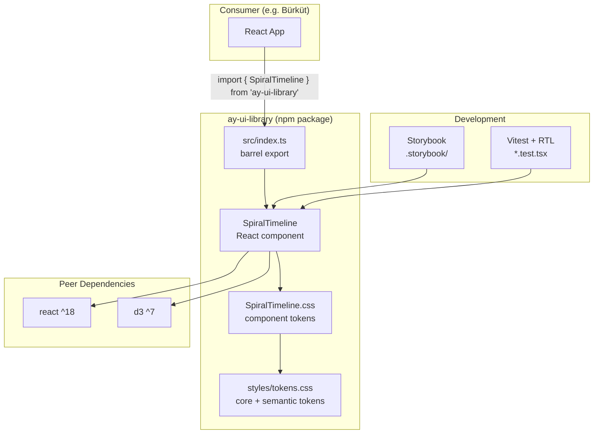
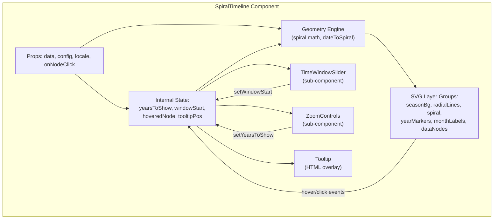
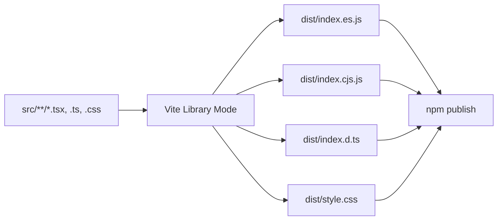

# Design Document: D3 Spiral Timeline Widget

## Overview

This design describes `ay-ui-library` ("🌜 Ay UI Library"), a standalone npm package containing the `SpiralTimeline` block component — a D3-powered spiral timeline visualization built as a React component. The package is fully independent from the Bürküt app: it has its own repository, build pipeline, Storybook, and test setup. Bürküt will consume it as an npm dependency in the future.

The `SpiralTimeline` component renders data items on an Archimedean spiral where each concentric ring represents one calendar year, months are arranged as 30° radial sectors, and data nodes are plotted at their calendar positions. It supports configurable zoom, fog/depth effects, ring color gradients, animated transitions, custom data-node shapes, a draggable time-window slider, and full theme/locale customization.

The existing `d3-timeline.html` prototype (~1240 lines) serves as the reference implementation. This design extracts that logic into a clean React component with proper TypeScript interfaces, CSS custom property theming, and a library-mode build pipeline.

### Key Design Decisions

1. **Standalone package, not a Bürküt module** — The package has zero imports from Bürküt. Data, callbacks, and locale are passed via props. This makes the component portable to any React project.
2. **D3 for math only, React owns the DOM** — D3 is used for scales, color interpolators, geometry calculations, and data joins within a single `<svg>` element managed via a ref. D3 does not create DOM outside the SVG.
3. **Vite library mode for build** — Produces ESM + CJS bundles with `.d.ts` declarations. D3 and React are externalized as peer dependencies.
4. **CSS custom properties for theming** — Follows the same three-tier token architecture as Bürküt (core → semantic → component), enabling theme switching via `data-theme` attribute or CSS variable overrides.
5. **Blocks architecture** — Components live in `src/blocks/{Name}/` with co-located `.tsx`, `.css`, `.test.tsx`, `.stories.tsx` files. A barrel `src/index.ts` re-exports the public API.

## Architecture

### System Context



### Component Internal Architecture



### Data Flow

1. Consumer passes `data` (array of `DataNode`) and optional `config` / `locale` / `onNodeClick` props
2. Component merges `config` with `DEFAULT_CONFIG` defaults
3. Internal state tracks `yearsToShow` and `windowStart` (the visible time window)
4. Geometry engine computes spiral coordinates: `dateToSpiral(date)` → `{ x, y, angle, radius }`
5. D3 data joins render SVG elements with enter/update/exit transitions
6. User interactions (drag slider, zoom buttons, mouse wheel, hover, click) update state → trigger re-render cycle
7. `onNodeClick` callback fires on data node click, passing the node data and mouse event to the consumer


## Components and Interfaces

### Package Structure

```
ay-ui-library/
├── src/
│   ├── index.ts                              # Barrel: re-exports all blocks + types
│   ├── blocks/
│   │   └── SpiralTimeline/
│   │       ├── SpiralTimeline.tsx             # Main component
│   │       ├── SpiralTimeline.css             # Component-level CSS custom properties
│   │       ├── SpiralTimeline.test.tsx         # Vitest + RTL tests
│   │       ├── SpiralTimeline.stories.tsx      # Storybook stories
│   │       ├── SpiralTimeline.mdx             # MDX documentation page
│   │       ├── README.md                      # Component documentation
│   │       ├── types.ts                       # DataNode, SpiralTimelineConfig, SpiralTimelineProps
│   │       ├── defaults.ts                    # DEFAULT_CONFIG constant
│   │       ├── geometry.ts                    # Spiral math: dateToSpiral, yearMarkerPos, etc.
│   │       ├── shapes.ts                      # drawShape: renders circle/square/triangle/star/pentagon
│   │       ├── colors.ts                      # getYearColor, getSeasonColor, colorInterpolator lookup
│   │       ├── TimeWindowSlider.tsx           # Bottom slider sub-component
│   │       └── ZoomControls.tsx               # Top-right zoom panel sub-component
│   └── styles/
│       └── tokens.css                         # Core + semantic design tokens (mirrors Bürküt's global.css)
├── .storybook/
│   ├── main.ts                               # Storybook config: discovers src/blocks/**/*.stories.tsx
│   ├── preview.ts                            # Loads tokens.css, configures viewports/themes
│   └── preview-head.html                     # Injects token CSS for Storybook iframe
├── .kiro/
│   └── steering/
│       ├── tech.md
│       ├── structure.md
│       ├── product.md
│       └── component-workflow.md
├── package.json
├── tsconfig.json
├── vite.config.ts                            # Vite library mode build
├── biome.json
├── README.md                                 # Package-level documentation
├── CHANGELOG.md
└── LICENSE
```

### Component Decomposition

#### `SpiralTimeline` (main component)

The root component that owns state and orchestrates rendering. It:
- Merges user `config` with `DEFAULT_CONFIG`
- Manages `yearsToShow`, `windowStart`, `hoveredNode`, `tooltipPos` state
- Creates persistent SVG layer groups on mount (one-time init via `useEffect`)
- Runs the main D3 rendering effect when data/state changes
- Renders the HTML tooltip overlay, `TimeWindowSlider`, and `ZoomControls`
- Attaches `ResizeObserver` for responsive sizing (debounced at 200ms)
- Cleans up D3 selections and event listeners on unmount

#### `TimeWindowSlider` (sub-component)

A controlled component rendered at the bottom of the container:
- Receives `dataMinYear`, `dataMaxYear`, `yearsToShow`, `windowStart`, `labels`, and `onWindowStartChange` as props
- Renders a horizontal track with year tick marks
- Renders a draggable window indicator (mouse drag + track click)
- Displays current range label and summary info

#### `ZoomControls` (sub-component)

A controlled component rendered at the top-right:
- Receives `yearsToShow`, `totalDataYears`, `zoomConfig`, `labels`, `onYearsToShowChange` as props
- Conditionally renders +/− buttons (when `zoom.buttons` is true)
- Conditionally renders a range slider (when `zoom.slider` is true)
- Displays current zoom value

#### Utility Modules

| Module | Responsibility |
|--------|---------------|
| `geometry.ts` | `dateToSpiral(date, oldestYear, radiusIncrement)` → `{ x, y, angle, radius }`, `yearMarkerPos(year, ...)`, `spiralPointAt(absYear, ...)` |
| `shapes.ts` | `drawShape(selection, shape, size, color)` — appends SVG shape to a D3 selection |
| `colors.ts` | `getColorInterpolator(scale)`, `getYearColor(offset, interpolator)`, `getSeasonColor(monthIndex)` |
| `defaults.ts` | `DEFAULT_CONFIG` constant with all default values |
| `types.ts` | All public TypeScript interfaces and types |


## Data Models

### TypeScript Interfaces

```typescript
// ── Data Node ──────────────────────────────────────────────

/** A single data item to be plotted on the spiral. */
export interface DataNode {
  /** Calendar date for positioning on the spiral. */
  date: Date;
  /** Type key — maps to a TypeConfig entry for color/shape. */
  type: string;
  /** Display title shown in tooltip and aria-label. */
  title: string;
  /** Content summary shown in tooltip body. */
  content: string;
  /** Optional stable identifier for keying during data updates. */
  id?: string;
  /** Optional pass-through for additional front-matter fields. */
  metadata?: Record<string, unknown>;
}

// ── Type Configuration ─────────────────────────────────────

export type NodeShape = "circle" | "square" | "triangle" | "star" | "pentagon";

/** Visual mapping for a data-node type. */
export interface TypeConfig {
  /** Unique key matching DataNode.type. */
  key: string;
  /** CSS color string for the node stroke. */
  color: string;
  /** SVG shape to render. */
  shape: NodeShape;
}

// ── Zoom Configuration ─────────────────────────────────────

export interface ZoomConfig {
  /** Zoom speed multiplier (default: 1.0). */
  speed: number;
  /** Enable mouse wheel zoom on SVG area (default: true). */
  mouseWheel: boolean;
  /** Show zoom range slider (default: true). */
  slider: boolean;
  /** Show +/− zoom buttons (default: true). */
  buttons: boolean;
}

// ── Fog Configuration ──────────────────────────────────────

export interface FogConfig {
  /** Enable fog/depth effect on outer rings (default: true). */
  enabled: boolean;
  /** Ring index where fog begins (default: 2). */
  startRing: number;
  /** Fog intensity 0–1 (default: 0.8). */
  intensity: number;
}

// ── Ring Gradient Configuration ────────────────────────────

export type ColorScale = "spectral" | "rainbow" | "cool" | "warm";
export type GradientTarget = "grid" | "labels";

export interface RingGradientConfig {
  /** Enable ring color gradient (default: true). */
  enabled: boolean;
  /** D3 color interpolator name (default: "spectral"). */
  scale: ColorScale;
  /** Which elements receive the gradient (default: ["grid", "labels"]). */
  applyTo: GradientTarget[];
}

// ── Animation Configuration ────────────────────────────────

export interface AnimationConfig {
  /** Enable animated transitions (default: true). */
  enabled: boolean;
  /** Transition duration in milliseconds (default: 400). */
  duration: number;
}

// ── Year Label Position ────────────────────────────────────

export type YearLabelPosition =
  | "top" | "right" | "bottom" | "left"
  | "top-right" | "top-left" | "bottom-right" | "bottom-left";

// ── Localized Labels ───────────────────────────────────────

/** Localized UI strings for controls and summary text. */
export interface SpiralTimelineLabels {
  /** Zoom control heading (default: "Years to Show"). */
  zoomTitle?: string;
  /** Zoom slider label (default: "Year Count"). */
  zoomSliderLabel?: string;
  /** Zoom value template, {count} and {start}/{end} are replaced (default: "{count} years shown ({start}–{end})"). */
  zoomValueTemplate?: string;
  /** Time window heading (default: "Time Window"). */
  timeWindowTitle?: string;
  /** Summary template for ring count (default: "Spiral: {rings} rings + tail"). */
  ringSummaryTemplate?: string;
  /** Summary template for total data years (default: "Total data: {years} years"). */
  totalYearsTemplate?: string;
}

// ── Main Config Object ─────────────────────────────────────

export interface SpiralTimelineConfig {
  /** Number of visible year rings (default: 2). */
  yearsToShow?: number;
  /** Angle position for year labels on ring boundaries (default: "top"). */
  yearLabelPosition?: YearLabelPosition;
  /** Zoom behavior configuration. */
  zoom?: Partial<ZoomConfig>;
  /** Fog/depth effect configuration. */
  fog?: Partial<FogConfig>;
  /** Ring color gradient configuration. */
  ringGradient?: Partial<RingGradientConfig>;
  /** Transition animation configuration. */
  animations?: Partial<AnimationConfig>;
  /** Data-node type → visual mapping. */
  types?: TypeConfig[];
  /** Callback invoked when a data node is clicked. */
  onNodeClick?: (node: DataNode, event: MouseEvent) => void;
  /** Localized UI label overrides. */
  labels?: Partial<SpiralTimelineLabels>;
}

// ── Component Props ────────────────────────────────────────

export interface SpiralTimelineProps {
  /** Array of data items to plot on the spiral. */
  data: DataNode[];
  /** Configuration object (all fields optional, defaults applied). */
  config?: SpiralTimelineConfig;
  /** Locale string for month labels and date formatting (default: browser locale). */
  locale?: string;
  /** Additional CSS class name for the root container. */
  className?: string;
}
```

### Default Configuration

```typescript
export const DEFAULT_CONFIG: Required<
  Omit<SpiralTimelineConfig, "onNodeClick" | "labels">
> & {
  labels: Required<SpiralTimelineLabels>;
} = {
  yearsToShow: 2,
  yearLabelPosition: "top",
  zoom: {
    speed: 1.0,
    mouseWheel: true,
    slider: true,
    buttons: true,
  },
  fog: {
    enabled: true,
    startRing: 2,
    intensity: 0.8,
  },
  ringGradient: {
    enabled: true,
    scale: "spectral",
    applyTo: ["grid", "labels"],
  },
  animations: {
    enabled: true,
    duration: 400,
  },
  types: [
    { key: "default", color: "#38bdf8", shape: "circle" },
  ],
  labels: {
    zoomTitle: "Years to Show",
    zoomSliderLabel: "Year Count",
    zoomValueTemplate: "{count} years shown ({start}–{end})",
    timeWindowTitle: "Time Window",
    ringSummaryTemplate: "Spiral: {rings} rings + tail",
    totalYearsTemplate: "Total data: {years} years",
  },
};
```

### Data Interface Compatibility with Bürküt

The `DataNode` interface is designed to be compatible with Bürküt's `ContentEntry` shape. A minimal adapter maps content entries to data nodes:

```typescript
// Future adapter in Bürküt (not part of ay-ui-library)
function contentEntryToDataNode(entry: ContentEntry, body: string): DataNode {
  return {
    date: new Date(entry.start ?? ""),
    type: entry.group ?? "default",
    title: entry.title ?? entry.id,
    content: body.slice(0, 200),
    id: entry.id,
    metadata: { tags: entry.tags, location: entry.location },
  };
}
```

The `metadata` field is a `Record<string, unknown>` escape hatch that allows passing through any additional front-matter fields without breaking the interface contract.

### CSS Custom Property Architecture

The package ships its own `styles/tokens.css` that mirrors the Bürküt semantic token names. This ensures components render correctly both in Storybook (standalone) and when consumed by Bürküt (where the app's `global.css` provides the actual token values).

#### Token Tiers in the Package

| Tier | Location | Example | Purpose |
|------|----------|---------|---------|
| Core | `styles/tokens.css :root` | `--color-gray-500`, `--space-2`, `--radius-md` | Raw design values |
| Semantic | `styles/tokens.css :root` + `[data-theme="dark"]` | `--color-bg-surface`, `--color-text-primary`, `--color-primary` | Theme-aware mappings |
| Component | `SpiralTimeline.css` | `--spiral-bg`, `--spiral-tooltip-bg`, `--spiral-control-bg` | Component-specific overrides |

#### Component-Level Tokens (SpiralTimeline.css)

```css
.spiral-timeline {
  /* ── Component tokens mapped to semantic tokens ── */
  --spiral-bg: var(--color-bg-body);
  --spiral-surface: var(--color-bg-surface);
  --spiral-text: var(--color-text-primary);
  --spiral-text-secondary: var(--color-text-secondary);
  --spiral-primary: var(--color-primary);
  --spiral-border: var(--color-border-default);
  --spiral-tooltip-bg: var(--color-bg-surface);
  --spiral-tooltip-border: var(--color-border-default);
  --spiral-control-bg: var(--color-bg-surface);
  --spiral-control-border: var(--color-border-default);
}
```

Consumers can override any `--spiral-*` token without touching the semantic layer:

```css
.my-custom-wrapper .spiral-timeline {
  --spiral-primary: hotpink;
  --spiral-tooltip-bg: #1a1a2e;
}
```

### SVG Layer Architecture

The SVG rendering uses persistent layer groups created once on mount, with D3 data joins for efficient updates:

```
<svg>
  <g class="root" transform="translate(cx, cy)">
    <g class="layer-season-bg">      <!-- seasonal background wedges (static) -->
    <g class="layer-radial-lines">    <!-- 12 month grid lines (static) -->
    <g class="layer-spiral">          <!-- spiral path segments (data-joined) -->
    <g class="layer-year-markers">    <!-- year dots + labels (data-joined) -->
    <g class="layer-month-labels">    <!-- month text labels (static) -->
    <g class="layer-data-nodes">      <!-- data node shapes (data-joined) -->
  </g>
</svg>
```

Static layers (season background, radial lines, month labels) are drawn once on mount and only redrawn on container resize. Data-joined layers (spiral segments, year markers, data nodes) use D3 enter/update/exit with transitions keyed by absolute calendar position, enabling smooth animations when the time window shifts.

### Geometry Engine

The spiral geometry maps calendar dates to polar coordinates:

```
angle = -π/2 - (yearDiff + dayOfYear/365) × 2π
radius = (yearDiff + dayOfYear/365) × radiusIncrement
x = cos(angle) × radius
y = sin(angle) × radius
```

Where:
- `yearDiff = date.getFullYear() - oldestYear` (oldest year = windowStart − 1, the invisible center)
- `radiusIncrement = maxRadius / totalTurns`
- `maxRadius = min(containerWidth, containerHeight) × 0.4`
- January is at the 12-o'clock position (−π/2)

The geometry engine is extracted into `geometry.ts` as pure functions, making it independently testable without DOM dependencies.

### Build Pipeline



Vite library mode config:
- Entry: `src/index.ts`
- Externals: `react`, `react-dom`, `d3` (peer dependencies)
- Formats: `es`, `cjs`
- CSS: extracted to `dist/style.css`
- TypeScript declarations generated via `vite-plugin-dts`

`package.json` entry points:
```json
{
  "main": "dist/index.cjs.js",
  "module": "dist/index.es.js",
  "types": "dist/index.d.ts",
  "files": ["dist"],
  "peerDependencies": {
    "react": "^18.0.0",
    "react-dom": "^18.0.0",
    "d3": "^7.0.0"
  }
}
```


## Correctness Properties

*A property is a characteristic or behavior that should hold true across all valid executions of a system — essentially, a formal statement about what the system should do. Properties serve as the bridge between human-readable specifications and machine-verifiable correctness guarantees.*

### Property 1: Valid input produces complete SVG structure

*For any* non-empty array of valid `DataNode` objects (each with a valid `Date`, non-empty `type`, `title`, and `content`) and *for any* valid `SpiralTimelineConfig` object, rendering the `SpiralTimeline` component should produce an SVG element containing all six layer groups: `layer-season-bg`, `layer-radial-lines`, `layer-spiral`, `layer-year-markers`, `layer-month-labels`, and `layer-data-nodes`.

**Validates: Requirements 3.1, 3.2, 3.4**

### Property 2: Angle mapping — January at 12 o'clock, one year per rotation

*For any* valid `Date`, the `dateToSpiral` function should map January 1 to an angle of −π/2 (12 o'clock position), and a date exactly one year later should differ by exactly 2π radians (one full rotation). Formally: `angle(date) = -π/2 - (yearDiff + dayOfYear/365) × 2π`.

**Validates: Requirements 5.1**

### Property 3: Radial distance monotonicity

*For any* two dates `d1` and `d2` where `d1` is more recent than `d2` (i.e., `d1 > d2`), the spiral radius of `d1` should be strictly less than the spiral radius of `d2`. More recent dates are closer to the center.

**Validates: Requirements 5.2**

### Property 4: Year label position angle mapping

*For any* `yearLabelPosition` value from the set `{top, right, bottom, left, top-right, top-left, bottom-right, bottom-left}`, the computed marker angle should match the expected radian value: `top → -π/2`, `right → 0`, `bottom → π/2`, `left → π`, `top-right → -π/4`, `top-left → -3π/4`, `bottom-right → π/4`, `bottom-left → 3π/4`.

**Validates: Requirements 4.2, 5.5**

### Property 5: Node click callback receives correct data

*For any* `DataNode` in the data array and *for any* `onNodeClick` callback, clicking that node's SVG element should invoke the callback exactly once with the original `DataNode` object as the first argument.

**Validates: Requirements 4.8, 8.3**

### Property 6: Time window slider proportional width and label

*For any* `yearsToShow` (1 ≤ yearsToShow ≤ totalDataYears) and *for any* `windowStart` within the valid range, the time window indicator width percentage should equal `(yearsToShow / totalDataYears) × 100`, and the window label should display `"{windowStart}–{windowEnd}"` (or just `"{windowStart}"` when `windowStart === windowEnd`).

**Validates: Requirements 6.2, 6.5**

### Property 7: Zoom clamping invariant

*For any* sequence of zoom operations (button clicks, slider changes, mouse wheel events), the invariant `1 ≤ yearsToShow ≤ totalDataYears` AND `dataMinYear ≤ windowStart` AND `windowStart + yearsToShow - 1 ≤ dataMaxYear` must hold after every operation.

**Validates: Requirements 7.1, 7.4**

### Property 8: Tooltip displays node information on hover

*For any* rendered `DataNode`, hovering over its SVG element should make the tooltip visible and its content should include the node's `title`, `content`, and a date string matching `date.toLocaleDateString(locale, { year: "numeric", month: "long", day: "numeric" })`.

**Validates: Requirements 8.1**

### Property 9: Data node accessibility attributes

*For any* rendered `DataNode`, its SVG group element should have `role="button"`, `tabindex="0"`, and an `aria-label` attribute containing both the node's `title` and a formatted date string.

**Validates: Requirements 8.4**

### Property 10: Fog opacity scaling

*For any* ring index and fog configuration where `fog.enabled` is true: rings at index ≤ `fog.startRing` should have opacity 1, and rings at index > `fog.startRing` should have opacity < 1, decreasing proportionally with distance. When `fog.enabled` is false, *all* rings should have uniform opacity regardless of ring index.

**Validates: Requirements 9.1, 9.4**

### Property 11: Ring gradient color interpolation

*For any* `ColorScale` value (`spectral`, `rainbow`, `cool`, `warm`) and *for any* ring offset, the `getYearColor` function should return the same value as the corresponding D3 color interpolator evaluated at `(offset % 10) / 10`. When `ringGradient.enabled` is false, spiral segments should use a uniform fallback color.

**Validates: Requirements 9.2, 9.3**

### Property 12: Locale-aware month labels and date formatting

*For any* supported locale string (e.g., `"tr"`, `"en"`, `"zh"`), the 12 month labels rendered by the component should match the abbreviated month names produced by `Intl.DateTimeFormat(locale, { month: "short" })` for months 0–11, and tooltip dates should match `toLocaleDateString(locale, ...)`.

**Validates: Requirements 11.1, 11.4**

### Property 13: Responsive radius computation

*For any* container dimensions `(width, height)` where both are > 0, the computed `maxRadius` should equal `Math.min(width, height) × 0.4`. The spiral should never overflow its container.

**Validates: Requirements 12.1**


## Error Handling

### Empty Data

When `data` is an empty array, the component renders the SVG with static layers (season background, radial lines, month labels) but no spiral segments, year markers, or data nodes. The time window slider displays "0 years" and the zoom controls are disabled. No errors are thrown.

### Invalid Dates

`DataNode` entries with invalid `Date` objects (e.g., `new Date("invalid")`) are filtered out during the data processing step before spiral coordinate computation. A `console.warn` is emitted for each filtered entry in development mode.

### Missing Type Config

When a `DataNode.type` does not match any entry in `config.types`, the component falls back to the first entry in the `types` array (or the default type `{ key: "default", color: "#38bdf8", shape: "circle" }` if `types` is empty).

### Container Size Zero

If the container has zero width or height (e.g., hidden via CSS), the component skips rendering and waits for a resize event. The `ResizeObserver` will trigger a re-render when the container becomes visible.

### Config Merging

All `config` fields are optional. The component deep-merges the provided config with `DEFAULT_CONFIG` using a shallow merge per sub-object (e.g., `{ ...DEFAULT_CONFIG.zoom, ...config.zoom }`). Missing fields always fall back to defaults.

### D3 Cleanup

On unmount, the component:
1. Removes all D3 selections from the SVG
2. Disconnects the `ResizeObserver`
3. Removes document-level `mousemove`/`mouseup` listeners (used by the time window slider drag)
4. Cancels any in-flight D3 transitions via `selection.interrupt()`

### Keyboard Accessibility

Data nodes with `role="button"` and `tabindex="0"` support keyboard navigation. Pressing Enter or Space on a focused data node triggers the `onNodeClick` callback. The tooltip is shown on focus and hidden on blur.

## Testing Strategy

### Testing Stack

| Tool | Purpose |
|------|---------|
| Vitest | Test runner (single-pass via `vitest run`) |
| @testing-library/react | Component rendering and DOM queries |
| jsdom | Browser environment simulation |
| fast-check | Property-based testing library |

### Property-Based Testing Configuration

- Library: **fast-check** (the standard PBT library for TypeScript/JavaScript)
- Minimum iterations: **100 per property test**
- Each property test references its design document property via a tag comment
- Tag format: `// Feature: d3-timeline-widget, Property {N}: {title}`

Each correctness property from the design document is implemented as a single `fc.assert(fc.property(...))` test. Generators produce random `DataNode` arrays, `SpiralTimelineConfig` objects, locale strings, and container dimensions.

### Unit Testing

Unit tests complement property tests by covering:
- Specific examples (e.g., rendering with sample data from the prototype)
- Edge cases (empty data, single data point, all dates in the same year)
- Error conditions (invalid dates, missing type config, zero-size container)
- Integration points (tooltip show/hide, zoom button clicks, slider drag)
- Unmount cleanup (D3 selections removed, listeners detached)
- Storybook interaction tests (hover, click, drag) via `@storybook/test` play functions

### Test Organization

```
src/blocks/SpiralTimeline/
├── SpiralTimeline.test.tsx        # Component-level unit + property tests
├── geometry.test.ts               # Pure function tests for spiral math
├── colors.test.ts                 # Pure function tests for color interpolation
└── shapes.test.ts                 # Pure function tests for SVG shape generation
```

Pure utility modules (`geometry.ts`, `colors.ts`, `shapes.ts`) are tested independently with property-based tests since they have no DOM dependencies. Component-level tests use `@testing-library/react` with `jsdom` for rendering and interaction.

### Property Test → Design Property Mapping

| Test File | Property | Design Property |
|-----------|----------|-----------------|
| `geometry.test.ts` | Angle mapping | Property 2 |
| `geometry.test.ts` | Radial monotonicity | Property 3 |
| `geometry.test.ts` | Year label position angle | Property 4 |
| `geometry.test.ts` | Responsive radius | Property 13 |
| `colors.test.ts` | Ring gradient interpolation | Property 11 |
| `colors.test.ts` | Fog opacity scaling | Property 10 |
| `SpiralTimeline.test.tsx` | Valid input → complete SVG | Property 1 |
| `SpiralTimeline.test.tsx` | Node click callback | Property 5 |
| `SpiralTimeline.test.tsx` | Time window proportional width | Property 6 |
| `SpiralTimeline.test.tsx` | Zoom clamping invariant | Property 7 |
| `SpiralTimeline.test.tsx` | Tooltip content on hover | Property 8 |
| `SpiralTimeline.test.tsx` | ARIA accessibility attributes | Property 9 |
| `SpiralTimeline.test.tsx` | Locale-aware labels | Property 12 |

### Quality Gates

All tests must pass before merge:
```bash
npx tsc --noEmit        # zero type errors
npx biome check src     # zero diagnostics
npm test                # all tests pass (vitest run)
npm run build           # production build succeeds
```
