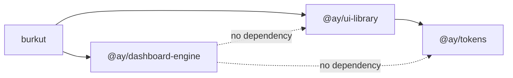

# Design Document

## Overview

This design extracts `@ay/dashboard-engine` — the grid, `WidgetShell`, the
widget-type registry, an options-schema system, and pluggable persistence — out
of `apps/burkut`, and moves the four purified widgets into `@ay/ui-library` as
Blocks (`TreeList`, `MarkdownViewer`, `GeoMap`, `LinearTimeline`). Bürküt becomes
a consumer of both packages instead of the sole owner of this code.

Four ideas carry the design:

1. **The registry already does generic prop-wiring; this phase adds a schema on
   top of it.** `WidgetTypeDefinition.buildProps(ctx, config)` already replaced
   the switch statement the roadmap describes (verified against
   `apps/burkut/src/components/WidgetGrid/widgetTypeRegistry.ts` — see
   [Findings](#findings-from-reading-the-current-sources)). What's missing is a
   declarative `optionsSchema` next to `buildProps`, which both generates the
   config panel and backs a Standard-Schema validator for the untrusted-boundary
   check in Requirement 4.
2. **`WidgetShell` is a new component, not a renamed `WidgetHeader`.**
   `WidgetHeader` is impure (`useTranslation()`, imports `config` directly) and
   is a sibling of the body today. `WidgetShell` owns header + error boundary +
   body as one unit and is purity-contract-clean: labels and config in, JSX out.
   `WidgetHeader` is deleted, not moved.
3. **One field-kind enum, six controls, zero new dependencies.** Every field the
   four existing hand-written config panels expose reduces to six kinds:
   `string`, `number`, `boolean`, `stringArray`, `enum`, `dateString`. The engine
   implements validators for exactly these six as Standard-Schema-compliant
   objects — no `zod` dependency, matching Requirement 5.
4. **Generalize the two existing middlewares by parameterizing, not rewriting.**
   `persistenceMiddleware.ts` and `broadcastMiddleware.ts` already have the right
   shape (debounce+retry+hydrate; broadcast+merge). The engine's versions take a
   `PersistenceAdapter`/channel name and a state-shape type parameter instead of
   hardcoding `Dashboard[]`; Bürküt's versions become thin call sites.

### Findings from reading the current sources

**The roadmap's "switch on `widgetTypeId`" is already gone.** `WidgetGrid.tsx`
calls `getWidgetType(instance.widgetTypeId).buildProps(ctx, instance.config)` and
renders `<WidgetComponent {...props} />` generically; `ConfigPanel =
typeDef?.configPanel` resolves the config panel generically too. This spec does
not redo that work — see the requirements doc's "Correction to the roadmap's
framing." What Phase 2 actually adds on top: an `optionsSchema` so config panels
are generated instead of hand-written, and validation at the layout-load
boundary.

**Two widget registries exist; one is dead.** `widgetTypeRegistry.ts` is live
(used by `WidgetGrid`, `WidgetPicker`, `dashboardStore`). `widgetRegistry.ts`
(the `WIDGET_REGISTRY` array + `WIDGET_IDS`) is consumed only by
`WidgetVisibilityMenu`, `useLayoutPersistence`, and their own test files —
`WidgetVisibilityMenu` is never imported by `App.tsx` or anywhere else in
non-test code (grep confirms this). Both are pre-dashboard-store leftovers from
the earlier `react-grid-layout-widgets` migration and are dead. Requirement 8.6
deletes them rather than migrating them; deleting them also removes
`bugCondition.exploration.test.tsx`, which exists specifically to document a bug
in the now-dead `useLayoutPersistence` dual-instance pattern.

**`WidgetHeader` is impure and out of Phase 1's stated scope, but back in scope
here.** Phase 1 explicitly left `WidgetShell`/`WidgetHeader` untouched
("Out of scope: `WidgetShell`, error boundaries"). Phase 2's Requirement 1 puts
`WidgetShell` in scope, so `WidgetHeader`'s `useTranslation()` call and direct
`config` import get resolved now, folded into the new component instead of
inherited by it.

**`main.tsx` imports three third-party CSS files that belong to the moving
widgets:** `leaflet/dist/leaflet.css` (GeoMap), and
`TimelinePanel.tsx` already self-imports `vis-timeline/styles/vis-timeline-graph2d.min.css`.
`react-grid-layout/css/styles.css` and `react-resizable/css/styles.css` belong to
the *grid*, not a widget, so they move to the dashboard-engine's own entry point.
Leaflet's CSS has no natural component-level import point in Leaflet's own
package, so `GeoMap.tsx` gains a self-import of `leaflet/dist/leaflet.css`
(matching the `vis-timeline` pattern already used by `TimelinePanel`), and
Bürküt's `main.tsx` drops both the Leaflet and react-grid-layout/react-resizable
imports.

## Architecture

### Target package layout

```
packages/
├── dashboard-engine/            # NEW — @ay/dashboard-engine, publishable
│   ├── src/
│   │   ├── index.ts             # barrel
│   │   ├── WidgetShell/
│   │   │   ├── WidgetShell.tsx
│   │   │   ├── WidgetErrorBoundary.tsx
│   │   │   ├── WidgetShell.css
│   │   │   └── WidgetShell.test.tsx
│   │   ├── DashboardGrid/
│   │   │   ├── DashboardGrid.tsx      # generalized WidgetGrid
│   │   │   ├── DashboardGrid.css
│   │   │   └── DashboardGrid.test.tsx
│   │   ├── registry/
│   │   │   ├── createWidgetRegistry.ts
│   │   │   ├── types.ts               # WidgetTypeDefinition, WidgetRenderContext
│   │   │   └── createWidgetRegistry.test.ts
│   │   ├── schema/
│   │   │   ├── fieldKinds.ts          # the 6 Standard-Schema field validators
│   │   │   ├── deriveValidator.ts     # OptionsSchema -> StandardSchemaV1
│   │   │   ├── validateWidgetConfig.ts
│   │   │   ├── types.ts               # OptionsSchema, FieldDescriptor
│   │   │   └── *.property.test.ts
│   │   ├── ConfigPanel/
│   │   │   ├── GeneratedConfigPanel.tsx
│   │   │   ├── fields/                # one control component per field kind
│   │   │   └── GeneratedConfigPanel.test.tsx
│   │   ├── persistence/
│   │   │   ├── createPersistenceMiddleware.ts
│   │   │   ├── createBroadcastMiddleware.ts
│   │   │   ├── createMigrationRunner.ts
│   │   │   ├── types.ts               # PersistenceAdapter
│   │   │   └── *.test.ts
│   │   └── tests/setup.ts
│   ├── package.json
│   ├── vite.config.ts
│   ├── tsconfig.json
│   └── biome.json
├── ui-library/
│   └── src/blocks/
│       ├── TreeList/            # was apps/burkut/src/components/Sidebar
│       ├── MarkdownViewer/      # was .../ContentPanel
│       ├── GeoMap/              # was .../MapPanel
│       └── LinearTimeline/      # was .../TimelinePanel
└── ...

apps/burkut/src/
├── components/
│   ├── WidgetGrid/
│   │   ├── WidgetGrid.tsx           # thin: assembles context, calls DashboardGrid
│   │   ├── widgetTypeRegistry.ts    # thin: createWidgetRegistry() + 4 registrations
│   │   └── configPanels/            # DELETED — generated panel replaces these
│   ├── WidgetHeader/                 # DELETED — absorbed into WidgetShell
│   └── WidgetVisibilityMenu/         # DELETED — dead code
├── hooks/
│   └── useLayoutPersistence.ts       # DELETED — dead code (see Findings)
└── stores/
    ├── dashboardStore.ts              # unchanged shape; persistence/broadcast
    ├── persistenceMiddleware.ts       # thin: createPersistenceMiddleware() + adapter
    ├── broadcastMiddleware.ts         # thin: createBroadcastMiddleware() call
    └── layoutMigrations.ts            # unchanged content, passed into createMigrationRunner()
```

### Dependency graph after this phase



`@ay/dashboard-engine` has no workspace dependency on `@ay/ui-library` or
`@ay/tokens` — it's a second, independent root alongside `@ay/tokens`, joined
only at the app. This matches Requirement 8.7 and Requirement 9.3, and is why
`WidgetTypeDefinition.component` is typed as `ComponentType<any>` (already true
today) rather than importing a Block type from `@ay/ui-library`.

## Components and Interfaces

### 1. `WidgetShell`

Replaces the current sibling arrangement (`<WidgetHeader/>` then a separate
`<div className="widget-item__body">`) with one owning component.

```typescript
// packages/dashboard-engine/src/WidgetShell/WidgetShell.tsx

export interface WidgetShellLabels {
  configAriaLabel?: string;
  duplicateAriaLabel?: string;
  removeAriaLabel?: string;
  closeAriaLabel?: string;
  retryLabel?: string;
  /** Shown in the error state; app supplies the message, shell supplies the layout. */
  errorFallbackMessage?: string;
}

export interface WidgetShellProps {
  title: string;
  labels?: WidgetShellLabels;
  draggable: boolean;
  onConfigClick?: () => void;
  onDuplicateClick?: () => void;
  onRemoveClick?: () => void;
  onClose?: () => void;
  /** Rendered when the instance has no data worth showing (e.g. empty tree). */
  isEmpty?: boolean;
  emptyState?: ReactNode;
  children: ReactNode;
}

export function WidgetShell(props: WidgetShellProps): JSX.Element;
```

Internally: a class-based `WidgetErrorBoundary` (function components cannot
implement `componentDidCatch`) wraps `children`. On catch, it renders an error
state with `title`, `labels.errorFallbackMessage` (default supplied by the
engine, overridable), and a retry button that calls `this.setState({ hasError:
false })`, re-mounting `children` — satisfying Requirement 1.7 ("independently
recoverable... without requiring other widgets to re-render") because the error
boundary's state is local to that one `WidgetShell` instance; sibling shells
never re-render.

```typescript
// WidgetErrorBoundary.tsx
interface State { hasError: boolean }
class WidgetErrorBoundary extends Component<Props, State> {
  state: State = { hasError: false };
  static getDerivedStateFromError() { return { hasError: true }; }
  componentDidCatch(error: Error) { this.props.onError?.(error); }
  private retry = () => this.setState({ hasError: false });
  render() {
    if (this.state.hasError) return this.props.renderError(this.retry);
    return this.props.children;
  }
}
```

Suspense (Requirement 1.5) is the app's responsibility to trigger (e.g. a widget
whose `buildProps` reads from a suspending resource) — `WidgetShell` simply
places `<Suspense fallback={props.loadingState}>` around `children` when a
`loadingState` prop is supplied, so the shell provides the boundary without
deciding what "loading" means for any given widget.

`WidgetShell` calls no `useTranslation()`/`useTheme()` — every string arrives via
`labels`, matching Requirement 1.4. Bürküt's `WidgetGrid.tsx` passes `t(...)`
results into `labels` the same way `buildProps` already passes `t(...)` results
into widget `config.labels` today.

### 2. Options schema and Standard-Schema field kinds

```typescript
// packages/dashboard-engine/src/schema/types.ts

export type FieldKind = "string" | "number" | "boolean" | "stringArray" | "enum" | "dateString";

interface BaseField<K extends FieldKind, V> {
  key: string;
  kind: K;
  label: string;
  description?: string;
  default: V;
}

export type StringField = BaseField<"string", string> & { placeholder?: string };
export type NumberField = BaseField<"number", number | null> & { min?: number; max?: number; step?: number };
export type BooleanField = BaseField<"boolean", boolean>;
export type StringArrayField = BaseField<"stringArray", string[]> & { itemPlaceholder?: string };
export type EnumField<T extends string = string> = BaseField<"enum", T> & { options: readonly T[] };
export type DateStringField = BaseField<"dateString", string | null>;

export type FieldDescriptor =
  | StringField | NumberField | BooleanField | StringArrayField | EnumField | DateStringField;

export type OptionsSchema = readonly FieldDescriptor[];
```

Each field kind gets one Standard-Schema-compliant validator
(`packages/dashboard-engine/src/schema/fieldKinds.ts`), implementing exactly the
interface from `@standard-schema/spec`:

```typescript
import type { StandardSchemaV1 } from "@standard-schema/spec";

function stringField(): StandardSchemaV1<string> {
  return {
    "~standard": {
      version: 1,
      vendor: "@ay/dashboard-engine",
      validate(value) {
        if (typeof value === "string") return { value };
        return { issues: [{ message: "Expected string" }] };
      },
    },
  };
}
// numberField, booleanField, stringArrayField, enumField(options), dateStringField
// follow the same shape.
```

`deriveValidator.ts` maps an `OptionsSchema` to a single object-shaped
`StandardSchemaV1<Record<string, unknown>>` by running each field's validator
against `config[field.key]`, collecting issues with `path: [field.key]`, and
returning `{ value: mergedConfig }` on success — this is the function
Requirement 2.3 asks for. It only depends on `@standard-schema/spec`'s
*types*, not on any validator implementation, satisfying Requirement 5.1: an app
could pass a `zod`-backed `StandardSchemaV1` for one field's `default`/validate
pair without the engine caring, though none of Bürküt's four widget types need
to.

`@standard-schema/spec` (types-only, zero runtime) is added as the engine's only
new dependency for this requirement — see [package.json](#9-packagejson) below.

### 3. Generated config panel

Replaces the four hand-written panels with one generic renderer plus six field
controls.

```typescript
// packages/dashboard-engine/src/ConfigPanel/GeneratedConfigPanel.tsx

export interface GeneratedConfigPanelLabels {
  title: string;
  closeAriaLabel: string;
  addTagPlaceholder?: string;   // stringArray control
  removeTagAriaLabel?: (tag: string) => string;
}

export interface GeneratedConfigPanelProps {
  schema: OptionsSchema;
  config: Record<string, unknown>;
  labels: GeneratedConfigPanelLabels;
  onUpdate: (partial: Record<string, unknown>) => void;
  onClose: () => void;
}

export function GeneratedConfigPanel(props: GeneratedConfigPanelProps): JSX.Element;
```

It maps `schema` to one field control per descriptor
(`StringField`, `NumberField`, `BooleanField`, `StringArrayField`, `EnumField`,
`DateStringField` components in `ConfigPanel/fields/`), each a small
presentational component taking `{ field, value, onChange }`. This exactly
reproduces each existing hand-written panel's control choice (text input,
number input, checkbox, tag/chip editor, select, date input — Requirement 3.2).
No `useTranslation()` inside `GeneratedConfigPanel` or any field control — all
copy comes through `labels` and `field.label`/`field.description`, satisfying
Requirement 3.5.

`WidgetGrid.tsx` (Bürküt) replaces:

```typescript
const ConfigPanel = typeDef?.configPanel;
...
{configInstanceId === instance.instanceId && ConfigPanel && (
  <ConfigPanel instance={instance} onUpdate={...} onClose={...} />
)}
```

with:

```typescript
{configInstanceId === instance.instanceId && typeDef?.optionsSchema && (
  <GeneratedConfigPanel
    schema={typeDef.optionsSchema}
    config={instance.config}
    labels={{ title: t(`config.${instance.widgetTypeId}.title`), closeAriaLabel: t("widget.close"), ... }}
    onUpdate={(cfg) => updateWidgetConfig(dashboard.id, instance.instanceId, cfg as WidgetConfig)}
    onClose={() => setConfigInstanceId(null)}
  />
)}
```

`WidgetTypeDefinition.configPanel` (the `ComponentType<WidgetConfigPanelProps>`
field) is removed; `optionsSchema` replaces it. This satisfies Requirement 2.4
(no schema → no panel offered, since the `&&` guard is on `optionsSchema` now)
and Requirement 3.3/3.4.

**Bürküt's four `optionsSchema` declarations**, added to
`widgetTypeRegistry.ts`, cover every field the deleted panels exposed:

| Widget type | Fields (from deleted panel) | `optionsSchema` |
|---|---|---|
| `tree-list` | `tags: string[]`, `contentType: ContentType \| null` | `stringArray` for tags; `enum` (`all`/`markdown`/`image`/`video`/`audio`) for contentType, default `"all"` mapped to `null` at the adapter boundary (see below) |
| `markdown-viewer` | `pinnedItemId: string \| null` | `string`, default `""`, mapped to `null` when empty |
| `geo-map` | `boundingBox: {n,s,e,w} \| null`, `zoomLevel: number \| null` | four `number` fields (`boundingBoxNorth/South/East/West`) + one `number` (`zoomLevel`, min 0 max 20 step 1); assembled back into `MapWidgetConfig.boundingBox` in `buildProps`/an update adapter |
| `linear-timeline` | `startDate: string \| null`, `endDate: string \| null` | two `dateString` fields |

The `null`-vs-schema-default mismatch (schema fields need a concrete `default`,
domain types use `null` for "unset") is resolved by a small
`toSchemaConfig`/`fromSchemaConfig` pair per widget type living next to each
registration in `widgetTypeRegistry.ts` — this is Bürküt-specific domain
mapping, so it stays in Bürküt, not the engine, consistent with the adapters
already established in Phase 1 (`contentAdapters.ts`).

### 4. Validation at the untrusted boundary

```typescript
// packages/dashboard-engine/src/schema/validateWidgetConfig.ts

export function validateWidgetConfig<TDef extends { optionsSchema?: OptionsSchema; defaultConfig: unknown }>(
  typeDef: TDef,
  config: unknown,
): unknown {
  if (!typeDef.optionsSchema) return config;
  const validator = deriveValidator(typeDef.optionsSchema);
  const result = validator["~standard"].validate(config);
  if ("value" in result) return result.value;
  // Field-level fallback: keep valid fields, replace only the invalid ones
  // with their schema default, rather than discarding the whole instance.
  return mergeWithDefaults(typeDef.optionsSchema, config, typeDef.defaultConfig);
}
```

Called exactly once, in the persistence hydration path
(`createPersistenceMiddleware`'s `hydrateFromServer`/adapter `load()` path) —
per widget instance, right after `migrateLayoutDocument` runs and before
`_mergeSharedState` reaches the store. Not called on every render (Requirement
4.3): `WidgetGrid`'s render path still just reads `instance.config` directly.
Also called once more, synchronously, inside `updateWidgetConfig` right before
the generated panel's `onUpdate` writes to the store — this is "once per
explicit config update" from Requirement 4.3, not a render-path check.

Requirement 4.4 (dev-time registration check) is a `registerWidgetType` guard:
in non-production builds (`import.meta.env.DEV`), `createWidgetRegistry().register()`
runs each field's `default` through that same field's own validator and throws
synchronously if a schema is internally inconsistent (e.g. an `enum` default not
in `options`) — this catches authoring mistakes at startup, not at first render.

### 5. `PersistenceAdapter` and generic middleware factories

```typescript
// packages/dashboard-engine/src/persistence/types.ts

export interface PersistenceAdapter<T> {
  load(): Promise<T | null>;
  save(state: T): Promise<void>;
}

export interface CreatePersistenceMiddlewareOptions<T> {
  adapter: PersistenceAdapter<T>;
  currentVersion: number;
  migrations: Record<number, (state: T) => T>;
  /** ms to debounce save() calls after a state change (default 500, matches today). */
  debounceMs?: number;
  /** Extracts the persisted slice from full store state. */
  getPersistedSlice: (state: any) => T;
  /** Called once hydration resolves, to merge into the live store. */
  mergeHydratedState: (set: SetState, hydrated: T) => void;
}

export function createPersistenceMiddleware<T>(
  opts: CreatePersistenceMiddlewareOptions<T>,
): <S>(f: StateCreator<S>) => StateCreator<S>;
```

This is `apps/burkut/src/stores/persistenceMiddleware.ts`'s existing debounce
(500ms), retry-with-backoff (`[1000, 2000, 4000]`, 3 attempts, treat 404 as
"no endpoint, don't retry"), and hydrate-on-load logic, generalized over `T`
instead of hardcoded to `{ dashboards: Dashboard[] }`. The legacy-localStorage
migration (`migrateFromLocalStorage`) is Bürküt-specific (it knows about
`burkut-widget-layouts`/`burkut-widget-visibility` keys from a pre-dashboard-store
era) and stays in Bürküt's thin wrapper, run before calling into the engine's
hydration, exactly as it runs today before `hydrateFromServer`.

```typescript
// packages/dashboard-engine/src/persistence/createMigrationRunner.ts

export function createMigrationRunner<T>(
  currentVersion: number,
  migrations: Record<number, (state: T) => T>,
): (input: unknown, defaultState: T) => { version: number; state: T };
```

This generalizes `layoutMigrations.ts#migrateLayoutDocument`'s loop exactly
(unversioned input → version 1, apply migrations in sequence, stop at the first
missing migration or at `currentVersion`). Bürküt's `layoutMigrations.ts` keeps
its content (`CURRENT_LAYOUT_VERSION = 2`, `V1_TO_V2_WIDGET_TYPE_ID_MAP`,
`migrateDashboardV1ToV2`) and becomes a call site:

```typescript
const runner = createMigrationRunner<{ dashboards: Dashboard[] }>(CURRENT_LAYOUT_VERSION, {
  1: migrateV1ToV2,
});
export function migrateLayoutDocument(input: unknown): PersistedDashboardState {
  const { version, state } = runner(input, { dashboards: [] });
  return { version, ...state };
}
```

satisfying Requirement 6.5 exactly (same detection rule, same rename map, same
"unknown/custom IDs pass through" behavior — unchanged because the migration
functions themselves are untouched, only their runner moved).

```typescript
// packages/dashboard-engine/src/persistence/createBroadcastMiddleware.ts

export function createBroadcastMiddleware<T>(
  channelName: string,
  getSlice: (state: any) => T,
  mergeIncoming: (set: SetState, incoming: T) => void,
): <S>(f: StateCreator<S>) => StateCreator<S>;
```

Generalizes `broadcastMiddleware.ts` (senderId, `postMessage`/`onmessage`,
skip-own-messages, reference-equality broadcast guard) over `T` instead of
`Dashboard[]`.

Bürküt's `HttpLayoutPersistenceAdapter` (new, small):

```typescript
// apps/burkut/src/stores/httpPersistenceAdapter.ts
export const httpLayoutPersistenceAdapter: PersistenceAdapter<PersistedDashboardState> = {
  async load() {
    const res = await fetch("/api/layouts");
    if (!res.ok) return null;
    return migrateLayoutDocument(await res.json());  // existing function, unchanged
  },
  async save(state) {
    await fetch("/api/layouts", { method: "POST", headers: {...}, body: JSON.stringify(state) });
  },
};
```

wraps the exact same `GET`/`POST /api/layouts` calls against
`apps/burkut/vite-plugins/burkut-content.ts` with no wire-format change
(Requirement 6.4) — the retry/backoff/404-handling logic lives in the engine's
`createPersistenceMiddleware` now, so this adapter is deliberately thin.

### 6. `createWidgetRegistry` and `DashboardGrid`

```typescript
// packages/dashboard-engine/src/registry/types.ts

export interface WidgetTypeDefinition<TCtx = unknown> {
  typeId: string;
  titleKey: string;      // opaque to the engine — Bürküt happens to use i18n keys here
  descriptionKey: string;
  component: ComponentType<any>;
  defaultSize: { w: number; h: number };
  minSize: { w: number; h: number };
  defaultConfig: unknown;
  optionsSchema?: OptionsSchema;
  buildProps: (ctx: TCtx, config: unknown) => Record<string, unknown>;
}

export function createWidgetRegistry<TCtx = unknown>(): {
  register: (def: WidgetTypeDefinition<TCtx>) => void;
  get: (typeId: string) => WidgetTypeDefinition<TCtx> | undefined;
  getAll: () => WidgetTypeDefinition<TCtx>[];
};
```

`TCtx` is a free type parameter — the engine does not know about `ContentIndex`,
`i18next`'s `TFunction`, or Bürküt's theme type. `WidgetRenderContext` (today's
shape: `index`, `getContent`, `selectedId`, `onSelectItem`, `isComplete`,
`onToggleComplete`, `completedSet`, `hiddenGroups`, `theme`, `t`) becomes Bürküt's
own type, instantiating `TCtx` at Bürküt's call site:

```typescript
// apps/burkut/src/components/WidgetGrid/widgetTypeRegistry.ts (thin, post-refactor)
export interface WidgetRenderContext { /* unchanged shape */ }
const registry = createWidgetRegistry<WidgetRenderContext>();
registry.register({ typeId: "tree-list", component: TreeList, optionsSchema: treeListSchema, buildProps: ..., ... });
// ...3 more
export const { get: getWidgetType, getAll: getAllWidgetTypes } = registry;
export function registerWidgetType(def: WidgetTypeDefinition<WidgetRenderContext>) { registry.register(def); }
```

`DashboardGrid` generalizes `WidgetGrid.tsx`: it takes `instances`,
`resolveType: (typeId) => WidgetTypeDefinition<TCtx> | undefined`,
`renderContext: TCtx`, `onLayoutChange`, and per-instance action callbacks
(`onConfigClick`, `onDuplicate`, `onRemove`), and renders each instance inside a
`WidgetShell`. It does not import Zustand or any Bürküt type — `WidgetGrid.tsx`
becomes the thin adapter that reads from `useDashboardStore` and passes concrete
callbacks down, matching Requirement 8.2/8.4.

## Data Models

No change to `Dashboard`, `WidgetInstance`, `GridPosition`, or
`PersistedDashboardState` (`apps/burkut/src/shared/types.ts`) — those stay
Bürküt's domain types. `WidgetConfig`'s per-type members
(`SidebarWidgetConfig`, etc.) are unchanged; the `optionsSchema` fields describe
a *view* over these types for the generated panel, not a replacement for them.

## Package: `@ay/dashboard-engine`

### `package.json`

```json
{
  "name": "@ay/dashboard-engine",
  "version": "0.1.0",
  "description": "🌜 Ay Dashboard Engine — grid, widget registry, schema-driven config, pluggable persistence",
  "license": "MIT",
  "type": "module",
  "main": "dist/index.cjs.js",
  "module": "dist/index.es.js",
  "types": "dist/index.d.ts",
  "exports": {
    ".": { "types": "./dist/index.d.ts", "import": "./dist/index.es.js", "require": "./dist/index.cjs.js" },
    "./dist/style.css": "./dist/style.css",
    "./styles.css": "./dist/style.css",
    "./package.json": "./package.json"
  },
  "files": ["dist", "README.md", "CHANGELOG.md", "LICENSE"],
  "scripts": {
    "build": "vite build",
    "test": "vitest run",
    "test:watch": "vitest",
    "typecheck": "tsc --noEmit",
    "lint": "biome check src",
    "lint:fix": "biome check --fix src",
    "format": "biome format --write src"
  },
  "publishConfig": { "access": "public" },
  "dependencies": {
    "@standard-schema/spec": "1.1.0"
  },
  "peerDependencies": {
    "react": "^18.0.0",
    "react-dom": "^18.0.0",
    "react-grid-layout": "^2.2.2",
    "zustand": "^5.0.0"
  },
  "devDependencies": {
    "@biomejs/biome": "catalog:",
    "@testing-library/dom": "catalog:",
    "@testing-library/jest-dom": "catalog:",
    "@testing-library/react": "catalog:",
    "@types/react": "catalog:",
    "@types/react-dom": "catalog:",
    "@vitejs/plugin-react": "catalog:",
    "fast-check": "catalog:",
    "jsdom": "catalog:",
    "react": "catalog:",
    "react-dom": "catalog:",
    "react-grid-layout": "^2.2.2",
    "typescript": "catalog:",
    "vite": "catalog:",
    "vite-plugin-dts": "^4.5.4",
    "vitest": "catalog:",
    "zustand": "^5.0.12"
  },
  "repository": { "type": "git", "url": "git+https://github.com/pemre/ay-stack.git", "directory": "packages/dashboard-engine" }
}
```

`react-grid-layout` is a peer, not a direct dependency, mirroring
`@ay/ui-library`'s treatment of `d3` as a peer — the app owns the version. This
satisfies Requirement 9.3 ("no dependency on `@ay/ui-library` or `@ay/tokens`")
and Requirement 5.2 (`@standard-schema/spec` only, no `zod`).

`vite.config.ts` mirrors `packages/ui-library/vite.config.ts` exactly (library
mode, `vite-plugin-dts`, externalize `react`/`react-dom`), replacing the
`external` array with `["react", "react-dom", "react/jsx-runtime",
"react-grid-layout", "zustand"]`.

### Workspace wiring

- `pnpm-workspace.yaml`: no change (glob already covers `packages/*`).
- `packages/vite-config/src/index.ts`: `AY_LOCAL_ENTRIES` gains
  `"@ay/dashboard-engine": "packages/dashboard-engine/src/index.ts"`.
- `apps/burkut/package.json`: add `"@ay/dashboard-engine": "workspace:^"` and
  keep `"react-grid-layout": "^2.2.2"` in `dependencies` — peer dependencies are
  not auto-installed by pnpm, so the app that declares the peer contract must
  also declare the concrete version, exactly as `apps/burkut` already does for
  `react`/`react-dom` alongside `@ay/ui-library`. Remove `leaflet`,
  `react-leaflet`, `vis-timeline`, `vis-data`, `react-markdown`, `remark-gfm`
  from `dependencies` once no file under `apps/burkut/src` imports them
  directly (moved to `@ay/ui-library`); `react-resizable`'s CSS import moves
  into the engine's entry point, but the package itself is a transitive
  dependency of `react-grid-layout` already and is not imported directly by
  Bürküt today, so it is removed from `apps/burkut/package.json`'s
  `devDependencies` once confirmed unused.
- `packages/ui-library/package.json`: add `leaflet`, `react-leaflet` (peer,
  matching their current direct-dependency versions in `apps/burkut`),
  `vis-timeline`, `vis-data`, `react-markdown`, `remark-gfm` as dependencies
  (not peers — these aren't things a consumer app would reasonably want to
  version independently, unlike `react`/`d3`/`tailwindcss`).

## Correctness Properties

### Property 1: Field-kind validator round trip

For each of the six field kinds, an arbitrary value matching that kind's shape
(respecting `enum` options and `number` min/max where declared) always validates
successfully (`{ value }`, no `issues`); an arbitrary value of the wrong JS type
always produces a non-empty `issues` array.

**Validates: Requirements 5.1, 5.2**

### Property 2: Derived-validator composability

For an arbitrary `OptionsSchema` (built from the six field kinds) and an
arbitrary config object, `deriveValidator(schema)`'s issue count equals the
number of fields whose own individual validator rejects `config[field.key]` —
the whole-schema validator is exactly the sum of its per-field parts, never more
and never fewer issues.

**Validates: Requirements 2.3**

### Property 3: Migration runner never skips a version and always terminates

For an arbitrary set of registered migration versions and an arbitrary starting
version ≤ `currentVersion`, `createMigrationRunner`'s result version is either
`currentVersion` or the first version with no registered migration from it — the
loop never jumps past an intermediate version and never loops indefinitely. This
is the same property `layoutMigrations.ts#migrateLayoutDocument` already
satisfies today; the property test moves with the implementation rather than
being newly invented.

**Validates: Requirements 6.5**

### Property 4: Config validation never discards a widget instance

For an arbitrary widget type with an `optionsSchema` and an arbitrary
(possibly-invalid) config object, `validateWidgetConfig` always returns a
config object with every field present — valid fields are preserved verbatim,
invalid fields fall back to their schema default, and the function never
returns `undefined`/throws for a structurally-object input.

**Validates: Requirements 4.2**

## Error Handling

- **Widget render throw** → caught by `WidgetErrorBoundary` inside that
  instance's `WidgetShell`; other instances unaffected (React error boundaries
  are already scoped this way; the design just ensures one exists per instance
  rather than one for the whole grid).
- **Invalid persisted `config`** → `validateWidgetConfig` falls back to
  per-field defaults, not to discarding the instance — an instance with a typo'd
  `zoomLevel: "twelve"` keeps its valid fields and gets `zoomLevel: null` back,
  rather than vanishing from the dashboard.
- **Malformed `optionsSchema` at registration** → throws synchronously in dev
  builds only, so it's caught in development and never in a way that could crash
  a production dashboard load (`import.meta.env.DEV` guard, same pattern
  Vite/React itself uses for dev-only warnings).
- **Persistence adapter failure** (network error, disk write failure) → same
  retry-with-backoff behavior as today, generalized; a 404 (endpoint absent, not
  running under `burkut serve`) still short-circuits without retrying.

## Testing Strategy

Mirrors the existing property-test-heavy convention (`fast-check`, `catalog:`
version) used throughout the workspace (`contentGraph.property.test.ts`,
`scanner.property.test.ts`, `token-import-form.property.test.ts`, etc.):

- **`schema/fieldKinds.ts`** — property test per field kind: arbitrary valid
  values validate successfully and round-trip through `~standard.validate`;
  arbitrary invalid values (wrong type) always produce an `issues` array.
- **`schema/deriveValidator.ts`** — property test: for an arbitrary
  `OptionsSchema` and an arbitrary config object, the derived validator's
  issue count equals the number of fields whose value fails that field's own
  validator (composability property).
- **`persistence/createMigrationRunner.ts`** — property test: for an arbitrary
  chain of migrations and an arbitrary starting version ≤ `currentVersion`,
  running the migration chain never skips a version and always terminates at
  either `currentVersion` or the first version with no registered migration.
  This is the same property `layoutMigrations.ts` already implicitly satisfies;
  the test moves with the implementation.
- **`WidgetErrorBoundary`** — unit tests: a component that throws on render is
  caught and shows the fallback; clicking retry re-attempts render; a sibling
  `WidgetShell` (rendered in the same test) never unmounts when its neighbor
  throws.
- **`GeneratedConfigPanel`** — unit tests: one per field kind, verifying the
  correct control renders and `onUpdate` receives the right partial config shape
  on interaction — direct analogues of the existing
  `SidebarConfigPanel`/`MapConfigPanel`/etc. tests, retargeted at the generic
  component with different `schema` fixtures per test.
- **`createPersistenceMiddleware`/`createBroadcastMiddleware`** — the existing
  Bürküt-specific tests for `persistenceMiddleware.ts`/`broadcastMiddleware.ts`
  (if present) move to the engine, parameterized over a small test-only state
  shape instead of `Dashboard[]`; Bürküt keeps a thin integration test verifying
  its `httpLayoutPersistenceAdapter` calls the right URLs.
- **Regression:** the token-architecture baseline diff
  (`tools/tokens/baseline.json`) re-runs unchanged — this refactor is component
  code, not CSS, and CSS files move verbatim with their components.
- **End-to-end sanity:** after the move, `apps/burkut`'s existing
  `WidgetGrid`/`WidgetPicker`/`App` tests are updated for new import paths and
  the removal of `configPanel`/`WidgetHeader`, but their assertions (renders four
  widgets, add/remove/duplicate work, config panel opens) stay semantically the
  same — this is the check for Requirement 10.

## Accepted tradeoffs

- **`@ay/ui-library` takes on five new runtime dependencies**
  (`leaflet`, `react-leaflet`, `vis-timeline`, `vis-data`, `react-markdown`,
  `remark-gfm`) it did not have before, because the `@ay/ui`/`@ay/widgets` split
  is explicitly deferred per the user's direction and the roadmap's own ledger.
  Any consumer importing *anything* from `@ay/ui-library` pays for all of these
  in their dependency tree (though tree-shaking should still drop unused code
  from their bundle, since each Block is its own module). Revisit when the
  second app arrives, per the roadmap.
- **`TimelinePanel` → `LinearTimeline` is a rename, not a refactor.** Its
  internals (the `vis-timeline` init/sync effect logic) are carried over
  unchanged; only the file name, component name, exported type names
  (`TimelinePanelLabels` → `LinearTimelineLabels`, etc.), and CSS class prefix
  change, to pair with `SpiralTimeline` per the roadmap's stated intent.
- **`react-grid-layout` version ownership moves from the app to the engine's
  peer dependency contract**, meaning a future major-version bump of
  `react-grid-layout` is a `@ay/dashboard-engine` concern signaled via its peer
  range, not something Bürküt discovers by upgrading its own lockfile entry.
