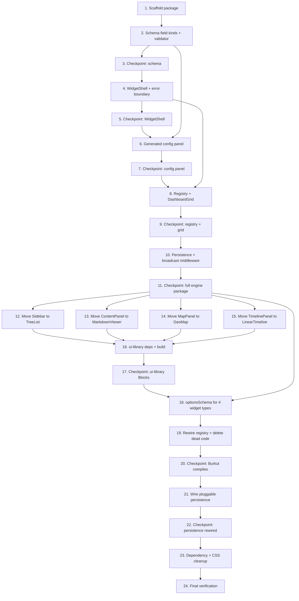

# Implementation Plan: dashboard-engine-extraction

## Overview

Extracts `@ay/dashboard-engine` (grid, `WidgetShell`, registry, options schema,
pluggable persistence) from `apps/burkut`, and moves the four purified widgets
into `@ay/ui-library` as Blocks (`TreeList`, `MarkdownViewer`, `GeoMap`,
`LinearTimeline`). Order: scaffold the new package and its pure/testable pieces
first (schema, error boundary, migration runner) with no Bürküt wiring yet, then
move the Blocks, then rewire Bürküt to consume both, deleting dead code as it's
subsumed. Each numbered task ends in a state where `pnpm verify` at minimum
typechecks and lints for the packages touched so far.

## Tasks

- [x] 1. Scaffold `packages/dashboard-engine`
  - [x] 1.1 Create `packages/dashboard-engine/package.json`, `tsconfig.json`,
    `biome.json`, `vite.config.ts` per the design's package.json/vite.config
    (library mode, `vite-plugin-dts`, externalize `react`/`react-dom`/
    `react-grid-layout`/`zustand`, peer deps on those four, direct dependency on
    `@standard-schema/spec`)
    - Add `@standard-schema/spec` at version `1.1.0` (pinned, not a range)
    - _Requirements: 9.1, 9.2, 9.3, 5.2_
  - [x] 1.2 Create `src/index.ts` (empty barrel for now) and `src/tests/setup.ts`
    (mirror `packages/ui-library/src/tests/setup.ts`)
  - [x] 1.3 Add `"@ay/dashboard-engine": "packages/dashboard-engine/src/index.ts"`
    to `AY_LOCAL_ENTRIES` in `packages/vite-config/src/index.ts`
    - _Requirements: 9.6_
  - [x] 1.4 Run `pnpm install` at the root and confirm the new package resolves
    in the workspace (`pnpm --filter @ay/dashboard-engine typecheck` succeeds on
    the empty barrel)

- [x] 2. Implement the options-schema field kinds and validator derivation
  - [x] 2.1 Create `src/schema/types.ts` with `FieldKind`, `StringField`,
    `NumberField`, `BooleanField`, `StringArrayField`, `EnumField`,
    `DateStringField`, `FieldDescriptor`, `OptionsSchema` per the design
    - _Requirements: 2.1_
  - [x] 2.2 Create `src/schema/fieldKinds.ts` implementing one
    `StandardSchemaV1`-compliant validator per field kind
    (`stringField()`, `numberField(opts)`, `booleanField()`,
    `stringArrayField(opts)`, `enumField(options)`, `dateStringField()`)
    - _Requirements: 5.1, 5.2, 5.3_
  - [x] 2.3 Write property tests for each field kind's validator
    (`src/schema/fieldKinds.property.test.ts`)
    - **Property: valid values validate successfully.** For each kind, an
      arbitrary value of the correct type/shape (respecting `enum` options and
      `number` min/max where declared) always returns `{ value }` with no
      `issues`.
    - **Property: invalid values always produce issues.** An arbitrary value of
      the wrong JS type for a given kind always returns a result with a non-empty
      `issues` array, never `{ value }`.
    - **Validates: Requirements 5.1, 5.2**
  - [x] 2.4 Create `src/schema/deriveValidator.ts` implementing
    `deriveValidator(schema: OptionsSchema): StandardSchemaV1<Record<string, unknown>>`
    per the design (per-field validation, `path: [field.key]` on issues, merged
    value on success)
    - _Requirements: 2.3_
  - [x] 2.5 Write property test for `deriveValidator`
    (`src/schema/deriveValidator.property.test.ts`)
    - **Property: composability.** For an arbitrary `OptionsSchema` (generated
      from the six field kinds) and an arbitrary config object, the derived
      validator's `issues.length` equals the count of fields whose own
      individual validator rejects `config[field.key]`.
    - **Validates: Requirements 2.3**
  - [x] 2.6 Create `src/schema/validateWidgetConfig.ts` implementing
    `validateWidgetConfig(typeDef, config)` with the field-level fallback-to-default
    behavor described in the design (`mergeWithDefaults`)
    - _Requirements: 4.1, 4.2_
  - [x] 2.7 Write unit tests for `validateWidgetConfig`
    - Test: a fully valid config passes through unchanged
    - Test: a config with one invalid field returns that field replaced by its
      schema default, with all other valid fields preserved
    - Test: a widget type with no `optionsSchema` returns the config unchanged
    - _Requirements: 4.1, 4.2, 2.4_

- [x] 3. Checkpoint — schema module
  - Run `pnpm --filter @ay/dashboard-engine test` and
    `pnpm --filter @ay/dashboard-engine typecheck`; ensure all green before
    continuing. Ask the user if questions arise.

- [x] 4. Implement `WidgetShell` and its error boundary
  - [x] 4.1 Create `src/WidgetShell/WidgetErrorBoundary.tsx`: class component,
    `getDerivedStateFromError`, `componentDidCatch` (calls optional `onError`
    prop), a `retry` method resetting `hasError`, rendering `renderError(retry)`
    on error or `children` otherwise
    - _Requirements: 1.2, 1.3, 1.7_
  - [x] 4.2 Create `src/WidgetShell/WidgetShell.tsx` implementing
    `WidgetShellProps`/`WidgetShellLabels` per the design: header (title +
    config/duplicate/remove/close action buttons, drag-handle CSS class),
    optional `Suspense` wrapper when `loadingState` is supplied, optional empty
    state when `isEmpty`, `WidgetErrorBoundary` wrapping `children`, default
    error fallback UI using `labels.errorFallbackMessage`/`labels.retryLabel`
    - No `useTranslation()`/`useTheme()` calls anywhere in this file
    - _Requirements: 1.1, 1.4, 1.5, 1.6_
  - [x] 4.3 Create `src/WidgetShell/WidgetShell.css` (drag-handle class, error
    state layout, empty state layout) — port relevant rules from
    `apps/burkut/src/components/WidgetHeader/WidgetHeader.css` and
    `apps/burkut/src/components/WidgetGrid/WidgetGrid.css` (`.widget-item`,
    `.widget-item__body`) rather than inventing new class names, so Bürküt's
    existing token-driven styling carries over
  - [x] 4.4 Write unit tests for `WidgetErrorBoundary`
    (`src/WidgetShell/WidgetErrorBoundary.test.tsx`)
    - Test: renders children when no error is thrown
    - Test: a throwing child is caught and the fallback renders instead
    - Test: `onError` is called with the thrown error
    - Test: clicking retry re-attempts rendering `children` (use a
      stateful throwing helper that stops throwing after the first render, so
      retry visibly succeeds)
    - _Requirements: 1.2, 1.3_
  - [x] 4.5 Write unit tests for `WidgetShell`
    (`src/WidgetShell/WidgetShell.test.tsx`)
    - Test: renders `title` and `children` when no error
    - Test: shows error state (not the grid-breaking crash) when `children`
      throws, with `title` still visible in the error state
    - Test: renders `emptyState` instead of `children` when `isEmpty` is true
    - Test: two sibling `WidgetShell`s in the same render tree — one throwing,
      one not — the non-throwing one never unmounts/re-renders when the other
      enters its error state (assert via a render-count spy)
    - Test: calls `onConfigClick`/`onDuplicateClick`/`onRemoveClick`/`onClose`
      when their respective buttons are clicked, using `labels` ARIA text
    - _Requirements: 1.1, 1.2, 1.4, 1.7_

- [x] 5. Checkpoint — `WidgetShell`
  - Run `pnpm --filter @ay/dashboard-engine test`; ensure all green. Ask the
    user if questions arise.

- [x] 6. Implement the generated config panel
  - [x] 6.1 Create `src/ConfigPanel/fields/` with one presentational component
    per field kind (`StringFieldControl`, `NumberFieldControl`,
    `BooleanFieldControl`, `StringArrayFieldControl`, `EnumFieldControl`,
    `DateStringFieldControl`), each `{ field, value, onChange }`, matching the
    existing hand-written panels' control choices (text input, number input,
    checkbox, tag/chip editor, select, date input)
    - _Requirements: 3.2_
  - [x] 6.2 Create `src/ConfigPanel/GeneratedConfigPanel.tsx` per the design:
    maps `schema` to field controls, calls `onUpdate` with a partial config per
    change, uses `labels` for all panel-level strings, no `useTranslation()`
    - _Requirements: 3.1, 3.5_
  - [x] 6.3 Create `src/ConfigPanel/configPanels.css` (port from
    `apps/burkut/src/components/WidgetGrid/configPanels/configPanels.css`)
  - [x] 6.4 Write unit tests for `GeneratedConfigPanel`
    (`src/ConfigPanel/GeneratedConfigPanel.test.tsx`), one scenario per field
    kind using a small fixture schema for each:
    - Test: `string` field renders a text input; typing calls `onUpdate` with
      `{ [key]: value }`
    - Test: `number` field renders a number input with `min`/`max` when
      declared; typing calls `onUpdate` with a numeric value
    - Test: `boolean` field renders a checkbox; toggling calls `onUpdate`
    - Test: `stringArray` field renders existing chips plus an add-tag input;
      adding/removing a tag calls `onUpdate` with the updated array
    - Test: `enum` field renders a select with all `options`; changing it calls
      `onUpdate`
    - Test: `dateString` field renders a date input; changing it calls
      `onUpdate`
    - Test: a widget type's full multi-field schema renders one control per
      field, in declaration order
    - _Requirements: 3.2, 3.5_

- [x] 7. Checkpoint — config panel
  - Run `pnpm --filter @ay/dashboard-engine test`; ensure all green. Ask the
    user if questions arise.

- [x] 8. Implement the widget-type registry and `DashboardGrid`
  - [x] 8.1 Create `src/registry/types.ts` (`WidgetTypeDefinition<TCtx>`) and
    `src/registry/createWidgetRegistry.ts` (`register`/`get`/`getAll`, plus the
    dev-mode `optionsSchema` consistency check on `register` — default values
    must pass their own field's validator)
    - _Requirements: 8.1, 4.4_
  - [x] 8.2 Write unit tests for `createWidgetRegistry`
    - Test: `register` then `get` returns the same definition
    - Test: `getAll` returns every registered definition
    - Test: registering a definition whose `optionsSchema` has a field default
      that fails its own validator throws in dev mode (mock
      `import.meta.env.DEV`)
    - _Requirements: 8.1, 4.4_
  - [x] 8.3 Create `src/DashboardGrid/DashboardGrid.tsx`: generalizes
    `apps/burkut/src/components/WidgetGrid/WidgetGrid.tsx` per the design —
    takes `instances`, `resolveType`, `renderContext`, `onLayoutChange`, and
    per-instance action callbacks; renders `react-grid-layout`'s `Responsive`
    with each instance wrapped in `WidgetShell`; imports nothing from Zustand or
    any app-specific type
    - _Requirements: 8.2_
  - [x] 8.4 Create `src/DashboardGrid/DashboardGrid.css` (port from
    `apps/burkut/src/components/WidgetGrid/WidgetGrid.css`)
  - [x] 8.5 Write unit tests for `DashboardGrid`
    (`src/DashboardGrid/DashboardGrid.test.tsx`), using fixture widget types and
    a fixture render context (not any Bürküt type):
    - Test: renders one `WidgetShell`-wrapped instance per item in `instances`
    - Test: an instance whose `resolveType` returns `undefined` renders an
      "unknown widget" fallback instead of crashing
    - Test: `onLayoutChange` fires with the updated layout on a layout change
    - Test: each instance's action callbacks are wired to its `WidgetShell`
    - _Requirements: 8.2_
  - [x] 8.6 Assemble `src/index.ts` barrel exporting `WidgetShell`,
    `WidgetErrorBoundary`, `GeneratedConfigPanel`, `createWidgetRegistry`,
    `DashboardGrid`, all field-kind constructors, `deriveValidator`,
    `validateWidgetConfig`, and their public types
    - _Requirements: 9.1_

- [x] 9. Checkpoint — registry and grid
  - Run `pnpm --filter @ay/dashboard-engine test`,
    `pnpm --filter @ay/dashboard-engine typecheck`,
    `pnpm --filter @ay/dashboard-engine lint`. Ensure all green. Ask the user if
    questions arise.

- [x] 10. Implement the pluggable persistence and broadcast middleware factories
  - [x] 10.1 Create `src/persistence/types.ts` (`PersistenceAdapter<T>`)
    - _Requirements: 6.1_
  - [x] 10.2 Create `src/persistence/createMigrationRunner.ts` generalizing
    `apps/burkut/src/stores/layoutMigrations.ts#migrateLayoutDocument`'s loop
    over an arbitrary `T`
    - _Requirements: 6.5_
  - [x] 10.3 Write property test for `createMigrationRunner`
    (`src/persistence/createMigrationRunner.property.test.ts`)
    - **Property: migration chain never skips a version and always
      terminates.** For an arbitrary set of registered migration versions and an
      arbitrary starting version ≤ `currentVersion`, the runner's final version
      is either `currentVersion` or the first version with no registered
      migration — it is never skipped past.
    - **Validates: Requirements 6.5**
  - [x] 10.4 Create `src/persistence/createPersistenceMiddleware.ts`
    generalizing `apps/burkut/src/stores/persistenceMiddleware.ts`'s debounce
    (default 500ms) / retry-with-backoff (`[1000, 2000, 4000]`, 3 attempts, skip
    retry on 404) / hydrate-on-load logic over `PersistenceAdapter<T>`
    - _Requirements: 6.2_
  - [x] 10.5 Write unit tests for `createPersistenceMiddleware`
    - Test: debounces multiple rapid state changes into one `adapter.save()`
      call
    - Test: retries `adapter.save()` up to 3 times with the documented backoff
      on failure, then gives up
    - Test: does not retry when `adapter.save()`/`load()` signals a 404-equivalent
      "not found" (mirroring today's short-circuit)
    - Test: on creation, calls `adapter.load()` and merges the result into the
      store via the supplied `mergeHydratedState`
    - _Requirements: 6.2_
  - [x] 10.6 Create `src/persistence/createBroadcastMiddleware.ts` generalizing
    `apps/burkut/src/stores/broadcastMiddleware.ts` over `T` and a channel name
    - _Requirements: 6.3_
  - [x] 10.7 Write unit tests for `createBroadcastMiddleware`
    - Test: a state change posts a message on the named `BroadcastChannel`
    - Test: an incoming message from a different sender calls `mergeIncoming`
    - Test: an incoming message with this instance's own `senderId` is ignored
    - Test: gracefully no-ops when `BroadcastChannel` is unavailable
    - _Requirements: 6.3_
  - [x] 10.8 Add the four persistence/broadcast exports to `src/index.ts`

- [x] 11. Checkpoint — persistence module and full engine package
  - Run `pnpm --filter @ay/dashboard-engine verify`-equivalent
    (`typecheck && lint && test && build`). Ensure all green, including that
    `vite build` produces `dist/index.es.js`, `dist/index.cjs.js`,
    `dist/index.d.ts`. Ask the user if questions arise.

- [x] 12. Move `Sidebar` → `TreeList` into `@ay/ui-library`
  - [x] 12.1 Move `apps/burkut/src/components/Sidebar/Sidebar.tsx` to
    `packages/ui-library/src/blocks/TreeList/TreeList.tsx`, renaming the
    component to `TreeList` and its types (`SidebarLabels` → `TreeListLabels`,
    `SidebarConfig` → `TreeListConfig`, `DEFAULT_SIDEBAR_LABELS` →
    `DEFAULT_TREE_LIST_LABELS`); move `Sidebar.css` → `TreeList.css` (CSS class
    names may keep their `sidebar-*` prefix if renaming them risks an
    unintended visual diff against the token baseline — confirm during
    implementation, prefer renaming to `tree-list-*` if the baseline diff stays
    green)
    - _Requirements: 7.1_
  - [x] 12.2 Move `Sidebar.test.tsx` → `TreeList.test.tsx`, updating imports and
    names
  - [x] 12.3 Create `packages/ui-library/src/blocks/TreeList/TreeList.stories.tsx`
    following `SpiralTimeline.stories.tsx`'s structure (default export with
    `component: TreeList`, a couple of representative story exports)
    - _Requirements: 7.6_
  - [x] 12.4 Add `TreeList` and its public types to
    `packages/ui-library/src/index.ts`
    - _Requirements: 7.7_

- [x] 13. Move `ContentPanel` → `MarkdownViewer` into `@ay/ui-library`
  - [x] 13.1 Move and rename `ContentPanel.tsx` →
    `packages/ui-library/src/blocks/MarkdownViewer/MarkdownViewer.tsx`
    (`ContentPanelLabels` → `MarkdownViewerLabels`, etc.); move `ContentPanel.css`
    - _Requirements: 7.2_
  - [x] 13.2 Move and update `ContentPanel.test.tsx` →
    `MarkdownViewer.test.tsx`
  - [x] 13.3 Create `MarkdownViewer.stories.tsx`
    - _Requirements: 7.6_
  - [x] 13.4 Add `MarkdownViewer` and its types to
    `packages/ui-library/src/index.ts`
    - _Requirements: 7.7_

- [x] 14. Move `MapPanel` → `GeoMap` into `@ay/ui-library`
  - [x] 14.1 Move and rename `MapPanel.tsx` →
    `packages/ui-library/src/blocks/GeoMap/GeoMap.tsx` (`MapPanelLabels` →
    `GeoMapLabels`, `MapPanelConfig` → `GeoMapConfig`, etc.); move `MapPanel.css`
    - Add `import "leaflet/dist/leaflet.css";` at the top of `GeoMap.tsx` (moved
      from `apps/burkut/src/main.tsx`), matching the self-import pattern
      `TimelinePanel.tsx` already uses for `vis-timeline`'s CSS
    - _Requirements: 7.3_
  - [x] 14.2 Move and update `MapPanel.test.tsx` → `GeoMap.test.tsx`
  - [x] 14.3 Create `GeoMap.stories.tsx`
    - _Requirements: 7.6_
  - [x] 14.4 Add `GeoMap` and its types to `packages/ui-library/src/index.ts`
    - _Requirements: 7.7_

- [x] 15. Move `TimelinePanel` → `LinearTimeline` into `@ay/ui-library`
  - [x] 15.1 Move and rename `TimelinePanel.tsx` →
    `packages/ui-library/src/blocks/LinearTimeline/LinearTimeline.tsx`
    (`TimelinePanelLabels` → `LinearTimelineLabels`,
    `TimelinePanelConfig` → `LinearTimelineConfig`,
    `DEFAULT_TIMELINE_PANEL_LABELS` → `DEFAULT_LINEAR_TIMELINE_LABELS`); move
    `TimelinePanel.css` → `LinearTimeline.css`; keep the `vis-timeline` CSS
    self-import as-is
    - _Requirements: 7.4_
  - [x] 15.2 Move and update `TimelinePanel.test.tsx` → `LinearTimeline.test.tsx`
  - [x] 15.3 Create `LinearTimeline.stories.tsx`, pairing with
    `SpiralTimeline.stories.tsx`'s conventions
    - _Requirements: 7.6_
  - [x] 15.4 Add `LinearTimeline` and its types to
    `packages/ui-library/src/index.ts`
    - _Requirements: 7.7_

- [x] 16. Update `@ay/ui-library` dependencies and build
  - [x] 16.1 Add `leaflet`, `react-leaflet` (matching `apps/burkut`'s current
    versions) as dependencies to `packages/ui-library/package.json`; add
    `vis-timeline`, `vis-data`, `react-markdown`, `remark-gfm` as dependencies
    - _Requirements: 7.8_
  - [x] 16.2 Run `pnpm install` at the root
  - [x] 16.3 Run `pnpm --filter @ay/ui-library typecheck`,
    `pnpm --filter @ay/ui-library lint`,
    `pnpm --filter @ay/ui-library test`, `pnpm --filter @ay/ui-library build`;
    fix any import path or type errors surfaced by the four new Blocks living
    inside the library

- [x] 17. Checkpoint — `@ay/ui-library` with four new Blocks
  - Ensure all `@ay/ui-library` tests, typecheck, lint, and build pass, and that
    `pnpm --filter @ay/ui-library storybook` (or `build-storybook`) succeeds
    with the four new stories present. Ask the user if questions arise.

- [x] 18. Declare `optionsSchema` for each of Bürküt's four widget types
  - [x] 18.1 In `apps/burkut/src/components/WidgetGrid/widgetTypeRegistry.ts`
    (still at its current location for now), add a `treeListOptionsSchema`
    covering `tags: stringArray` and `contentType: enum` (`all`/`markdown`/
    `image`/`video`/`audio`, default `"all"`), plus a small
    `toSchemaConfig`/`fromSchemaConfig` pair mapping `SidebarWidgetConfig`'s
    `contentType: ContentType | null` to/from the schema's `"all"`-as-null
    convention (per the design's table)
    - _Requirements: 2.5_
  - [x] 18.2 Add `markdownViewerOptionsSchema` covering `pinnedItemId: string`
    (default `""`, mapped to `null` when empty) plus its
    `toSchemaConfig`/`fromSchemaConfig` pair
    - _Requirements: 2.5_
  - [x] 18.3 Add `geoMapOptionsSchema` covering `boundingBoxNorth/South/East/West:
    number` and `zoomLevel: number` (min 0, max 20, step 1) plus its
    `toSchemaConfig`/`fromSchemaConfig` pair assembling/disassembling
    `MapWidgetConfig.boundingBox`
    - _Requirements: 2.5_
  - [x] 18.4 Add `linearTimelineOptionsSchema` covering `startDate: dateString`
    and `endDate: dateString` plus its `toSchemaConfig`/`fromSchemaConfig` pair
    - _Requirements: 2.5_
  - [x] 18.5 Write unit tests confirming each `toSchemaConfig`/`fromSchemaConfig`
    pair round-trips a representative `WidgetConfig` value for its widget type
    - _Requirements: 2.5_

- [x] 19. Rewire `apps/burkut`'s registry onto `createWidgetRegistry` and the moved Blocks
  - [x] 19.1 Add `"@ay/dashboard-engine": "workspace:^"` to
    `apps/burkut/package.json` dependencies; run `pnpm install`
    - _Requirements: 8.1_
  - [x] 19.2 Update `widgetTypeRegistry.ts` imports: `Sidebar`/`ContentPanel`/
    `MapPanel`/`TimelinePanel` from `apps/burkut/src/components/*` become
    `TreeList`/`MarkdownViewer`/`GeoMap`/`LinearTimeline` from
    `@ay/ui-library`; the module-level `widgetTypes: Record<...>` and manual
    `registerBuiltInTypes()` are replaced by a call to the engine's
    `createWidgetRegistry<WidgetRenderContext>()`, registering the same four
    types with their new `optionsSchema` fields and `component` references
    - Remove the now-unused `configPanel` field from each registration (no
      `ComponentType<WidgetConfigPanelProps>` reference remains)
    - _Requirements: 8.1, 8.3_
  - [x] 19.3 Update `WidgetGrid.tsx` to import `DashboardGrid`,
    `WidgetShell`, and `GeneratedConfigPanel` from `@ay/dashboard-engine`;
    assemble `WidgetRenderContext` as before and pass it plus the registry into
    `DashboardGrid`; render the config panel via `GeneratedConfigPanel` using
    `typeDef.optionsSchema` instead of `typeDef.configPanel`
    - _Requirements: 3.3, 8.4_
  - [x] 19.4 Delete `apps/burkut/src/components/WidgetGrid/configPanels/`
    (`SidebarConfigPanel.tsx`, `ContentConfigPanel.tsx`, `MapConfigPanel.tsx`,
    `TimelineConfigPanel.tsx`, `types.ts`, `configPanels.css`) and their test
    files
    - _Requirements: 3.4_
  - [x] 19.5 Delete `apps/burkut/src/components/WidgetHeader/` (`WidgetHeader.tsx`,
    `WidgetHeader.css`, and its test file); confirm no remaining import
    references it
    - _Requirements: 8.5_
  - [x] 19.6 Delete the dead legacy registry and its sole consumers:
    `apps/burkut/src/components/WidgetGrid/widgetRegistry.ts`,
    `apps/burkut/src/components/WidgetVisibilityMenu/` (component + CSS + test),
    `apps/burkut/src/hooks/useLayoutPersistence.ts` and its test,
    `apps/burkut/src/components/WidgetGrid/defaultLayouts.ts` (confirm it has no
    other consumer first), and
    `apps/burkut/src/components/WidgetGrid/bugCondition.exploration.test.tsx`
    (documents a bug in code being deleted)
    - _Requirements: 8.6_
  - [x] 19.7 Delete `apps/burkut/src/components/Sidebar/`,
    `apps/burkut/src/components/ContentPanel/`, `apps/burkut/src/components/MapPanel/`,
    `apps/burkut/src/components/TimelinePanel/` (now that their contents live in
    `@ay/ui-library`) and update any remaining import in
    `apps/burkut/src/adapters/contentAdapters.ts` or elsewhere that referenced
    their old paths for types only (view-model types in
    `apps/burkut/src/adapters/viewModels.ts` are unaffected — they were never
    co-located with the widgets)

- [x] 20. Checkpoint — Bürküt compiles against the new registry
  - Run `pnpm --filter burkut typecheck` and fix all import-path fallout from
    tasks 12–19 before proceeding. Ask the user if questions arise.

- [x] 21. Wire pluggable persistence into Bürküt
  - [x] 21.1 Create `apps/burkut/src/stores/httpPersistenceAdapter.ts`
    implementing `PersistenceAdapter<PersistedDashboardState>` per the design,
    wrapping the existing `GET`/`POST /api/layouts` calls (including calling
    the existing `migrateLayoutDocument` on `load()`)
    - _Requirements: 6.4_
  - [x] 21.2 Update `apps/burkut/src/stores/layoutMigrations.ts` to build
    `migrateLayoutDocument` on top of the engine's `createMigrationRunner`,
    keeping `CURRENT_LAYOUT_VERSION`, `V1_TO_V2_WIDGET_TYPE_ID_MAP`,
    `migrateDashboardV1ToV2`/`migrateInstanceV1ToV2` exactly as they are today
    - _Requirements: 6.5_
  - [x] 21.3 Update `apps/burkut/src/stores/persistenceMiddleware.ts` to call
    the engine's `createPersistenceMiddleware` with `httpLayoutPersistenceAdapter`,
    keeping `migrateFromLocalStorage` (the pre-dashboard-store legacy migration)
    as Bürküt-local code that runs before falling back to the adapter, exactly
    as it does today
    - Also call `validateWidgetConfig` per widget instance right after
      `migrateLayoutDocument` resolves, before `_mergeSharedState` — satisfying
      Requirement 4.1
    - _Requirements: 6.2, 4.1_
  - [x] 21.4 Update `apps/burkut/src/stores/broadcastMiddleware.ts` to call the
    engine's `createBroadcastMiddleware` with the existing channel name
    (`"burkut-dashboard-sync"`)
    - _Requirements: 6.3_
  - [x] 21.5 Update `apps/burkut/src/stores/dashboardStore.ts#updateWidgetConfig`
    to call `validateWidgetConfig` on the merged config before writing to state
    — satisfying Requirement 4.3's "once per explicit config update"
    - _Requirements: 4.3_
  - [x] 21.6 Update or write unit/integration tests for
    `httpPersistenceAdapter`, the updated `persistenceMiddleware.ts`, and
    `broadcastMiddleware.ts`, verifying the same debounce/retry/hydrate/broadcast
    behavior the pre-refactor tests verified (retarget assertions at the new
    thin wrappers rather than duplicating the engine's own tests)
    - _Requirements: 6.2, 6.3_

- [ ] 22. Checkpoint — persistence rewired
  - Run `pnpm --filter burkut test`; ensure all green, including that a manual
    check of `.burkut/layouts/dashboard.json` (already at `version: 2`) still
    loads correctly via `pnpm dev` (start dev server, confirm dashboard renders
    with existing layout, ask user to confirm visually if automated coverage is
    insufficient here). Ask the user if questions arise.

- [x] 23. Clean up `apps/burkut`'s dependencies and global CSS imports
  - [x] 23.1 Remove `leaflet`, `react-leaflet`, `vis-timeline`, `vis-data`,
    `react-markdown`, `remark-gfm` from `apps/burkut/package.json` dependencies
    (confirm via grep that nothing under `apps/burkut/src` imports them
    directly anymore)
    - _Requirements: 7.8_
  - [x] 23.2 Remove `import "leaflet/dist/leaflet.css";` from
    `apps/burkut/src/main.tsx` (now self-imported by `GeoMap.tsx` inside
    `@ay/ui-library`)
    - _Requirements: (design) Findings — CSS import ownership_
  - [x] 23.3 Confirm `react-grid-layout`'s CSS imports
    (`react-grid-layout/css/styles.css`, `react-resizable/css/styles.css`) are
    still needed in `apps/burkut/src/main.tsx` (they are — `DashboardGrid` uses
    `react-grid-layout` but does not import its CSS, matching how
    `@ay/ui-library` doesn't self-import Tailwind); leave them in place unless
    moving them into the engine's own entry point is cleaner — decide during
    implementation and note the choice in a comment
  - [x] 23.4 Run `pnpm install` at the root to update the lockfile after
    dependency removals

- [ ] 24. Final verification
  - [ ] 24.1 Run `pnpm verify` (`typecheck` → `lint` → `test` → `build`, every
    package) at the workspace root; fix anything red
    - _Requirements: 10.6_
  - [x] 24.2 Run the token-architecture baseline diff
    (`tools/tokens/resolve.mjs` / whatever command `tests/token-architecture.property.test.ts`
    invokes) and confirm it stays green — this refactor moved component code and
    CSS verbatim, so no new baseline diff is expected
    - _Requirements: 10.5_
  - [ ] 24.3 Manually verify (or ask the user to verify) `pnpm dev`: dashboard
    renders the same four widgets at the same default sizes; drag, resize,
    add/remove/duplicate widget, and open each widget's config panel all work;
    a deliberately-thrown error in one widget (temporary test hook) shows the
    shell error state without blanking the rest of the grid
    - _Requirements: 10.1, 10.2, 10.3, 1.2_
  - [ ] 24.4 Confirm `AY_LOCAL=1 pnpm dev` resolves `@ay/dashboard-engine` and
    `@ay/ui-library` to source (edit a Block or engine file, confirm HMR picks
    it up in the running Bürküt dev server) per the Local Dev Alias steering
    document
  - [x] 24.5 Update `ROADMAP.md`: mark Phase 2 (`dashboard-engine-extraction`)
    as finished in the "Where we are" table

## Notes

- Tasks 1–11 build `@ay/dashboard-engine` in isolation, with no Bürküt import
  yet — every property/unit test in this range uses fixture types, not
  `Dashboard`/`WidgetInstance`/`ContentIndex`. This is deliberate: it's the
  mechanism that proves the engine doesn't secretly depend on Bürküt's domain
  shapes (Requirement 8.1/8.7).
- Tasks 12–17 move Blocks into `@ay/ui-library` before task 19 rewires Bürküt's
  registry to import them, so Bürküt is never mid-refactor pointing at a
  half-moved component.
- Tasks 18–23 are the Bürküt-side rewiring and cleanup, ordered so dead code
  (task 19.4–19.7) is deleted only after its replacement (tasks 1–18) exists and
  compiles.
- Per the environment hazard noted in `ROADMAP.md`'s standing constraints,
  re-read every file this plan generates before trusting it, and finish each
  package's work with `pnpm biome format --write src` — auto-reindentation has
  previously corrupted template literals in this workspace.
- Property tests in tasks 2, 10 follow the workspace's existing `fast-check`
  convention (see `apps/burkut/src/cli/*.property.test.ts`,
  `packages/tokens/tests/*`) — arbitrary generators over the field-kind/schema
  shapes, not over Bürküt's domain types.

## Task Dependency Graph



Tasks 12 through 15 (the four Block moves) are mutually independent and can
proceed in any order, or in parallel, once task 11's engine package is
complete. They do not depend on each other or on the engine's registry/grid
code, only on `@ay/ui-library`'s existing structure. Task 18 depends on both
the finished engine (for `OptionsSchema`/field-kind types) and the finished
`ui-library` move; nothing structural forces that order, but doing it last
avoids editing `widgetTypeRegistry.ts` twice. Tasks 19 onward are strictly
sequential: each one deletes code that the previous task's replacement made
obsolete.

```json
{
  "waves": [
    { "wave": 1, "tasks": [1] },
    { "wave": 2, "tasks": [2] },
    { "wave": 3, "tasks": [3] },
    { "wave": 4, "tasks": [4] },
    { "wave": 5, "tasks": [5] },
    { "wave": 6, "tasks": [6] },
    { "wave": 7, "tasks": [7] },
    { "wave": 8, "tasks": [8] },
    { "wave": 9, "tasks": [9] },
    { "wave": 10, "tasks": [10] },
    { "wave": 11, "tasks": [11] },
    { "wave": 12, "tasks": [12, 13, 14, 15] },
    { "wave": 13, "tasks": [16] },
    { "wave": 14, "tasks": [17] },
    { "wave": 15, "tasks": [18] },
    { "wave": 16, "tasks": [19] },
    { "wave": 17, "tasks": [20] },
    { "wave": 18, "tasks": [21] },
    { "wave": 19, "tasks": [22] },
    { "wave": 20, "tasks": [23] },
    { "wave": 21, "tasks": [24] }
  ]
}
```
