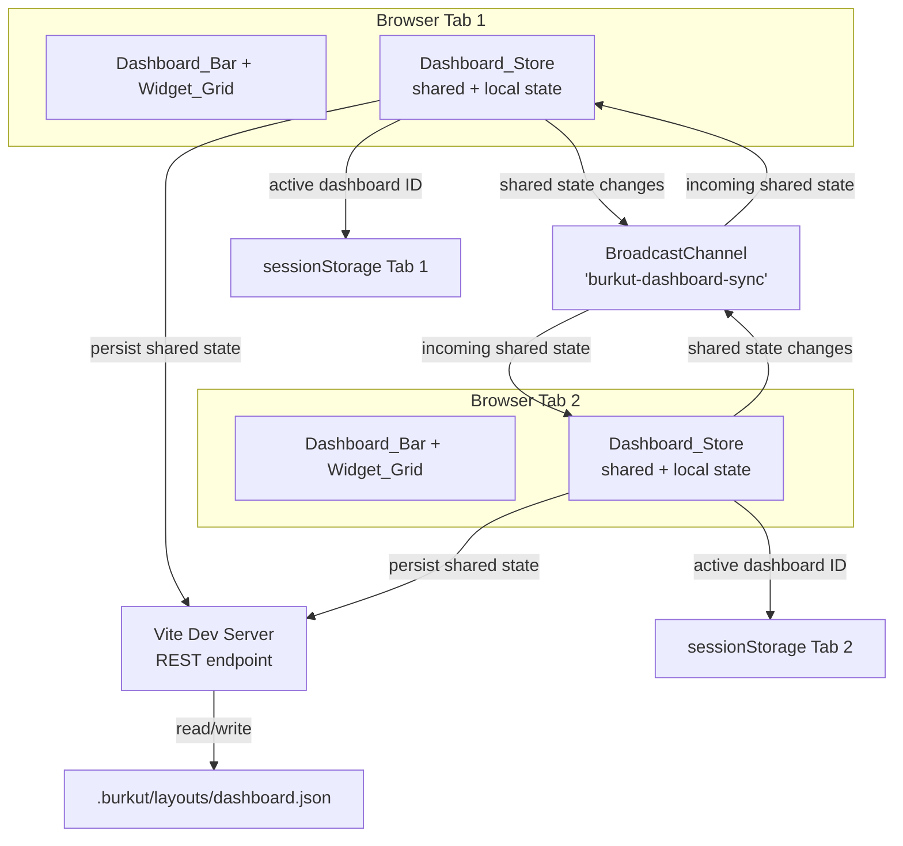
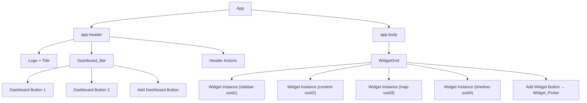

# Design Document: Multi-Tab Dashboard System

## Overview

This design transforms Bürküt from a single fixed-widget layout into a Datadog-style multi-dashboard system where users create named Dashboards, each containing independently configured Widget Instances. The system supports cross-browser-tab synchronization of dashboard definitions while allowing each tab to independently select which dashboard to view — enabling multi-monitor workflows.

The core architectural shift is from a static `WIDGET_REGISTRY` array + `useLayoutPersistence` hook to a Zustand-based `Dashboard_Store` with:
- A `Widget_Type_Registry` that defines available widget types and their components
- UUID-based `Widget_Instance` objects with per-instance `Widget_Config`
- `BroadcastChannel`-based cross-tab sync middleware for shared state
- File-based persistence to `.burkut/layouts/dashboard.json` (replacing localStorage)
- A `Dashboard_Bar` in the header and a `Widget_Picker` for adding instances

**Key design decisions:**
1. Zustand over React Context — Zustand's middleware system naturally supports both BroadcastChannel sync and persistence without custom plumbing. It also avoids unnecessary re-renders.
2. Shared/local state split in a single store — the store holds both the synced dashboard definitions and the per-tab active dashboard ID. The sync middleware only broadcasts the shared slice.
3. File persistence via dev server endpoint — since Bürküt runs via `burkut serve`, the Vite dev server can expose a small REST endpoint for reading/writing `.burkut/layouts/dashboard.json`. This avoids the 5 MB localStorage limit and keeps layout data in the project directory.
4. Migration on first run — the persistence layer detects legacy `burkut-widget-layouts` / `burkut-widget-visibility` localStorage keys, converts them to a single-dashboard state in the new format, writes the file, and removes the legacy keys.

## Architecture

### High-Level Data Flow



### State Architecture

```mermaid
graph LR
    subgraph DashboardStore["Dashboard_Store (Zustand)"]
        subgraph Shared["Shared State (synced + persisted)"]
            DL[dashboards: Dashboard[]]
        end
        subgraph Local["Local State (per-tab)"]
            AD[activeDashboardId: string]
        end
        subgraph Actions
            A1[createDashboard]
            A2[deleteDashboard]
            A3[renameDashboard]
            A4[setActiveDashboard]
            A5[addWidgetInstance]
            A6[removeWidgetInstance]
            A7[duplicateWidgetInstance]
            A8[updateWidgetConfig]
            A9[updateLayout]
            A10[updateDashboardFilter]
            A11[resetDashboardLayout]
        end
    end

    Shared --> SyncMW[broadcastChannel middleware]
    Shared --> PersistMW[persistence middleware]
    Local --> SS[sessionStorage]
```

### Component Tree Changes



## Components and Interfaces

### 1. Dashboard_Store (`src/stores/dashboardStore.ts`)

The central Zustand store. Replaces `useLayoutPersistence`.

**Validates: Requirements 1, 2, 3, 4, 5, 6, 7, 8, 9, 10**

```typescript
import { create } from "zustand";

// ── Shared state (synced across tabs, persisted to disk) ──

interface SharedState {
  dashboards: Dashboard[];
}

// ── Local state (per-tab, NOT synced) ──

interface LocalState {
  activeDashboardId: string;
}

// ── Actions ──

interface DashboardActions {
  // Dashboard CRUD
  createDashboard: (templateId?: string) => void;
  deleteDashboard: (dashboardId: string) => void;
  renameDashboard: (dashboardId: string, name: string) => void;
  setActiveDashboard: (dashboardId: string) => void;
  reorderDashboards: (fromIndex: number, toIndex: number) => void;

  // Widget instance management
  addWidgetInstance: (dashboardId: string, widgetTypeId: string) => void;
  removeWidgetInstance: (dashboardId: string, instanceId: string) => void;
  duplicateWidgetInstance: (dashboardId: string, instanceId: string) => void;
  updateWidgetConfig: (dashboardId: string, instanceId: string, config: Partial<WidgetConfig>) => void;
  updateWidgetLayout: (dashboardId: string, instanceId: string, layout: GridPosition) => void;

  // Dashboard-level filter
  updateDashboardFilter: (dashboardId: string, filter: ContentFilter) => void;

  // Layout operations
  resetDashboardLayout: (dashboardId: string) => void;
  onLayoutChange: (dashboardId: string, layouts: ResponsiveLayouts) => void;

  // Sync
  _mergeSharedState: (incoming: SharedState) => void;
}

type DashboardStore = SharedState & LocalState & DashboardActions;
```

### 2. Widget_Type_Registry (`src/components/WidgetGrid/widgetTypeRegistry.ts`)

Replaces the current `widgetRegistry.ts`. Each entry now includes a component reference, default size, and default config.

**Validates: Requirements 14.1, 14.2, 14.3, 14.4**

```typescript
import type { ComponentType } from "react";

interface WidgetTypeDefinition {
  typeId: string;
  titleKey: string;
  descriptionKey: string;
  component: ComponentType<WidgetInstanceProps>;
  defaultSize: { w: number; h: number };
  minSize: { w: number; h: number };
  defaultConfig: WidgetConfig;
}

// Built-in types
const WIDGET_TYPES: Record<string, WidgetTypeDefinition> = {
  sidebar: {
    typeId: "sidebar",
    titleKey: "panels.sidebar",
    descriptionKey: "panels.sidebar.description",
    component: SidebarWidget,
    defaultSize: { w: 3, h: 8 },
    minSize: { w: 2, h: 2 },
    defaultConfig: { type: "sidebar", tags: [], contentType: null },
  },
  content: {
    typeId: "content",
    titleKey: "panels.content",
    descriptionKey: "panels.content.description",
    component: ContentWidget,
    defaultSize: { w: 5, h: 8 },
    minSize: { w: 2, h: 2 },
    defaultConfig: { type: "content", pinnedItemId: null },
  },
  map: {
    typeId: "map",
    titleKey: "panels.map",
    descriptionKey: "panels.map.description",
    component: MapWidget,
    defaultSize: { w: 4, h: 8 },
    minSize: { w: 2, h: 2 },
    defaultConfig: { type: "map", boundingBox: null, zoomLevel: null },
  },
  timeline: {
    typeId: "timeline",
    titleKey: "panels.timeline",
    descriptionKey: "panels.timeline.description",
    component: TimelineWidget,
    defaultSize: { w: 12, h: 4 },
    minSize: { w: 2, h: 2 },
    defaultConfig: { type: "timeline", startDate: null, endDate: null },
  },
};

// Registration function for extensibility
function registerWidgetType(definition: WidgetTypeDefinition): void;
function getWidgetType(typeId: string): WidgetTypeDefinition | undefined;
function getAllWidgetTypes(): WidgetTypeDefinition[];
```

### 3. Cross_Tab_Sync Middleware (`src/stores/broadcastMiddleware.ts`)

A Zustand middleware that uses `BroadcastChannel` to sync the shared state slice.

**Validates: Requirements 9.1, 9.2, 9.3, 9.4, 9.5, 9.6**

```typescript
const CHANNEL_NAME = "burkut-dashboard-sync";

function broadcastMiddleware<T>(config: StateCreator<T>): StateCreator<T> {
  // 1. On state change: extract shared slice, broadcast via BroadcastChannel
  // 2. On message received: call _mergeSharedState with incoming shared state
  // 3. Graceful fallback: if BroadcastChannel is unavailable, skip silently
  // 4. Deduplication: include a sender ID (crypto.randomUUID()) to ignore own messages
}
```

The middleware extracts only the `dashboards` array from the store state for broadcasting. The `activeDashboardId` is never broadcast.

When a tab receives a broadcast where a dashboard it's currently viewing has been deleted, the store's `_mergeSharedState` action detects this and falls back to the nearest remaining dashboard.

### 4. Layout_Persistence Middleware (`src/stores/persistenceMiddleware.ts`)

Debounced persistence of shared state to `.burkut/layouts/dashboard.json` via the dev server.

**Validates: Requirements 10.1, 10.2, 10.3, 10.4, 10.5, 10.6, 10.7**

```typescript
// Dev server endpoints (added to vite-plugins/burkut-content.ts):
// GET  /api/layouts  → reads .burkut/layouts/dashboard.json
// POST /api/layouts  → writes .burkut/layouts/dashboard.json

function persistenceMiddleware<T>(config: StateCreator<T>): StateCreator<T> {
  // 1. On store init: fetch GET /api/layouts, hydrate shared state
  // 2. On shared state change: debounce 500ms, POST /api/layouts
  // 3. On fetch error: fall back to default state, log warning
}

// Migration logic (runs once on init):
function migrateFromLocalStorage(): SharedState | null {
  // 1. Check for legacy keys: "burkut-widget-layouts", "burkut-widget-visibility"
  // 2. If found: convert to single Dashboard with Widget_Instances
  // 3. Map each layout item (sidebar, content, map, timeline) to a Widget_Instance
  // 4. Remove legacy keys
  // 5. Return the migrated SharedState
}
```

**sessionStorage for active dashboard ID:**

```typescript
const SESSION_KEY = "burkut-active-dashboard";

// On setActiveDashboard: sessionStorage.setItem(SESSION_KEY, id)
// On init: read sessionStorage, validate ID exists in shared state, fallback to first dashboard
```

### 5. Dashboard_Bar (`src/components/DashboardBar/DashboardBar.tsx`)

Horizontal tab strip in the app header.

**Validates: Requirements 12.1–12.8, 4.1–4.4, 2.1–2.3, 3.1–3.3**

```typescript
interface DashboardBarProps {
  // All state comes from Dashboard_Store via hooks
}

// Renders:
// - One button per dashboard (active state highlighted)
// - Inline rename on double-click (Req 4)
// - Close icon per button (hidden when count === 1, Req 3.3)
// - "Add dashboard" button with template dropdown (Req 11.2)
// - Horizontal scroll overflow (Req 12.6)
// - Keyboard navigation: arrow keys, Enter, Delete (Req 12.8)
```

### 6. Widget_Picker (`src/components/WidgetPicker/WidgetPicker.tsx`)

Modal/dropdown for adding widget instances.

**Validates: Requirements 13.1–13.5**

```typescript
interface WidgetPickerProps {
  dashboardId: string;
  onClose: () => void;
}

// Renders:
// - Grid/list of available Widget_Types from Widget_Type_Registry
// - Localized name + description for each type
// - Click or Enter to add instance and close
// - Keyboard navigation: arrow keys + Enter (Req 13.5)
```

### 7. Widget Instance Configuration UI

Each widget type provides a configuration panel rendered in a popover/drawer triggered from the WidgetHeader.

**Validates: Requirements 6.1–6.8**

```typescript
interface WidgetConfigPanelProps {
  instance: WidgetInstance;
  onUpdate: (config: Partial<WidgetConfig>) => void;
  onClose: () => void;
}

// SidebarConfigPanel: tag multi-select, content type dropdown
// TimelineConfigPanel: date range pickers (start, end)
// MapConfigPanel: bounding box inputs or zoom level
// ContentConfigPanel: pinned item ID selector
```

### 8. Updated WidgetGrid (`src/components/WidgetGrid/WidgetGrid.tsx`)

The grid now renders Widget_Instances from the active dashboard instead of a fixed set.

**Validates: Requirements 5.5, 5.6, 7.1, 7.3**

```typescript
interface WidgetGridProps {
  dashboard: Dashboard;
  // Content data (from useContentGraph)
  index: ContentIndex;
  getContent: (id: string) => string | null;
  // Progress tracking
  isComplete?: (id: string) => boolean;
  onToggleComplete?: (id: string) => void;
  completedSet?: Set<string>;
}

// Key changes:
// - Layout items keyed by Widget_Instance.instanceId (not widget type)
// - Component resolved via Widget_Type_Registry.getWidgetType(instance.widgetTypeId)
// - Each widget receives its own WidgetConfig + resolved ContentFilter
// - "Add Widget" button rendered as a persistent grid element or floating button
```

### 9. Content Filtering Logic (`src/utils/contentFilter.ts`)

Pure function that resolves the effective filter for a widget instance.

**Validates: Requirements 8.1–8.5, 6.7, 6.8**

```typescript
function resolveFilter(
  dashboardFilter: ContentFilter,
  instanceConfig: WidgetConfig
): ContentFilter {
  // If instance has filter criteria → use instance filter
  // Else → use dashboard filter
  // Empty filter → show all content
}

function applyFilter(index: ContentIndex, filter: ContentFilter): ContentIndex {
  // Filter entries by contentType, tags, sourceDirectory
  // Returns a new ContentIndex with only matching entries
}
```

### 10. Template_Registry (`src/stores/templateRegistry.ts`)

Static list of dashboard templates.

**Validates: Requirements 11.1–11.5**

```typescript
interface DashboardTemplate {
  templateId: string;
  nameKey: string; // i18n key
  descriptionKey: string;
  instances: Array<{
    widgetTypeId: string;
    position: GridPosition;
    config: WidgetConfig;
  }>;
  filter: ContentFilter;
}

const TEMPLATES: DashboardTemplate[] = [
  { templateId: "daily", nameKey: "template.daily", /* ... */ },
  { templateId: "monthly", nameKey: "template.monthly", /* ... */ },
  { templateId: "travel", nameKey: "template.travel", /* ... */ },
  { templateId: "overview", nameKey: "template.overview", /* ... */ },
];

function registerTemplate(template: DashboardTemplate): void;
function getTemplate(templateId: string): DashboardTemplate | undefined;
function getAllTemplates(): DashboardTemplate[];
```

## Data Models

### Core Types (`src/shared/types.ts` additions)

```typescript
// ── Grid Position ──

interface GridPosition {
  x: number;
  y: number;
  w: number;
  h: number;
  minW?: number;
  minH?: number;
}

// ── Content Filter ──

interface ContentFilter {
  contentType?: ContentType | null;  // markdown, image, video, audio
  tags?: string[];                    // filter by tags (AND logic)
  sourceDirectory?: string | null;    // filter by source path
}

// ── Widget Config (discriminated union by type) ──

type WidgetConfig =
  | SidebarWidgetConfig
  | ContentWidgetConfig
  | MapWidgetConfig
  | TimelineWidgetConfig;

interface SidebarWidgetConfig {
  type: "sidebar";
  tags: string[];
  contentType: ContentType | null;
}

interface ContentWidgetConfig {
  type: "content";
  pinnedItemId: string | null;
}

interface MapWidgetConfig {
  type: "map";
  boundingBox: { north: number; south: number; east: number; west: number } | null;
  zoomLevel: number | null;
}

interface TimelineWidgetConfig {
  type: "timeline";
  startDate: string | null; // ISO date
  endDate: string | null;   // ISO date
}

// ── Widget Instance ──

interface WidgetInstance {
  instanceId: string;       // UUID
  widgetTypeId: string;     // references Widget_Type_Registry
  position: GridPosition;   // react-grid-layout position
  config: WidgetConfig;     // per-instance configuration
}

// ── Dashboard ──

interface Dashboard {
  id: string;               // UUID
  name: string;             // display name
  instances: WidgetInstance[];
  filter: ContentFilter;    // dashboard-level content filter
}

// ── Persisted State Shape ──

interface PersistedDashboardState {
  version: number;          // schema version for future migrations
  dashboards: Dashboard[];
}

// ── Widget Instance Props (passed to widget components) ──

interface WidgetInstanceProps {
  instance: WidgetInstance;
  index: ContentIndex;       // filtered content index
  getContent: (id: string) => string | null;
  selectedId: string | null;
  onSelectItem: (id: string) => void;
  isComplete?: (id: string) => boolean;
  onToggleComplete?: (id: string) => void;
  completedSet?: Set<string>;
}
```

### Persistence JSON Schema (`.burkut/layouts/dashboard.json`)

```json
{
  "version": 1,
  "dashboards": [
    {
      "id": "uuid-1",
      "name": "Dashboard",
      "filter": {},
      "instances": [
        {
          "instanceId": "uuid-inst-1",
          "widgetTypeId": "sidebar",
          "position": { "x": 0, "y": 0, "w": 3, "h": 8, "minW": 2, "minH": 2 },
          "config": { "type": "sidebar", "tags": [], "contentType": null }
        }
      ]
    }
  ]
}
```

### Default Dashboard State

When no persisted state exists and no legacy localStorage data is found, the store initializes with:

```typescript
const DEFAULT_DASHBOARD: Dashboard = {
  id: crypto.randomUUID(),
  name: "Dashboard",
  instances: [
    { instanceId: crypto.randomUUID(), widgetTypeId: "sidebar",  position: { x: 0, y: 0, w: 3, h: 8, minW: 2, minH: 2 }, config: { type: "sidebar", tags: [], contentType: null } },
    { instanceId: crypto.randomUUID(), widgetTypeId: "content",  position: { x: 3, y: 0, w: 5, h: 8, minW: 2, minH: 2 }, config: { type: "content", pinnedItemId: null } },
    { instanceId: crypto.randomUUID(), widgetTypeId: "map",      position: { x: 8, y: 0, w: 4, h: 8, minW: 2, minH: 2 }, config: { type: "map", boundingBox: null, zoomLevel: null } },
    { instanceId: crypto.randomUUID(), widgetTypeId: "timeline", position: { x: 0, y: 8, w: 12, h: 4, minW: 2, minH: 2 }, config: { type: "timeline", startDate: null, endDate: null } },
  ],
  filter: {},
};
```

### Migration from Legacy localStorage

The migration function in `persistenceMiddleware.ts`:

1. Reads `burkut-widget-layouts` (ResponsiveLayouts) and `burkut-widget-visibility` (Record<string, boolean>)
2. Takes the `lg` breakpoint layout items
3. For each visible layout item, creates a `WidgetInstance` with a new UUID, the item's `i` as `widgetTypeId`, the item's position, and the default `WidgetConfig` for that type
4. Wraps them in a single `Dashboard` named "Dashboard"
5. Writes to `.burkut/layouts/dashboard.json`
6. Removes the legacy localStorage keys


## Correctness Properties

*A property is a characteristic or behavior that should hold true across all valid executions of a system — essentially, a formal statement about what the system should do. Properties serve as the bridge between human-readable specifications and machine-verifiable correctness guarantees.*

### Property 1: Shared/local state structure invariant

*For any* Dashboard_Store state, the state SHALL contain a `dashboards` array (shared) and an `activeDashboardId` string (local), and the `activeDashboardId` SHALL reference an ID that exists in the `dashboards` array.

**Validates: Requirements 1.1**

### Property 2: Active dashboard ID excluded from shared state

*For any* Dashboard_Store state, when the shared state slice is extracted for broadcasting or persistence, the resulting object SHALL NOT contain the `activeDashboardId` field. Conversely, the shared slice SHALL contain the `dashboards` array.

**Validates: Requirements 1.2**

### Property 3: Active dashboard ID only changes via explicit activation

*For any* Dashboard_Store state and any action that modifies shared state (createDashboard excluded, deleteDashboard of active excluded), the `activeDashboardId` SHALL remain unchanged after the action. This includes incoming cross-tab sync merges — merging shared state from another tab SHALL preserve the local `activeDashboardId`.

**Validates: Requirements 1.4, 9.2**

### Property 4: Create dashboard appends with correct defaults

*For any* Dashboard_Store state with N dashboards, calling `createDashboard()` (without a template) SHALL result in N+1 dashboards. The new dashboard SHALL have a unique ID (not matching any existing dashboard ID), a non-empty display name, the default set of four Widget_Instances (sidebar, content, map, timeline) each with their Widget_Type's default config, and an empty Content_Filter.

**Validates: Requirements 2.1**

### Property 5: Create dashboard activates the new dashboard

*For any* Dashboard_Store state, after calling `createDashboard()`, the `activeDashboardId` SHALL equal the ID of the newly appended dashboard.

**Validates: Requirements 2.2**

### Property 6: Create dashboard from template matches template configuration

*For any* valid template ID in the Template_Registry, calling `createDashboard(templateId)` SHALL produce a dashboard whose Widget_Instances match the template's predefined instances in Widget_Type and Widget_Config, and whose Content_Filter matches the template's filter. The dashboard name SHALL match the template's name key.

**Validates: Requirements 2.3, 11.3**

### Property 7: Delete dashboard removes exactly one dashboard

*For any* Dashboard_Store state with N dashboards (N > 1) and any valid dashboard ID, calling `deleteDashboard(id)` SHALL result in N-1 dashboards, and the deleted ID SHALL NOT appear in the remaining dashboards. All other dashboards SHALL be unchanged.

**Validates: Requirements 3.1**

### Property 8: Deleting the active dashboard activates the nearest remaining

*For any* Dashboard_Store state with N dashboards (N > 1) where the active dashboard is at index I, deleting the active dashboard SHALL set `activeDashboardId` to the dashboard at index I-1 if I > 0, or index 0 if I === 0. This applies both to local deletions and to incoming cross-tab sync where the active dashboard has been removed.

**Validates: Requirements 3.2, 9.3**

### Property 9: Rename with valid input updates the display name

*For any* dashboard and any non-empty, non-whitespace-only string S, calling `renameDashboard(id, S)` SHALL set the dashboard's display name to `S.trim()`.

**Validates: Requirements 4.2**

### Property 10: Rename with whitespace-only input preserves the name

*For any* dashboard with current name N and any string composed entirely of whitespace (including empty string), calling `renameDashboard(id, whitespaceString)` SHALL leave the dashboard's display name as N.

**Validates: Requirements 4.3**

### Property 11: Add widget instance creates correct instance and allows duplicates of same type

*For any* dashboard with M widget instances and any valid widget type ID, calling `addWidgetInstance(dashboardId, typeId)` SHALL result in M+1 instances. The new instance SHALL have a unique instance ID, the specified widget type, the type's default config, and a valid grid position. Calling `addWidgetInstance` again with the same type ID SHALL result in M+2 instances, both with distinct instance IDs.

**Validates: Requirements 5.1, 5.4**

### Property 12: Remove widget instance removes only the target and preserves others

*For any* dashboard with M widget instances (M > 0) and any valid instance ID, calling `removeWidgetInstance(dashboardId, instanceId)` SHALL result in M-1 instances. The removed instance ID SHALL NOT appear in the remaining list. All other instances SHALL retain their original positions, configs, and IDs.

**Validates: Requirements 5.2, 5.6**

### Property 13: Duplicate widget instance creates a copy with new ID and offset position

*For any* dashboard and any existing widget instance, calling `duplicateWidgetInstance(dashboardId, instanceId)` SHALL create a new instance with a different instance ID, the same widget type ID, the same Widget_Config, and a grid position that differs from the source instance's position (offset to avoid exact overlap).

**Validates: Requirements 5.3**

### Property 14: Update widget config only affects the target instance

*For any* dashboard with multiple widget instances and any valid instance ID, calling `updateWidgetConfig(dashboardId, instanceId, newConfig)` SHALL update only the specified instance's config. All other instances on the same dashboard (including those of the same Widget_Type) SHALL retain their original configs.

**Validates: Requirements 6.2**

### Property 15: Instance-level filter overrides dashboard-level filter

*For any* ContentIndex, dashboard-level ContentFilter, and Widget_Instance with non-empty filter criteria in its Widget_Config, calling `resolveFilter(dashboardFilter, instanceConfig)` SHALL return the instance-level filter, not the dashboard-level filter. Applying the resolved filter to the ContentIndex SHALL return only items matching the instance-level criteria.

**Validates: Requirements 6.7, 8.5**

### Property 16: Empty instance config falls back to dashboard-level filter

*For any* ContentIndex, dashboard-level ContentFilter, and Widget_Instance with empty/default filter criteria in its Widget_Config, calling `resolveFilter(dashboardFilter, instanceConfig)` SHALL return the dashboard-level filter. If the dashboard-level filter is also empty, all content items SHALL be returned.

**Validates: Requirements 6.8, 8.3, 8.4**

### Property 17: Dashboard-scoped mutations don't affect other dashboards

*For any* Dashboard_Store state with multiple dashboards, any mutation scoped to a specific dashboard (updateWidgetLayout, updateDashboardFilter, addWidgetInstance, removeWidgetInstance, updateWidgetConfig) SHALL leave all other dashboards' instances, filters, and names unchanged.

**Validates: Requirements 7.1, 8.2**

### Property 18: Reset dashboard layout restores defaults without affecting other dashboards

*For any* Dashboard_Store state with multiple dashboards, calling `resetDashboardLayout(dashboardId)` SHALL replace the target dashboard's instances with the default set (one sidebar, one content, one map, one timeline with default configs) and leave all other dashboards unchanged.

**Validates: Requirements 7.2**

### Property 19: Cross-tab broadcast on shared state change

*For any* shared state mutation (dashboard created, deleted, renamed, widget instances modified), the broadcastChannel middleware SHALL post exactly one message containing the updated shared state to the BroadcastChannel. The message SHALL NOT contain the `activeDashboardId`.

**Validates: Requirements 9.1**

### Property 20: Persistence round-trip

*For any* valid `PersistedDashboardState` object, serializing it to JSON via `JSON.stringify` and then deserializing via `JSON.parse` SHALL produce an object deeply equal to the original. This ensures no data is lost during persistence.

**Validates: Requirements 10.5**

### Property 21: Legacy migration produces valid dashboard state

*For any* valid legacy localStorage layout data (a `ResponsiveLayouts` object with `lg` breakpoint containing items with IDs from `{sidebar, content, map, timeline}`) and a valid visibility state, the migration function SHALL produce a `PersistedDashboardState` with exactly one dashboard containing one Widget_Instance per visible legacy layout item, each with the correct widget type and position derived from the legacy layout.

**Validates: Requirements 10.4**

### Property 22: sessionStorage round-trip for active dashboard ID

*For any* valid dashboard ID that exists in the shared state, persisting it to sessionStorage and then restoring it SHALL yield the same dashboard ID. If the stored ID no longer exists in the shared state, the restore SHALL fall back to the first dashboard's ID.

**Validates: Requirements 10.6, 10.7**

### Property 23: Dashboard_Bar renders one button per dashboard

*For any* Dashboard_Store state with N dashboards, the Dashboard_Bar SHALL render exactly N dashboard buttons. The button corresponding to the `activeDashboardId` SHALL have a visually distinct attribute (e.g., `aria-current="true"` or an `active` CSS class).

**Validates: Requirements 12.2**

### Property 24: Widget_Picker displays all registered widget types

*For any* set of Widget_Types in the Widget_Type_Registry, the Widget_Picker SHALL render one selectable item per registered type, each displaying the type's localized name.

**Validates: Requirements 13.2**

### Property 25: Widget_Type_Registry entries have all required fields

*For any* entry in the Widget_Type_Registry, the entry SHALL have a non-empty `typeId`, a non-null `component`, a non-empty `titleKey`, a `defaultSize` with positive `w` and `h`, a `minSize` with positive `w` and `h`, and a non-null `defaultConfig`.

**Validates: Requirements 14.2**

### Property 26: i18n locale files contain all dashboard-related keys

*For any* dashboard-related translation key used in the Dashboard_Bar, Widget_Picker, or Widget_Instance configuration UI, all three locale files (tr, en, zh) SHALL contain a non-empty translation for that key.

**Validates: Requirements 15.3**

## Error Handling

### BroadcastChannel Unavailability (Req 9.5)

The `broadcastMiddleware` wraps `BroadcastChannel` construction in a try-catch. If `BroadcastChannel` is undefined (older browsers, some test environments), the middleware becomes a no-op passthrough — the store functions normally in single-tab mode. No error is thrown or logged.

### Persistence Failures

- **Network/server errors on write**: The persistence middleware catches fetch errors and logs a `console.warn`. The store continues operating with in-memory state. A retry with exponential backoff (up to 3 attempts) is attempted before giving up on that write cycle.
- **Network/server errors on read (startup)**: If the initial `GET /api/layouts` fails, the store falls back to default state. If legacy localStorage data exists, migration is attempted as a secondary source.
- **Invalid JSON on read**: If `dashboard.json` exists but contains invalid JSON or fails schema validation, the persistence layer falls back to default state and overwrites the corrupt file on the next write.
- **Schema version mismatch**: The `version` field in the persisted JSON enables future migrations. If the version is unrecognized, the system falls back to defaults.

### Invalid State from Cross-Tab Sync

When receiving a broadcast message, the `_mergeSharedState` action validates the incoming data:
- If the incoming `dashboards` array is empty or malformed, the merge is rejected (no-op).
- If the incoming state removes the active dashboard, the fallback logic from Property 8 activates.
- Messages from the same tab (identified by sender ID) are ignored.

### Widget_Type_Registry Lookup Failures

If a `WidgetInstance` references a `widgetTypeId` not found in the registry (e.g., after a type is removed in a future version), the `WidgetGrid` renders a placeholder "Unknown Widget" component with an error message and a "Remove" button. This prevents the entire grid from crashing.

### sessionStorage Failures

Reading/writing sessionStorage is wrapped in try-catch (private browsing, quota exceeded). On failure, the active dashboard defaults to the first dashboard in the list.

### Migration Edge Cases

- If legacy localStorage contains layout items with unknown widget IDs (not in `{sidebar, content, map, timeline}`), those items are skipped during migration.
- If legacy localStorage is partially corrupt (e.g., layouts valid but visibility invalid), the migration uses defaults for the corrupt portion.
- After successful migration, legacy keys are removed. If removal fails (private browsing), the migration is still considered successful — the next startup will detect the new `dashboard.json` and skip migration.

## Testing Strategy

### Dual Testing Approach

This feature requires both unit tests and property-based tests:

- **Unit tests** (Vitest + @testing-library/react): Verify specific examples, UI rendering, edge cases, keyboard interactions, and integration points.
- **Property-based tests** (Vitest + fast-check): Verify universal properties across randomly generated inputs — dashboard states, widget configs, filter combinations, sync messages.

Both are complementary: unit tests catch concrete bugs in specific scenarios, property tests verify general correctness across the input space.

### Property-Based Testing Configuration

- **Library**: `fast-check` (already in devDependencies)
- **Minimum iterations**: 100 per property test
- **Tag format**: Each property test includes a comment referencing the design property:
  ```typescript
  // Feature: multi-tab-dashboard, Property 4: Create dashboard appends with correct defaults
  ```
- **Each correctness property is implemented by a single property-based test**

### Test File Organization

| File | Tests |
|------|-------|
| `src/stores/dashboardStore.property.test.ts` | Properties 1–14, 17–18 (store logic) |
| `src/utils/contentFilter.property.test.ts` | Properties 15–16 (filter resolution) |
| `src/stores/broadcastMiddleware.property.test.ts` | Property 19 (broadcast behavior) |
| `src/stores/persistenceMiddleware.property.test.ts` | Properties 20–22 (persistence round-trip, migration, sessionStorage) |
| `src/components/DashboardBar/DashboardBar.test.tsx` | Property 23 + unit tests for UI interactions (rename, delete, keyboard nav) |
| `src/components/WidgetPicker/WidgetPicker.test.tsx` | Property 24 + unit tests for selection, keyboard nav |
| `src/components/WidgetGrid/widgetTypeRegistry.test.ts` | Property 25 (registry validation) |
| `src/i18n/dashboardKeys.test.ts` | Property 26 (i18n completeness) |

### fast-check Generators

Custom generators for the domain types:

```typescript
// Arbitrary Dashboard
const arbDashboard: fc.Arbitrary<Dashboard> = fc.record({
  id: fc.uuid(),
  name: fc.string({ minLength: 1, maxLength: 50 }),
  instances: fc.array(arbWidgetInstance, { minLength: 0, maxLength: 20 }),
  filter: arbContentFilter,
});

// Arbitrary WidgetInstance
const arbWidgetInstance: fc.Arbitrary<WidgetInstance> = fc.record({
  instanceId: fc.uuid(),
  widgetTypeId: fc.constantFrom("sidebar", "content", "map", "timeline"),
  position: arbGridPosition,
  config: arbWidgetConfig,
});

// Arbitrary ContentFilter
const arbContentFilter: fc.Arbitrary<ContentFilter> = fc.record({
  contentType: fc.option(fc.constantFrom("markdown", "image", "video", "audio"), { nil: null }),
  tags: fc.array(fc.string({ minLength: 1, maxLength: 20 }), { maxLength: 5 }),
  sourceDirectory: fc.option(fc.string({ minLength: 1, maxLength: 100 }), { nil: null }),
});

// Arbitrary SharedState (for round-trip and sync tests)
const arbSharedState: fc.Arbitrary<SharedState> = fc.record({
  dashboards: fc.array(arbDashboard, { minLength: 1, maxLength: 10 }),
});
```

### Unit Test Coverage

Unit tests focus on:
- **UI interactions**: double-click rename, Escape cancel, keyboard navigation, click-to-activate
- **Edge cases**: single dashboard delete prevention, empty/whitespace rename rejection, BroadcastChannel unavailability, corrupt persistence data
- **Integration**: WidgetGrid rendering correct components for widget instances, config panel rendering per widget type
- **Migration**: specific legacy localStorage formats converting correctly
- **Rendering**: Dashboard_Bar button count, active state, Widget_Picker item list

### Mocking Strategy

- **BroadcastChannel**: Mock via a simple class that tracks `postMessage` calls and allows triggering `onmessage`
- **fetch** (for persistence): Mock `globalThis.fetch` to intercept `/api/layouts` calls
- **sessionStorage/localStorage**: Use jsdom's built-in implementations (already configured in Vitest setup)
- **react-grid-layout**: Shallow render or mock the `Responsive` component to test layout data flow without full grid rendering
- **Widget components** (MapPanel, TimelinePanel): Mock as simple divs to avoid Leaflet/vis-timeline jsdom issues (consistent with existing test patterns)
